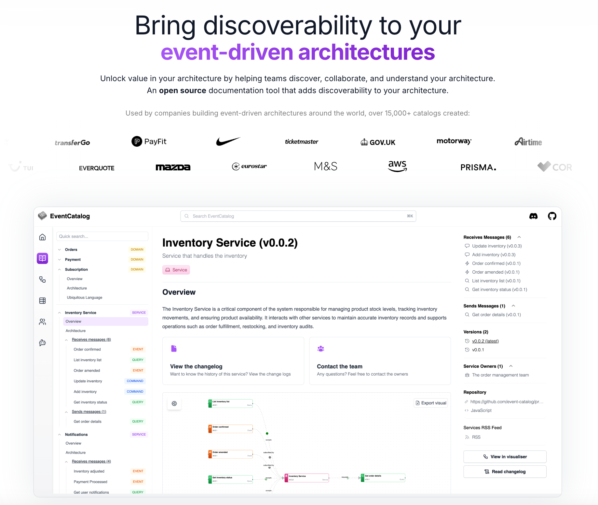

<div align="center">



<h1>📖 EventCatalog</h1>

<p align="center">
  <strong>The architecture catalog for distributed systems</strong>
  <br/>
  Document events, services, domains & flows with AI-powered discovery
  <br/><br/>
</p>

[](https://github.com/event-catalog/eventcatalog/actions/workflows/verify-build.yml)
[](https://github.com/event-catalog/eventcatalog/blob/main/LICENSE)
[](https://badge.fury.io/js/@eventcatalog/core)
[](#contributors-)

[Documentation](https://www.eventcatalog.dev/docs) | [Demo](https://demo.eventcatalog.dev) | [Discord](https://discord.gg/3rjaZMmrAm)

</div>

---

## 🚀 Quick Start

```bash
npx @eventcatalog/create-eventcatalog@latest my-catalog
```

Looking for help? Start with our [Getting Started](https://www.eventcatalog.dev/docs/development/getting-started/installation) guide.

---

## ✨ Features

- **🤖 AI-Native Discovery** - MCP Server integration, semantic search, auto-documentation
- **📊 Visual Documentation** - Beautiful node graphs, flows, and architecture diagrams
- **🔄 Multi-Platform** - Kafka, EventBridge, RabbitMQ, SNS/SQS, and more
- **🔐 Enterprise Ready** - OAuth2, RBAC, schema governance, breaking change detection
- **🎨 Customizable** - Themes, custom MDX components, configurable layouts
- **📦 15+ Generators** - OpenAPI, AsyncAPI, AWS, Confluent, Kafka, and more

---

## 📦 Monorepo Structure

EventCatalog is organized as a Turborepo monorepo:

- **[@eventcatalog/core](./eventcatalog)** - Main catalog application (Astro + React)
- **[@eventcatalog/sdk](./packages/sdk)** - Node.js SDK for programmatic catalog management
- **[@eventcatalog/create-eventcatalog](./packages/create-eventcatalog)** - CLI scaffolding tool

---

## 🎯 Why EventCatalog?

**vs. Generic Documentation Tools**
- ✅ Purpose-built for distributed systems and event-driven architectures
- ✅ AI-powered discovery and semantic search
- ✅ Schema governance with breaking change detection

**vs. Vendor-Specific Tools**
- ✅ Platform-agnostic (works with any broker/platform)
- ✅ Vendor-neutral (avoid lock-in)
- ✅ Open source with commercial support

**vs. Service Catalogs**
- ✅ 5 minutes to value vs 6+ months implementation
- ✅ Event-driven architecture depth, not generic breadth
- ✅ Runtime discovery from traffic analysis

---

## 🌍 Demos

See EventCatalog in action:

- [Finance System](https://eventcatalog-examples-finance.vercel.app/)
- [Healthcare System](https://eventcatalog-examples-healthcare.vercel.app/)
- [E-Commerce System](https://demo.eventcatalog.dev/)
- [SaaS System](https://eventcatalog-examples-saas.vercel.app/)

---

## 📚 Documentation

Visit our [official documentation](https://www.eventcatalog.dev/docs/development/getting-started) to learn more.

---

## 💬 Support

Having trouble? Get help in the official [EventCatalog Discord](https://discord.gg/3rjaZMmrAm).

---

## 🤝 Contributing

We welcome contributions! See our [contributing guidelines](https://eventcatalog.dev/docs/contributing/overview) to get started.

---

## Contributors ✨

Thanks goes to these wonderful people ([emoji key](https://allcontributors.org/docs/en/emoji-key)):

<!-- ALL-CONTRIBUTORS-LIST:START - Do not remove or modify this section -->
<!-- prettier-ignore-start -->
<!-- markdownlint-disable -->
<table>
  <tbody>
    <tr>
      <td align="center" valign="top" width="14.28%"><a href="https://boyney.io/"><br /><sub><b>David Boyne</b></sub></a><br /><a href="https://github.com/event-catalog/eventcatalog/commits?author=boyney123" title="Code">💻</a> <a href="#content-boyney123" title="Content">🖋</a> <a href="#design-boyney123" title="Design">🎨</a> <a href="#example-boyney123" title="Examples">💡</a> <a href="#ideas-boyney123" title="Ideas, Planning, & Feedback">🤔</a> <a href="https://github.com/event-catalog/eventcatalog/commits?author=boyney123" title="Documentation">📖</a></td>
      <td align="center" valign="top" width="14.28%"><a href="https://otbe.io"><br /><sub><b>Benjamin Otto</b></sub></a><br /><a href="https://github.com/event-catalog/eventcatalog/commits?author=otbe" title="Code">💻</a> <a href="#ideas-otbe" title="Ideas, Planning, & Feedback">🤔</a> <a href="https://github.com/event-catalog/eventcatalog/commits?author=otbe" title="Documentation">📖</a> <a href="https://github.com/event-catalog/eventcatalog/issues?q=author%3Aotbe" title="Bug reports">🐛</a></td>
      <td align="center" valign="top" width="14.28%"><a href="https://github.com/pongz79"><br /><sub><b>Tiago Oliveira</b></sub></a><br /><a href="https://github.com/event-catalog/eventcatalog/commits?author=pongz79" title="Documentation">📖</a> <a href="https://github.com/event-catalog/eventcatalog/issues?q=author%3Apongz79" title="Bug reports">🐛</a></td>
      <td align="center" valign="top" width="14.28%"><a href="https://www.bigjump.com/"><br /><sub><b>Jay McGuinness</b></sub></a><br /><a href="https://github.com/event-catalog/eventcatalog/commits?author=jaymcguinness" title="Documentation">📖</a></td>
      <td align="center" valign="top" width="14.28%"><a href="https://github.com/davidkpiano"><br /><sub><b>David Khourshid</b></sub></a><br /><a href="https://github.com/event-catalog/eventcatalog/commits?author=davidkpiano" title="Documentation">📖</a></td>
      <td align="center" valign="top" width="14.28%"><a href="https://github.com/thim81"><br /><sub><b>thim81</b></sub></a><br /><a href="#ideas-thim81" title="Ideas, Planning, & Feedback">🤔</a> <a href="https://github.com/event-catalog/eventcatalog/issues?q=author%3Athim81" title="Bug reports">🐛</a> <a href="https://github.com/event-catalog/eventcatalog/commits?author=thim81" title="Code">💻</a></td>
      <td align="center" valign="top" width="14.28%"><a href="https://github.com/Muthuveerappanv"><br /><sub><b>Muthu</b></sub></a><br /><a href="https://github.com/event-catalog/eventcatalog/issues?q=author%3AMuthuveerappanv" title="Bug reports">🐛</a></td>
    </tr>
    <tr>
      <td align="center" valign="top" width="14.28%"><a href="https://github.com/tavelli"><br /><sub><b>Dan Tavelli</b></sub></a><br /><a href="https://github.com/event-catalog/eventcatalog/commits?author=tavelli" title="Documentation">📖</a></td>
      <td align="center" valign="top" width="14.28%"><a href="https://github.com/steppi91"><br /><sub><b>steppi91</b></sub></a><br /><a href="https://github.com/event-catalog/eventcatalog/commits?author=steppi91" title="Documentation">📖</a></td>
      <td align="center" valign="top" width="14.28%"><a href="https://twitter.com/PipoPeperoni"><br /><sub><b>Donald Pipowitch</b></sub></a><br /><a href="https://github.com/event-catalog/eventcatalog/issues?q=author%3Adonaldpipowitch" title="Bug reports">🐛</a> <a href="https://github.com/event-catalog/eventcatalog/commits?author=donaldpipowitch" title="Code">💻</a></td>
      <td align="center" valign="top" width="14.28%"><a href="http://unravelled.dev"><br /><sub><b>Ken</b></sub></a><br /><a href="https://github.com/event-catalog/eventcatalog/commits?author=kzhen" title="Documentation">📖</a></td>
      <td align="center" valign="top" width="14.28%"><a href="http://rtoro.cl"><br /><sub><b>Rodolfo Toro</b></sub></a><br /><a href="https://github.com/event-catalog/eventcatalog/commits?author=rtoro" title="Code">💻</a></td>
      <td align="center" valign="top" width="14.28%"><a href="http://blog.hackedbrain.com"><br /><sub><b>Drew Marsh</b></sub></a><br /><a href="https://github.com/event-catalog/eventcatalog/commits?author=drub0y" title="Code">💻</a></td>
      <td align="center" valign="top" width="14.28%"><a href="https://github.com/dpwdec"><br /><sub><b>Dec Kolakowski</b></sub></a><br /><a href="https://github.com/event-catalog/eventcatalog/commits?author=dpwdec" title="Code">💻</a> <a href="https://github.com/event-catalog/eventcatalog/commits?author=dpwdec" title="Documentation">📖</a></td>
    </tr>
    <tr>
      <td align="center" valign="top" width="14.28%"><a href="https://github.com/dytyniuk"><br /><sub><b>Yevhenii Dytyniuk</b></sub></a><br /><a href="https://github.com/event-catalog/eventcatalog/commits?author=dytyniuk" title="Code">💻</a></td>
      <td align="center" valign="top" width="14.28%"><a href="https://github.com/lcsbltm"><br /><sub><b>lcsbltm</b></sub></a><br /><a href="https://github.com/event-catalog/eventcatalog/commits?author=lcsbltm" title="Code">💻</a></td>
      <td align="center" valign="top" width="14.28%"><a href="https://matt.martz.codes"><br /><sub><b>Matt Martz</b></sub></a><br /><a href="https://github.com/event-catalog/eventcatalog/commits?author=martzcodes" title="Code">💻</a></td>
      <td align="center" valign="top" width="14.28%"><a href="https://github.com/michelgrootjans"><br /><sub><b>Michel Grootjans</b></sub></a><br /><a href="https://github.com/event-catalog/eventcatalog/commits?author=michelgrootjans" title="Code">💻</a></td>
      <td align="center" valign="top" width="14.28%"><a href="https://github.com/arturoabruzzini"><br /><sub><b>Arturo Abruzzini</b></sub></a><br /><a href="https://github.com/event-catalog/eventcatalog/commits?author=arturoabruzzini" title="Code">💻</a></td>
      <td align="center" valign="top" width="14.28%"><a href="https://github.com/adlecluse"><br /><sub><b>Ad L'Ecluse</b></sub></a><br /><a href="https://github.com/event-catalog/eventcatalog/commits?author=adlecluse" title="Code">💻</a></td>
      <td align="center" valign="top" width="14.28%"><a href="https://github.com/rafaelrenanpacheco"><br /><sub><b>Rafael Renan Pacheco</b></sub></a><br /><a href="https://github.com/event-catalog/eventcatalog/commits?author=rafaelrenanpacheco" title="Code">💻</a> <a href="https://github.com/event-catalog/eventcatalog/commits?author=rafaelrenanpacheco" title="Documentation">📖</a></td>
    </tr>
    <tr>
      <td align="center" valign="top" width="14.28%"><a href="https://ldiego73.github.io/"><br /><sub><b>Luis Diego</b></sub></a><br /><a href="https://github.com/event-catalog/eventcatalog/commits?author=ldiego73" title="Code">💻</a></td>
      <td align="center" valign="top" width="14.28%"><a href="https://www.linkedin.com/in/danielruf/"><br /><sub><b>Daniel Ruf</b></sub></a><br /><a href="https://github.com/event-catalog/eventcatalog/commits?author=DanielRuf" title="Documentation">📖</a></td>
      <td align="center" valign="top" width="14.28%"><a href="https://github.com/frenkan"><br /><sub><b>Fredrik Johansson</b></sub></a><br /><a href="https://github.com/event-catalog/eventcatalog/commits?author=frenkan" title="Code">💻</a></td>
      <td align="center" valign="top" width="14.28%"><a href="https://gaddam1987.github.io/"><br /><sub><b>Naresh Kumar Reddy Gaddam</b></sub></a><br /><a href="https://github.com/event-catalog/eventcatalog/commits?author=gaddam1987" title="Code">💻</a></td>
      <td align="center" valign="top" width="14.28%"><a href="https://github.com/dremonkey"><br /><sub><b>Andre Deutmeyer</b></sub></a><br /><a href="https://github.com/event-catalog/eventcatalog/commits?author=dremonkey" title="Code">💻</a></td>
      <td align="center" valign="top" width="14.28%"><a href="https://github.com/pebbz"><br /><sub><b>Pebbz</b></sub></a><br /><a href="https://github.com/event-catalog/eventcatalog/commits?author=pebbz" title="Code">💻</a></td>
      <td align="center" valign="top" width="14.28%"><a href="https://alexander.holbreich.org/"><br /><sub><b>Alexander Holbreich</b></sub></a><br /><a href="https://github.com/event-catalog/eventcatalog/commits?author=aholbreich" title="Documentation">📖</a></td>
    </tr>
    <tr>
      <td align="center" valign="top" width="14.28%"><a href="https://www.josedelgadoing.com/"><br /><sub><b>José Delgado</b></sub></a><br /><a href="https://github.com/event-catalog/eventcatalog/commits?author=jslim" title="Code">💻</a></td>
      <td align="center" valign="top" width="14.28%"><a href="https://github.com/jlee-spt"><br /><sub><b>jlee-spt</b></sub></a><br /><a href="https://github.com/event-catalog/eventcatalog/commits?author=jlee-spt" title="Code">💻</a></td>
      <td align="center" valign="top" width="14.28%"><a href="https://github.com/kimrejstrom"><br /><sub><b>Kim Rejström</b></sub></a><br /><a href="https://github.com/event-catalog/eventcatalog/commits?author=kimrejstrom" title="Code">💻</a></td>
      <td align="center" valign="top" width="14.28%"><a href="https://github.com/cgabard"><br /><sub><b>Christophe Gabard</b></sub></a><br /><a href="https://github.com/event-catalog/eventcatalog/commits?author=cgabard" title="Code">💻</a></td>
      <td align="center" valign="top" width="14.28%"><a href="http://www.waydotnet.com"><br /><sub><b>Carlo Bertini</b></sub></a><br /><a href="https://github.com/event-catalog/eventcatalog/commits?author=WaYdotNET" title="Code">💻</a></td>
      <td align="center" valign="top" width="14.28%"><a href="https://github.com/dreglad"><br /><sub><b>David Regla</b></sub></a><br /><a href="https://github.com/event-catalog/eventcatalog/commits?author=dreglad" title="Code">💻</a></td>
      <td align="center" valign="top" width="14.28%"><a href="https://blogdomarcioweb.wordpress.com/"><br /><sub><b>Marcio Vinicius</b></sub></a><br /><a href="https://github.com/event-catalog/eventcatalog/commits?author=marciovmartins" title="Code">💻</a></td>
    </tr>
    <tr>
      <td align="center" valign="top" width="14.28%"><a href="https://github.com/danielcastill0"><br /><sub><b>Daniel Andres Castillo Ardila</b></sub></a><br /><a href="https://github.com/event-catalog/eventcatalog/commits?author=danielcastill0" title="Code">💻</a></td>
      <td align="center" valign="top" width="14.28%"><a href="http://www.ennovative-solutions.be"><br /><sub><b>Baerten Dennis</b></sub></a><br /><a href="https://github.com/event-catalog/eventcatalog/commits?author=debae" title="Code">💻</a></td>
      <td align="center" valign="top" width="14.28%"><a href="https://github.com/ryancormack"><br /><sub><b>Ryan Cormack</b></sub></a><br /><a href="https://github.com/event-catalog/eventcatalog/commits?author=ryancormack" title="Code">💻</a></td>
      <td align="center" valign="top" width="14.28%"><a href="https://natee.biz"><br /><sub><b>Nathan Birrell</b></sub></a><br /><a href="https://github.com/event-catalog/eventcatalog/commits?author=nathanbirrell" title="Code">💻</a></td>
      <td align="center" valign="top" width="14.28%"><a href="https://www.jacktomlinson.co.uk/"><br /><sub><b>Jack Tomlinson</b></sub></a><br /><a href="https://github.com/event-catalog/eventcatalog/commits?author=jacktomlinson" title="Code">💻</a></td>
      <td align="center" valign="top" width="14.28%"><a href="https://github.com/carlosallexandre"><br /><sub><b>Carlos Rodrigues</b></sub></a><br /><a href="https://github.com/event-catalog/eventcatalog/commits?author=carlosallexandre" title="Code">💻</a></td>
      <td align="center" valign="top" width="14.28%"><a href="https://github.com/XaaXaaX"><br /><sub><b>omid eidivandi</b></sub></a><br /><a href="https://github.com/event-catalog/eventcatalog/commits?author=XaaXaaX" title="Code">💻</a></td>
    </tr>
    <tr>
      <td align="center" valign="top" width="14.28%"><a href="https://github.com/hpatoio"><br /><sub><b>Simone Fumagalli</b></sub></a><br /><a href="https://github.com/event-catalog/eventcatalog/commits?author=hpatoio" title="Documentation">📖</a></td>
      <td align="center" valign="top" width="14.28%"><a href="https://github.com/d-o-h"><br /><sub><b>d-o-h</b></sub></a><br /><a href="https://github.com/event-catalog/eventcatalog/commits?author=d-o-h" title="Code">💻</a></td>
      <td align="center" valign="top" width="14.28%"><a href="https://pallares.io"><br /><sub><b>Cristian Pallarés</b></sub></a><br /><a href="https://github.com/event-catalog/eventcatalog/commits?author=skyrpex" title="Code">💻</a></td>
      <td align="center" valign="top" width="14.28%"><a href="https://github.com/SebasRendon12"><br /><sub><b>Sebastian Rendon</b></sub></a><br /><a href="https://github.com/event-catalog/eventcatalog/commits?author=SebasRendon12" title="Code">💻</a></td>
      <td align="center" valign="top" width="14.28%"><a href="http://craig0990.co.uk"><br /><sub><b>Craig Roberts</b></sub></a><br /><a href="https://github.com/event-catalog/eventcatalog/commits?author=craig0990" title="Code">💻</a></td>
      <td align="center" valign="top" width="14.28%"><a href="https://github.com/Vertygo"><br /><sub><b>Ivan Milosavljevic</b></sub></a><br /><a href="https://github.com/event-catalog/eventcatalog/commits?author=Vertygo" title="Documentation">📖</a></td>
      <td align="center" valign="top" width="14.28%"><a href="https://github.com/Mezzle"><br /><sub><b>Martin Meredith</b></sub></a><br /><a href="https://github.com/event-catalog/eventcatalog/commits?author=Mezzle" title="Code">💻</a></td>
    </tr>
    <tr>
      <td align="center" valign="top" width="14.28%"><a href="https://www.linkedin.com/in/ruudwelling/"><br /><sub><b>Ruud Welling</b></sub></a><br /><a href="https://github.com/event-catalog/eventcatalog/commits?author=WellingR" title="Code">💻</a></td>
      <td align="center" valign="top" width="14.28%"><a href="https://github.com/vienin"><br /><sub><b>Kevin Pouget</b></sub></a><br /><a href="https://github.com/event-catalog/eventcatalog/commits?author=vienin" title="Code">💻</a></td>
      <td align="center" valign="top" width="14.28%"><a href="https://github.com/VitaliiBalash"><br /><sub><b>Vitalii Balash</b></sub></a><br /><a href="https://github.com/event-catalog/eventcatalog/commits?author=VitaliiBalash" title="Code">💻</a></td>
      <td align="center" valign="top" width="14.28%"><a href="https://github.com/ababilone"><br /><sub><b>Arnaud Babilone</b></sub></a><br /><a href="https://github.com/event-catalog/eventcatalog/commits?author=ababilone" title="Code">💻</a></td>
      <td align="center" valign="top" width="14.28%"><a href="https://github.com/alexanderhorner"><br /><sub><b>Alexander Horner</b></sub></a><br /><a href="https://github.com/event-catalog/eventcatalog/commits?author=alexanderhorner" title="Code">💻</a></td>
      <td align="center" valign="top" width="14.28%"><a href="https://github.com/simonwfarrow"><br /><sub><b>simonwfarrow</b></sub></a><br /><a href="https://github.com/event-catalog/eventcatalog/commits?author=simonwfarrow" title="Code">💻</a></td>
      <td align="center" valign="top" width="14.28%"><a href="https://github.com/augusto-romero-arango"><br /><sub><b>Augusto Romero Arango</b></sub></a><br /><a href="https://github.com/event-catalog/eventcatalog/commits?author=augusto-romero-arango" title="Code">💻</a></td>
    </tr>
    <tr>
      <td align="center" valign="top" width="14.28%"><a href="https://github.com/cc-stjm"><br /><sub><b>cc-stjm</b></sub></a><br /><a href="https://github.com/event-catalog/eventcatalog/commits?author=cc-stjm" title="Code">💻</a></td>
      <td align="center" valign="top" width="14.28%"><a href="https://www.linkedin.com/in/lucianlature/"><br /><sub><b>Lucian Lature</b></sub></a><br /><a href="https://github.com/event-catalog/eventcatalog/issues?q=author%3Alucianlature" title="Bug reports">🐛</a> <a href="https://github.com/event-catalog/eventcatalog/commits?author=lucianlature" title="Code">💻</a></td>
      <td align="center" valign="top" width="14.28%"><a href="https://github.com/villAsh"><br /><sub><b>Vilas Chauvhan</b></sub></a><br /><a href="https://github.com/event-catalog/eventcatalog/commits?author=villAsh" title="Code">💻</a></td>
      <td align="center" valign="top" width="14.28%"><a href="https://github.com/mrerichoffman"><br /><sub><b>Eric Hoffman</b></sub></a><br /><a href="https://github.com/event-catalog/eventcatalog/issues?q=author%3Amrerichoffman" title="Bug reports">🐛</a></td>
      <td align="center" valign="top" width="14.28%"><a href="https://github.com/wimhaesen-kine"><br /><sub><b>wimhaesen-kine</b></sub></a><br /><a href="https://github.com/event-catalog/eventcatalog/commits?author=wimhaesen-kine" title="Code">💻</a></td>
      <td align="center" valign="top" width="14.28%"><a href="https://www.ondrejmusil.cz"><br /><sub><b>Ondrej Musil</b></sub></a><br /><a href="https://github.com/event-catalog/eventcatalog/issues?q=author%3Afreaz" title="Bug reports">🐛</a> <a href="#ideas-freaz" title="Ideas, Planning, & Feedback">🤔</a></td>
      <td align="center" valign="top" width="14.28%"><a href="https://github.com/anatolybolshakov"><br /><sub><b>Anatoly Bolshakov</b></sub></a><br /><a href="https://github.com/event-catalog/eventcatalog/commits?author=anatolybolshakov" title="Code">💻</a></td>
    </tr>
    <tr>
      <td align="center" valign="top" width="14.28%"><a href="https://github.com/reisingerf"><br /><sub><b>reisingerf</b></sub></a><br /><a href="https://github.com/event-catalog/eventcatalog/commits?author=reisingerf" title="Documentation">📖</a></td>
      <td align="center" valign="top" width="14.28%"><a href="https://github.com/jbarette-rossel"><br /><sub><b>Jonathan Barette</b></sub></a><br /><a href="https://github.com/event-catalog/eventcatalog/commits?author=jbarette-rossel" title="Code">💻</a></td>
      <td align="center" valign="top" width="14.28%"><a href="https://github.com/mumundum"><br /><sub><b>mumundum</b></sub></a><br /><a href="https://github.com/event-catalog/eventcatalog/commits?author=mumundum" title="Code">💻</a></td>
      <td align="center" valign="top" width="14.28%"><a href="https://www.argonus.tech"><br /><sub><b>Piotr Rybarczyk</b></sub></a><br /><a href="https://github.com/event-catalog/eventcatalog/issues?q=author%3AArgonus" title="Bug reports">🐛</a></td>
      <td align="center" valign="top" width="14.28%"><a href="https://github.com/ZakaryaCH"><br /><sub><b>ZakaryaCH</b></sub></a><br /><a href="https://github.com/event-catalog/eventcatalog/issues?q=author%3AZakaryaCH" title="Bug reports">🐛</a></td>
      <td align="center" valign="top" width="14.28%"><a href="https://github.com/jboeijenga"><br /><sub><b>Jasper Boeijenga</b></sub></a><br /><a href="https://github.com/event-catalog/eventcatalog/commits?author=jboeijenga" title="Code">💻</a></td>
      <td align="center" valign="top" width="14.28%"><a href="https://kirkdesigns.co.uk"><br /><sub><b>Tom Kirkpatrick</b></sub></a><br /><a href="https://github.com/event-catalog/eventcatalog/commits?author=mrfelton" title="Code">💻</a></td>
    </tr>
  </tbody>
</table>

<!-- markdownlint-restore -->
<!-- prettier-ignore-end -->

<!-- ALL-CONTRIBUTORS-LIST:END -->

This project follows the [all-contributors](https://github.com/all-contributors/all-contributors) specification. Contributions of any kind welcome!

---

## 📄 License

MIT.
