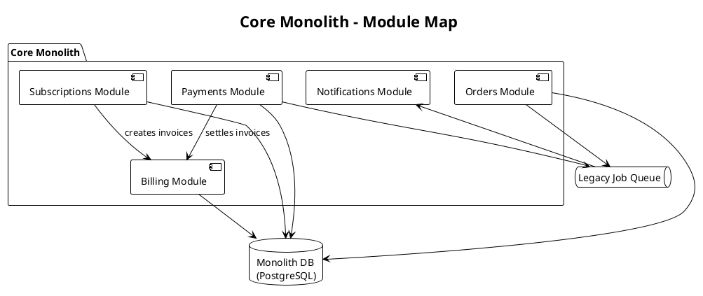

## Monolith Module Map

This diagram shows the modules that still live inside the **Core Monolith** and how
they share state through a single database. As part of the strangler-fig migration,
each of these modules is gradually being carved out into its own service.

- **Orders / Payments / Subscriptions** are the first candidates for extraction.
- **Billing** and **Notifications** remain tightly coupled to the shared schema.
- The shared **Monolith DB** is the biggest blocker to full decomposition.
