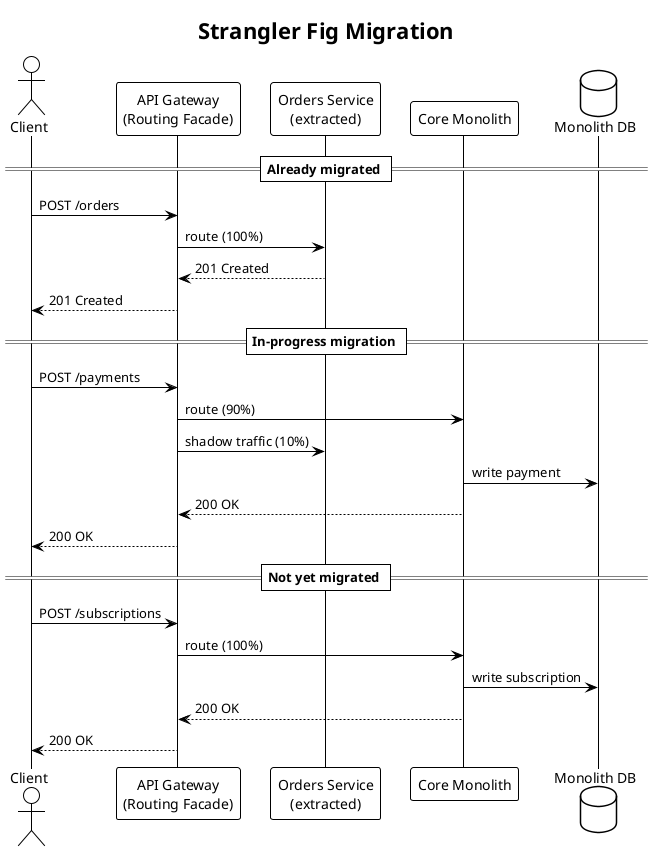

## Strangler Fig Migration

The API Gateway acts as a routing facade in front of the Core Monolith. As each
capability is extracted into its own service, the gateway shifts traffic away from
the monolith:

1. **Orders** is fully migrated — 100% of traffic hits the extracted service.
2. **Payments** is mid-migration — most traffic still hits the monolith, with a
   small percentage shadowed to the new implementation for comparison.
3. **Subscriptions** has not started migrating — all traffic still flows to the
   monolith.

This is the mechanism by which the Core Monolith shrinks over time.
