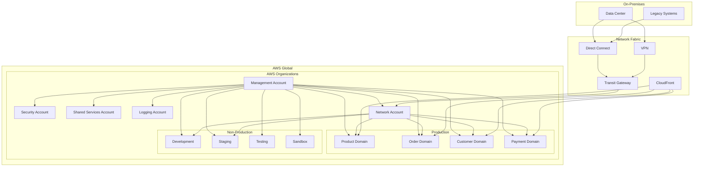
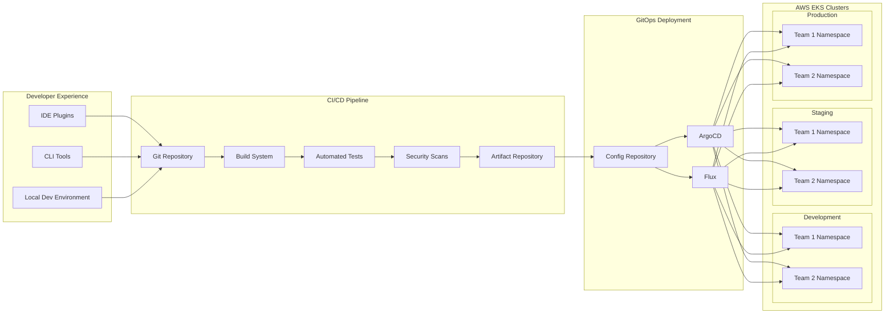
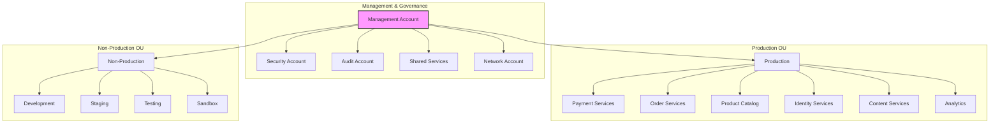

# DRAFT - NOT YET APPROVED

:::warning
This is a draft ADR. It is not yet approved and should not be used as a reference.
:::

## ADR-007: Cloud Infrastructure Strategy for FlowMart E-commerce Platform

### Status

Draft (Last Updated: 2024-09-25)

<Flow id="PaymentFlow" version="latest" includeKey={false} />
<Flow id="PaymentFlow" version="latest" includeKey={false} />
<Flow id="PaymentFlow" version="latest" includeKey={false} />

### Context

As part of our transition to a microservices architecture, we need to define our cloud infrastructure strategy to support the new FlowMart e-commerce platform. Our current infrastructure consists primarily of on-premises data centers with some workloads in AWS, creating operational and scaling challenges:

1. **Infrastructure Provisioning**: Manual processes for provisioning infrastructure lead to long lead times for new environments and services.

2. **Scaling Limitations**: Physical hardware constraints prevent rapid scaling during peak shopping periods.

3. **High Operational Overhead**: Significant effort required for hardware maintenance, patching, and capacity management.

4. **Disaster Recovery Challenges**: Limited geographic redundancy and complex DR procedures.

5. **Cloud Fragmentation**: Ad-hoc adoption of cloud services has created inconsistent practices and tooling.

6. **Developer Experience**: Complex local development setup and environment inconsistencies slow down development cycles.

7. **Cost Management**: Difficult to attribute infrastructure costs to specific business capabilities or teams.

8. **Security Compliance**: Maintaining compliance across hybrid infrastructure requires duplicate controls and auditing.

We need a cohesive infrastructure strategy that enables rapid delivery, scalability, and operational efficiency for our new e-commerce platform.

### Decision

We will adopt a **cloud-native infrastructure strategy** with a **multi-cloud capability** but **AWS-primary approach**. Key aspects of this strategy include:

1. **Primary Cloud Platform**:
   - AWS will be our primary cloud provider for all new workloads
   - Azure will be maintained as a secondary provider for specific use cases (e.g., Microsoft-ecosystem services)
   - GCP may be selectively used for specialized AI/ML workloads

2. **Infrastructure as Code (IaC)**:
   - Terraform as primary IaC tool for provisioning cloud resources
   - AWS CDK for complex, AWS-specific resource configurations
   - GitOps-based deployment workflows with infrastructure CI/CD pipelines

3. **Containerization Strategy**:
   - Containerize all new microservices using Docker
   - Amazon EKS (Kubernetes) as primary container orchestration platform
   - Amazon ECR for container registry with cross-region replication

4. **Platform Services Over Custom Infrastructure**:
   - Prefer managed services over self-managed infrastructure where possible
   - AWS RDS, DocumentDB, ElastiCache for database needs
   - AWS MSK (Managed Kafka) for event streaming
   - CloudFront for CDN and edge caching

5. **Multi-Region Architecture**:
   - Primary operations in AWS US-East-1 and US-West-2
   - Active-active configuration for critical services
   - Region-specific deployments for EU and APAC markets to address data residency

6. **Landing Zone and Account Structure**:
   - Hub-and-spoke model with centralized security and governance
   - Separate AWS accounts for production, staging, development, and sandbox environments
   - Service-oriented account structure within each environment category
   - Centralized logging, monitoring, and security controls

7. **Network Architecture**:
   - Transit Gateway for interconnecting VPCs and on-premises
   - VPC design aligned with microservice domains
   - AWS PrivateLink for service-to-service connectivity
   - AWS Shield and WAF for DDoS protection and application security

8. **Cost Optimization**:
   - Tagging strategy for cost allocation and tracking
   - Automated cost monitoring and anomaly detection
   - Leverage Savings Plans and Reserved Instances strategically
   - Implemented auto-scaling for elastic workloads

### Infrastructure Architecture by Domain

| Domain | Primary Services | Scaling Strategy | Special Requirements |
|--------|------------------|------------------|----------------------|
| Product Catalog | EKS, ElastiCache, DocumentDB | Horizontal pod scaling, Read replicas | High read throughput, Global availability |
| Order Processing | EKS, RDS (PostgreSQL), MSK | Horizontal pod scaling, DB connection pooling | Strong consistency, Transaction support |
| Payment | EKS, RDS (PostgreSQL), KMS | Fixed scaling with headroom | PCI-DSS compliance, Encryption requirements |
| Inventory | EKS, DocumentDB, Lambda | Horizontal auto-scaling | Event-sourcing patterns, Eventual consistency |
| User Authentication | Cognito, Lambda, DynamoDB | Regional deployments | Multi-factor auth, Token management |
| Content Delivery | S3, CloudFront, Lambda@Edge | Edge caching, Regional replication | Image optimization, Low latency delivery |
| Search | OpenSearch, Lambda, EKS | Search domain scaling, Query throttling | High cardinality, Complex query support |
| Analytics | Redshift, Kinesis, EMR | Workload-based scaling | Batch processing, Data lake integration |

### Consequences

#### Positive

1. **Improved Scalability**: Elastic infrastructure that scales with demand without manual intervention.

2. **Faster Time-to-Market**: Automated provisioning and deployment enable rapid delivery of new features.

3. **Enhanced Resilience**: Multi-region architecture improves availability and disaster recovery capabilities.

4. **Cost Efficiency**: Pay-for-use model and automated scaling optimize infrastructure costs.

5. **Developer Productivity**: Consistent environments and self-service capabilities improve developer experience.

6. **Security Improvements**: Standardized security controls and automated compliance checks.

7. **Operational Efficiency**: Reduced operational overhead through managed services and automation.

8. **Global Reach**: Ability to deploy services closer to customers in different geographic regions.

#### Negative

1. **Cloud Vendor Dependency**: While designed for multi-cloud, primary workloads will have AWS dependencies.

2. **Cost Management Complexity**: Cloud costs can escalate without proper governance and monitoring.

3. **Skill Set Transition**: Team needs to develop new skills in cloud-native technologies and practices.

4. **Increased Architectural Complexity**: Distributed cloud architecture is more complex to design and troubleshoot.

5. **Security Model Changes**: Cloud security requires different approaches and tools than on-premises.

6. **Data Transfer Costs**: Cross-region and internet data transfer can become a significant cost factor.

7. **Service Maturity Variations**: Some AWS services are more mature and reliable than others.

### Mitigation Strategies

1. **Cloud Platform Team**:
   - Create a dedicated platform engineering team for cloud infrastructure
   - Develop reusable infrastructure modules and patterns
   - Provide internal consultation and support to service teams

2. **Cloud Center of Excellence (CCoE)**:
   - Establish cloud best practices and governance
   - Regular architecture reviews and guidance
   - Develop certification and training program for engineering teams

3. **Cloud Financial Management**:
   - Implement FinOps practices and tooling
   - Regular cost reviews and optimization cycles
   - Showback/chargeback mechanisms to drive accountability

4. **Abstraction Layers**:
   - Create service abstractions to minimize direct cloud provider coupling
   - Develop infrastructure interfaces that could support multiple providers
   - Use cloud-agnostic tools and practices where practical

5. **Hybrid Transition Strategy**:
   - Phased migration from on-premises to cloud
   - Maintain hybrid capabilities during transition period
   - Clear exit criteria for legacy infrastructure decommissioning

### Implementation Details

#### Phase 1: Foundation (Q4 2024)

1. Establish AWS Landing Zone and account structure
2. Implement core networking and security controls
3. Set up CI/CD pipelines for infrastructure
4. Deploy EKS clusters for development and staging
5. Migrate first non-critical workloads

#### Phase 2: Production Migration (Q1-Q2 2025)

1. Deploy production EKS clusters and platform services
2. Migrate core services to cloud infrastructure
3. Implement multi-region capabilities for critical services
4. Establish cloud cost management and optimization
5. Complete developer tooling and self-service capabilities

#### Phase 3: Advanced Capabilities (Q3-Q4 2025)

1. Implement advanced security and compliance controls
2. Deploy cross-region data synchronization
3. Optimize for global performance and availability
4. Enhance disaster recovery capabilities
5. Begin decommissioning legacy infrastructure

### Considered Alternatives

#### 1. Maintain and Expand On-Premises Infrastructure

**Pros**: Full control, potentially lower ongoing costs for stable workloads, no data sovereignty concerns  
**Cons**: Limited agility, high capital expenditure, scaling limitations, operational overhead

This approach would not provide the agility and scalability needed for our strategic growth and would perpetuate our current limitations.

#### 2. Single Cloud Provider (AWS Only)

**Pros**: Simplified operations, deeper integration between services, volume discounts, focused expertise  
**Cons**: Vendor lock-in, limited negotiating leverage, regional provider limitations

While simpler operationally, this approach would increase our dependency on a single provider and limit flexibility.

#### 3. Multi-Cloud with Equal Workload Distribution

**Pros**: Maximize negotiating leverage, no single provider dependency, best-of-breed services  
**Cons**: Significantly increased complexity, higher operations costs, fragmented expertise, integration challenges

The operational complexity and cost of maintaining equal capabilities across multiple cloud providers outweighs the benefits for our current needs.

#### 4. Cloud Service Provider (CSP) Abstraction Layer

**Pros**: Provider independence, standardized interfaces, easier migration between providers  
**Cons**: Significant development overhead, lowest common denominator functionality, performance impacts

Building comprehensive abstractions across cloud providers would create substantial engineering overhead and limit access to valuable provider-specific capabilities.

### References

1. AWS Well-Architected Framework ([AWS Documentation](https://aws.amazon.com/architecture/well-architected/))
2. "Cloud Strategy Leadership" (Gartner)
3. "Architecting for the Cloud: AWS Best Practices" ([AWS Whitepaper](https://d1.awsstatic.com/whitepapers/AWS_Cloud_Best_Practices.pdf))
4. "Multi-cloud: The good, the bad and the ugly" (ThoughtWorks Technology Radar)
5. Terraform Documentation ([Terraform.io](https://www.terraform.io/docs/))
6. "Cloud Native Infrastructure" by Justin Garrison and Kris Nova

### Decision Record History

| Date | Version | Description | Author |
|------|---------|-------------|--------|
| 2024-09-10 | 0.1 | Initial draft | Marcus Johnson |
| 2024-09-18 | 0.2 | Added implementation phases and domain details | Patricia Lopez |
| 2024-09-25 | 0.3 | Incorporated feedback from architecture review | David Boyne |
| TBD | 1.0 | Pending approval | Architecture Board |

## Appendix A: Cloud Infrastructure Architecture

## Appendix B: Deployment Architecture

## Appendix C: AWS Account Structure

