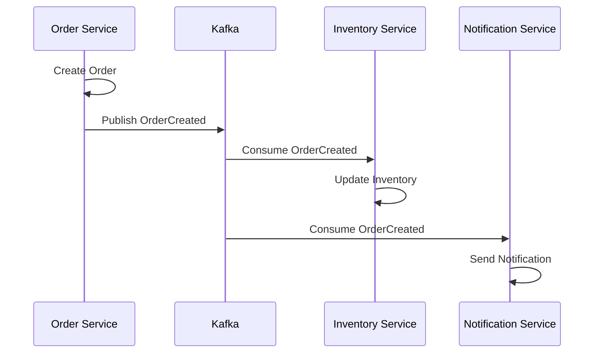
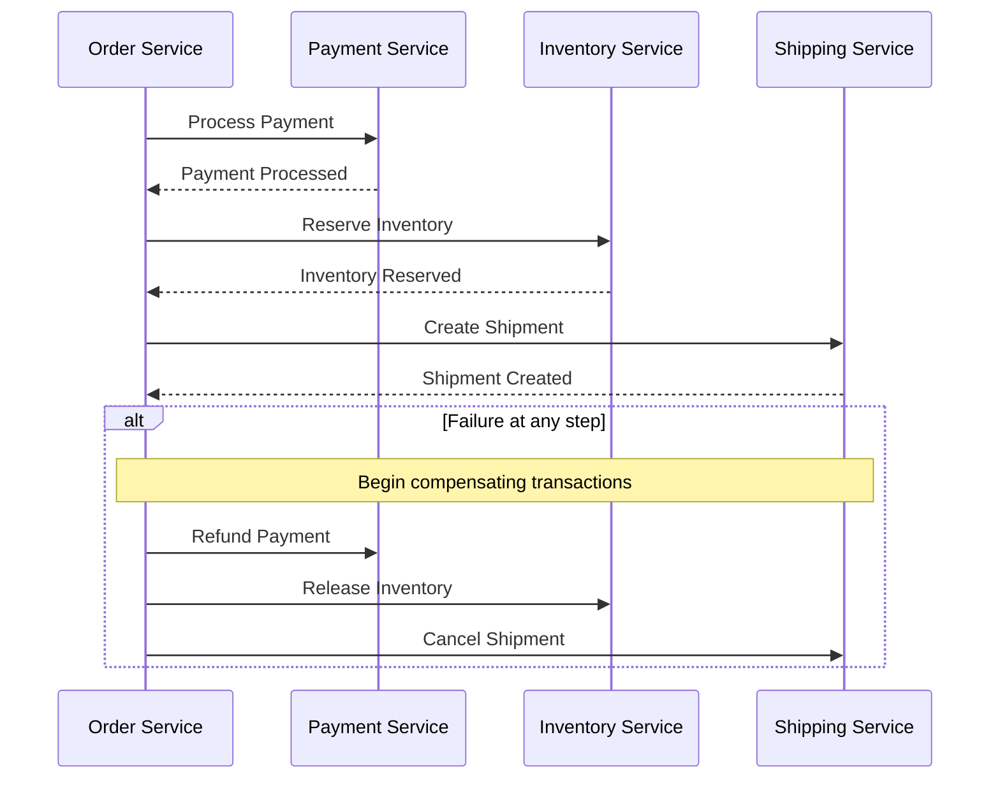

This guide outlines the database patterns and best practices for managing data in FlowMart's microservices architecture.

## Database Per Service Pattern

At FlowMart, we follow the **Database Per Service** pattern as our primary data management strategy:

- **Definition**: Each microservice owns and manages its database exclusively
- **Access Pattern**: Only the service that owns the database can perform direct read/write operations
- **Purpose**: Ensures loose coupling, independent scaling, and domain isolation


### Why This Pattern?

1. **Service Independence**: Services can be developed, deployed, and scaled independently
2. **Technology Freedom**: Teams can choose the most appropriate database technology for their service needs
3. **Resilience**: Database failures are isolated to individual services
4. **Security**: Clear data ownership boundaries limit the blast radius of security incidents
5. **Performance**: Database schemas and indexes can be optimized for specific service requirements

## Supported Database Technologies

FlowMart supports the following database technologies for microservices:

| Database Type | Technology | Best For | Support Level |
|--------------|------------|----------|---------------|
| Document | MongoDB | Flexible schemas, rapid development | Primary |
| Relational | PostgreSQL | Complex transactions, structured data | Primary |
| Key-Value | Redis | Caching, session management, rate limiting | Primary |
| Search | Elasticsearch | Full-text search, analytics | Secondary |
| Graph | Neptune | Relationship-heavy domains (e.g., recommendations) | Secondary |
| Time-Series | InfluxDB | Metrics, monitoring data | Secondary |

> **Primary**: Fully supported with managed services, infrastructure modules, and dedicated support
> 
> **Secondary**: Available but with limited tooling and support

## Data Modeling Principles

### 1. Model Around Bounded Contexts

- Define clear domain boundaries based on business capabilities
- Avoid modeling your database around UI needs
- Focus on the core domain model within each service

### 2. Design for Access Patterns

- Consider query patterns when designing the schema
- Optimize for the most frequent queries
- Plan for future data growth and access needs

### 3. Denormalization When Appropriate

- Strategic denormalization is often necessary in distributed systems
- Consider composite keys for efficient lookups
- Use materialized views for read-heavy scenarios

### Example: Product Service Data Model (MongoDB)

```javascript
// Product Collection
{
  "_id": ObjectId("5f8d0f3e1c9d440000c9a1f5"),
  "name": "Ultra HD Smart TV",
  "description": "55-inch Ultra HD Smart TV with voice control",
  "sku": "TV-55UHD-2023",
  "price": {
    "amount": 699.99,
    "currency": "USD"
  },
  "category": "electronics",
  "subcategory": "televisions",
  "attributes": {
    "brand": "TechVision",
    "model": "UHD-55X",
    "screenSize": "55",
    "resolution": "3840x2160",
    "smartFeatures": true,
    "voiceControl": true,
    "energyRating": "A+"
  },
  "images": [
    {
      "url": "https://storage.flowmart.com/products/tv-55uhd-2023-main.jpg",
      "isPrimary": true,
      "alt": "TechVision 55-inch Smart TV front view"
    },
    {
      "url": "https://storage.flowmart.com/products/tv-55uhd-2023-side.jpg",
      "isPrimary": false,
      "alt": "TechVision 55-inch Smart TV side view"
    }
  ],
  "inventory": {
    "inStock": 127,
    "reserved": 13,
    "available": 114,
    "lowStockThreshold": 25,
    "lastUpdated": ISODate("2023-09-15T14:23:45.000Z")
  },
  "status": "active",
  "createdAt": ISODate("2023-05-01T09:30:00.000Z"),
  "updatedAt": ISODate("2023-09-15T14:23:45.000Z")
}

// Review Collection
{
  "_id": ObjectId("5f8d0f3e1c9d440000c9a1f9"),
  "productId": ObjectId("5f8d0f3e1c9d440000c9a1f5"),
  "customerId": "cust-12345",
  "rating": 4.5,
  "title": "Great TV for the price",
  "content": "The picture quality is excellent and setup was easy...",
  "verified": true,
  "helpfulVotes": 27,
  "createdAt": ISODate("2023-06-15T18:22:10.000Z")
}
```

### Example: Order Service Data Model (PostgreSQL)

```sql
-- Orders Table
CREATE TABLE orders (
  id UUID PRIMARY KEY,
  customer_id VARCHAR(255) NOT NULL,
  order_number VARCHAR(50) NOT NULL UNIQUE,
  status VARCHAR(50) NOT NULL,
  total_amount DECIMAL(10, 2) NOT NULL,
  currency VARCHAR(3) NOT NULL,
  shipping_address_id UUID NOT NULL,
  billing_address_id UUID NOT NULL,
  payment_method_id UUID,
  created_at TIMESTAMP WITH TIME ZONE DEFAULT NOW(),
  updated_at TIMESTAMP WITH TIME ZONE DEFAULT NOW()
);

-- Order Items Table
CREATE TABLE order_items (
  id UUID PRIMARY KEY,
  order_id UUID NOT NULL REFERENCES orders(id),
  product_id VARCHAR(255) NOT NULL,
  product_sku VARCHAR(100) NOT NULL,
  product_name VARCHAR(255) NOT NULL,
  quantity INTEGER NOT NULL,
  unit_price DECIMAL(10, 2) NOT NULL,
  subtotal DECIMAL(10, 2) NOT NULL,
  created_at TIMESTAMP WITH TIME ZONE DEFAULT NOW()
);

-- Indexes
CREATE INDEX idx_orders_customer_id ON orders(customer_id);
CREATE INDEX idx_orders_status ON orders(status);
CREATE INDEX idx_order_items_order_id ON order_items(order_id);
CREATE INDEX idx_order_items_product_id ON order_items(product_id);
```

## Data Consistency Patterns

### 1. Eventual Consistency with Event-Driven Updates

At FlowMart, we embrace eventual consistency for most inter-service data coordination:



### 2. Saga Pattern for Distributed Transactions

For operations that span multiple services and require transactional semantics:



### 3. CQRS (Command Query Responsibility Segregation)

For services with complex read patterns or high read-to-write ratios:

```
┌───────────────┐     Commands     ┌───────────────┐
│               │ ──────────────▶  │               │
│   API Layer   │                  │ Command Model │
│               │ ◀──────────────  │               │
└───────────────┘                  └───────────────┘
        │                                  │
        │                                  │
        │                                  ▼
        │                          ┌───────────────┐
        │                          │               │
        │                          │  Event Store  │
        │                          │               │
        │                          └───────────────┘
        │                                  │
        │                                  │
        ▼                                  ▼
┌───────────────┐                  ┌───────────────┐
│               │                  │               │
│  Query Model  │ ◀──────────────  │ Event Handler │
│               │                  │               │
└───────────────┘                  └───────────────┘
```

## Data Migration Patterns

### 1. Schema Evolution

For incremental changes to a service's schema:

- Add new fields with default values
- Make changes backward compatible
- Use database migration tools (e.g., Flyway, Liquibase, MongoDB migrations)

Example migration script (Flyway):

```sql
-- V2023.09.15.1__Add_Order_Tracking.sql
ALTER TABLE orders ADD COLUMN tracking_number VARCHAR(100);
ALTER TABLE orders ADD COLUMN shipping_carrier VARCHAR(50);
```

### 2. Expand-Contract Pattern (Parallel Change)

For significant schema changes:

1. **Expand**: Add new fields/tables while maintaining old ones
2. **Migrate**: Copy/transform data from old to new structure
3. **Contract**: Remove old fields/tables after migration is complete

### 3. Service Decomposition

When splitting a monolithic database:

1. Identify bounded contexts
2. Create new service databases
3. Implement dual-write mechanism temporarily
4. Migrate historical data
5. Switch reads to the new database
6. Remove old tables after migration completes

## Database Access Patterns

### Repository Pattern

Our standard approach for database access:

```typescript
// Product Repository Interface
export interface ProductRepository {
  findById(id: string): Promise<Product | null>;
  findByCategory(category: string, limit?: number, offset?: number): Promise<Product[]>;
  findByQuery(query: ProductQuery): Promise<Product[]>;
  save(product: Product): Promise<Product>;
  update(id: string, updates: Partial<Product>): Promise<Product | null>;
  delete(id: string): Promise<boolean>;
}

// MongoDB Implementation
export class MongoProductRepository implements ProductRepository {
  constructor(private readonly db: Db) {}
  
  async findById(id: string): Promise<Product | null> {
    const result = await this.db.collection('products').findOne({ _id: new ObjectId(id) });
    return result ? this.mapToProduct(result) : null;
  }
  
  // Additional implementation methods...
}

// PostgreSQL Implementation
export class PostgresProductRepository implements ProductRepository {
  constructor(private readonly pool: Pool) {}
  
  async findById(id: string): Promise<Product | null> {
    const result = await this.pool.query(
      'SELECT * FROM products WHERE id = $1',
      [id]
    );
    return result.rows.length ? this.mapToProduct(result.rows[0]) : null;
  }
  
  // Additional implementation methods...
}
```

## Connection Management

### Connection Pooling

```javascript
// MongoDB Connection Pool (Node.js)
const { MongoClient } = require('mongodb');

class MongoDbClient {
  constructor(config) {
    this.client = new MongoClient(config.uri, {
      maxPoolSize: config.maxPoolSize || 10,
      minPoolSize: config.minPoolSize || 5,
      maxIdleTimeMS: config.maxIdleTimeMS || 30000,
      connectTimeoutMS: config.connectTimeoutMS || 5000
    });
  }
  
  async connect() {
    await this.client.connect();
    this.db = this.client.db(config.dbName);
    console.log('Connected to MongoDB');
    return this.db;
  }
  
  async disconnect() {
    await this.client.close();
    console.log('Disconnected from MongoDB');
  }
}
```

### Health Checks

```typescript
// Database Health Check (TypeScript)
export class DatabaseHealthCheck {
  constructor(private readonly dbClient: DbClient) {}
  
  async check(): Promise<HealthStatus> {
    try {
      const startTime = Date.now();
      await this.dbClient.ping();
      const responseTime = Date.now() - startTime;
      
      return {
        status: 'UP',
        responseTime,
        details: {
          database: this.dbClient.getDatabaseName(),
          connections: await this.dbClient.getConnectionStats()
        }
      };
    } catch (error) {
      return {
        status: 'DOWN',
        error: error.message,
        details: {
          database: this.dbClient.getDatabaseName()
        }
      };
    }
  }
}
```

## Database Security Practices

1. **Use IAM Roles/Service Accounts**: Avoid hardcoded credentials
2. **Encryption**: Enable at-rest and in-transit encryption
3. **No Direct Public Access**: Databases should never be directly exposed to the internet
4. **Least Privilege**: Grant minimal required permissions to service accounts
5. **Data Classification**: Tag data according to sensitivity
6. **Audit Logging**: Enable database auditing for sensitive operations
7. **Regular Backups**: Implement automated backup strategies
8. **Secure Connection Strings**: Store connection information in secure vaults

## Technology-Specific Guidelines

### MongoDB Best Practices

- Use document validation for schema enforcement
- Create indexes for frequent query patterns
- Limit document size (< 16MB)
- Use aggregation pipelines for complex queries
- Implement TTL indexes for expiring data

### PostgreSQL Best Practices

- Use connection pooling
- Implement database partitioning for large tables
- Create appropriate indexes based on query patterns
- Use prepared statements to prevent SQL injection
- Implement row-level security for multi-tenant data

### Redis Best Practices

- Set appropriate key expiration times
- Use Redis data structures (not just key-value)
- Implement Redis Cluster for high availability
- Monitor memory usage
- Use Redis for its strengths: caching, rate limiting, session storage

## Infrastructure as Code for Databases

FlowMart provides Terraform modules for common database setups:

```hcl
# MongoDB Atlas Cluster
module "mongodb_cluster" {
  source = "git::https://gitlab.flowmart.com/platform/terraform-modules//mongodb-atlas"
  
  project_id      = var.atlas_project_id
  cluster_name    = "${var.service_name}-${var.environment}"
  environment     = var.environment
  instance_size   = var.environment == "production" ? "M10" : "M0"
  region          = var.region
  
  backup_enabled = var.environment == "production" ? true : false
  
  teams = {
    owner     = "team-product",
    developer = "team-product-dev"
  }
  
  tags = {
    Service     = var.service_name
    Environment = var.environment
    ManagedBy   = "terraform"
  }
}

# PostgreSQL RDS Instance
module "postgres_db" {
  source = "git::https://gitlab.flowmart.com/platform/terraform-modules//aws-rds-postgres"
  
  identifier          = "${var.service_name}-${var.environment}"
  allocated_storage   = var.environment == "production" ? 100 : 20
  storage_type        = "gp2"
  engine_version      = "13.4"
  instance_class      = var.environment == "production" ? "db.m5.large" : "db.t3.small"
  database_name       = replace(var.service_name, "-", "_")
  vpc_id              = var.vpc_id
  subnet_ids          = var.database_subnet_ids
  multi_az            = var.environment == "production" ? true : false
  deletion_protection = var.environment == "production" ? true : false
  
  backup_retention_period = var.environment == "production" ? 7 : 1
  
  tags = {
    Service     = var.service_name
    Environment = var.environment
    ManagedBy   = "terraform"
  }
}
```

## Data Governance

### Practices for Maintaining Data Integrity

1. **Schema Registry**: Register and validate event schemas
2. **Data Catalogs**: Document available data and owners
3. **Data Lineage**: Track how data flows between services
4. **Data Quality Checks**: Implement validation and integrity checks
5. **Master Data Management**: Establish source-of-truth services

### GDPR and Compliance

1. **Data Minimization**: Collect only necessary data
2. **Right to Erasure**: Implement mechanisms to delete customer data
3. **Data Portability**: Support data export in common formats
4. **Consent Management**: Track and honor user consent
5. **Purpose Limitation**: Use data only for its intended purpose

## Recommended Resources

- **Books**:
  - "Database Internals" by Alex Petrov
  - "Designing Data-Intensive Applications" by Martin Kleppmann

- **Courses**:
  - MongoDB University
  - PostgreSQL Administration by EnterpriseDB

- **FlowMart Resources**:
  - Internal Database Patterns Playbook
  - Monthly Database Office Hours

## Next Steps

- Learn about [Event schema design](/docs/guides/creating-new-microservices/event-schemas)
- Explore [API design best practices](/docs/guides/creating-new-microservices/api-design)
- Understand [Observability in microservices](/docs/guides/creating-new-microservices/observability) 