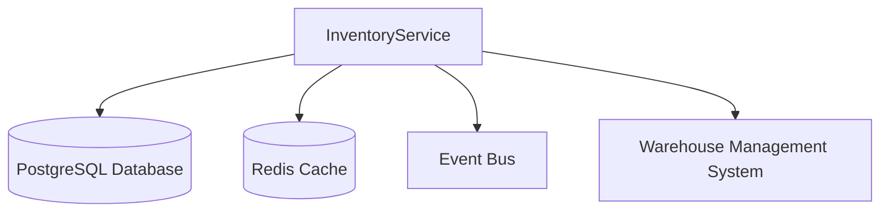

This runbook provides operational procedures for the InventoryService, which is responsible for managing product inventory and stock levels across the FlowMart e-commerce platform.

## Architecture

The InventoryService is responsible for:
- Managing product inventory and stock levels
- Reserving inventory for pending orders
- Tracking inventory across warehouses and locations
- Providing real-time availability information
- Triggering restock notifications

### Service Dependencies



## Monitoring and Alerting

### Key Metrics

| Metric | Description | Warning Threshold | Critical Threshold |
|--------|-------------|-------------------|-------------------|
| `inventory_check_rate` | Inventory availability checks per minute | > 1000 | > 5000 |
| `inventory_check_latency` | Time to check inventory availability | > 100ms | > 500ms |
| `inventory_update_latency` | Time to update inventory levels | > 200ms | > 1s |
| `low_stock_items` | Number of items with low stock | > 50 | > 100 |
| `connection_pool_usage` | Database connection pool utilization | > 70% | > 90% |
| `redis_hit_rate` | Cache hit rate | < 80% | < 60% |

### Dashboards

- [InventoryService Overview](https://grafana.flowmart.com/d/inventory-overview)
- [Stock Level Alerts](https://grafana.flowmart.com/d/inventory-stock-alerts)
- [Database Performance](https://grafana.flowmart.com/d/inventory-database)

### Common Alerts

| Alert | Description | Troubleshooting Steps |
|-------|-------------|----------------------|
| `InventoryServiceHighLatency` | API latency exceeds thresholds | See [High Latency](#high-latency) |
| `InventoryServiceDatabaseIssues` | Database connection or performance issues | See [Database Issues](#database-issues) |
| `InventoryServiceCacheFailure` | Redis cache unavailable or performance degraded | See [Cache Issues](#cache-issues) |
| `InventoryServiceOutOfStock` | Critical products out of stock | See [Stock Management](#stock-management) |

## Troubleshooting Guides

### High Latency

If the service is experiencing high latency:

1. **Check system resource usage**:
   ```bash
   kubectl top pods -n inventory
   ```

2. **Check database connection pool**:
   ```bash
   kubectl exec -it $(kubectl get pods -l app=inventory-service -n inventory -o jsonpath='{.items[0].metadata.name}') -n inventory -- curl localhost:8080/actuator/metrics/hikaricp.connections.usage
   ```

3. **Check cache hit rate**:
   ```bash
   kubectl exec -it $(kubectl get pods -l app=inventory-service -n inventory -o jsonpath='{.items[0].metadata.name}') -n inventory -- curl localhost:8080/actuator/metrics/cache.gets | grep "hit_ratio"
   ```

4. **Check for slow queries** in the database:
   ```bash
   kubectl exec -it $(kubectl get pods -l app=postgresql -n data -o jsonpath='{.items[0].metadata.name}') -n data -- psql -U postgres -c "SELECT query, calls, mean_exec_time FROM pg_stat_statements ORDER BY mean_exec_time DESC LIMIT 10;"
   ```

5. **Scale the service** if needed:
   ```bash
   kubectl scale deployment inventory-service -n inventory --replicas=5
   ```

### Database Issues

If there are database connection or performance issues:

1. **Check PostgreSQL status**:
   ```bash
   kubectl exec -it $(kubectl get pods -l app=postgresql -n data -o jsonpath='{.items[0].metadata.name}') -n data -- pg_isready -U postgres
   ```

2. **Check for long-running transactions**:
   ```bash
   kubectl exec -it $(kubectl get pods -l app=postgresql -n data -o jsonpath='{.items[0].metadata.name}') -n data -- psql -U postgres -c "SELECT pid, now() - xact_start AS duration, state, query FROM pg_stat_activity WHERE state != 'idle' ORDER BY duration DESC;"
   ```

3. **Check for table bloat**:
   ```bash
   kubectl exec -it $(kubectl get pods -l app=postgresql -n data -o jsonpath='{.items[0].metadata.name}') -n data -- psql -U postgres -c "SELECT schemaname, relname, n_live_tup, n_dead_tup, (n_dead_tup::float / n_live_tup::float) AS dead_ratio FROM pg_stat_user_tables WHERE n_live_tup > 1000 ORDER BY dead_ratio DESC;"
   ```

4. **Restart database connections** in the application if needed:
   ```bash
   kubectl exec -it $(kubectl get pods -l app=inventory-service -n inventory -o jsonpath='{.items[0].metadata.name}') -n inventory -- curl -X POST localhost:8080/actuator/restart-db-connections
   ```

### Cache Issues

If there are Redis cache issues:

1. **Check Redis status**:
   ```bash
   kubectl exec -it $(kubectl get pods -l app=redis -n data -o jsonpath='{.items[0].metadata.name}') -n data -- redis-cli ping
   ```

2. **Check Redis memory usage**:
   ```bash
   kubectl exec -it $(kubectl get pods -l app=redis -n data -o jsonpath='{.items[0].metadata.name}') -n data -- redis-cli info memory
   ```

3. **Check cache hit rate**:
   ```bash
   kubectl exec -it $(kubectl get pods -l app=redis -n data -o jsonpath='{.items[0].metadata.name}') -n data -- redis-cli info stats | grep hit_rate
   ```

4. **Clear cache** if necessary:
   ```bash
   kubectl exec -it $(kubectl get pods -l app=inventory-service -n inventory -o jsonpath='{.items[0].metadata.name}') -n inventory -- curl -X POST localhost:8080/actuator/caches/clearAll
   ```

### Stock Management

For critical stock issues:

1. **Identify products with low or no stock**:
   ```bash
   kubectl exec -it $(kubectl get pods -l app=inventory-service -n inventory -o jsonpath='{.items[0].metadata.name}') -n inventory -- curl localhost:8080/internal/api/inventory/low-stock
   ```

2. **Check for stuck inventory reservations**:
   ```bash
   kubectl exec -it $(kubectl get pods -l app=inventory-service -n inventory -o jsonpath='{.items[0].metadata.name}') -n inventory -- curl localhost:8080/internal/api/inventory/stuck-reservations
   ```

3. **Release expired reservations** if necessary:
   ```bash
   kubectl exec -it $(kubectl get pods -l app=inventory-service -n inventory -o jsonpath='{.items[0].metadata.name}') -n inventory -- curl -X POST localhost:8080/internal/api/inventory/release-expired-reservations
   ```

4. **Manually update inventory levels** for emergency corrections:
   ```bash
   curl -X PUT https://api.internal.flowmart.com/inventory/products/{productId}/stock \
     -H "Authorization: Bearer $ADMIN_TOKEN" \
     -H "Content-Type: application/json" \
     -d '{"warehouseId": "WAREHOUSE_ID", "quantity": 100, "reason": "Manual correction"}'
   ```

## Common Operational Tasks

### Scaling the Service

To scale the service horizontally:

```bash
kubectl scale deployment inventory-service -n inventory --replicas=<number>
```

### Restarting the Service

To restart all pods:

```bash
kubectl rollout restart deployment inventory-service -n inventory
```

### Database Maintenance

For routine database maintenance:

1. **Run VACUUM ANALYZE to optimize tables**:
   ```bash
   kubectl exec -it $(kubectl get pods -l app=postgresql -n data -o jsonpath='{.items[0].metadata.name}') -n data -- psql -U postgres -c "VACUUM ANALYZE inventory_items;"
   ```

2. **Update database statistics**:
   ```bash
   kubectl exec -it $(kubectl get pods -l app=postgresql -n data -o jsonpath='{.items[0].metadata.name}') -n data -- psql -U postgres -c "ANALYZE;"
   ```

### Reconcile Inventory

To reconcile inventory with the warehouse management system:

```bash
kubectl exec -it $(kubectl get pods -l app=inventory-service -n inventory -o jsonpath='{.items[0].metadata.name}') -n inventory -- curl -X POST localhost:8080/internal/api/inventory/reconcile
```

### Manually Trigger Restock Notifications

To trigger restock notifications for low stock items:

```bash
kubectl exec -it $(kubectl get pods -l app=inventory-service -n inventory -o jsonpath='{.items[0].metadata.name}') -n inventory -- curl -X POST localhost:8080/internal/api/inventory/trigger-restock-notifications
```

## Recovery Procedures

### Database Failure Recovery

If the PostgreSQL database becomes unavailable:

1. Verify the status of the PostgreSQL cluster:
   ```bash
   kubectl get pods -l app=postgresql -n data
   ```

2. If the primary instance is down, check if automatic failover has occurred:
   ```bash
   kubectl exec -it $(kubectl get pods -l app=postgresql-patroni -n data -o jsonpath='{.items[0].metadata.name}') -n data -- patronictl list
   ```

3. If automatic failover has not occurred, initiate manual failover:
   ```bash
   kubectl exec -it $(kubectl get pods -l app=postgresql-patroni -n data -o jsonpath='{.items[0].metadata.name}') -n data -- patronictl failover
   ```

4. Once database availability is restored, validate the InventoryService functionality:
   ```bash
   curl -X GET https://api.internal.flowmart.com/inventory/health
   ```

### Cache Failure Recovery

If the Redis cache becomes unavailable:

1. Verify Redis cluster status:
   ```bash
   kubectl get pods -l app=redis -n data
   ```

2. If needed, restart the Redis cluster:
   ```bash
   kubectl rollout restart statefulset redis -n data
   ```

3. The InventoryService will fall back to database queries when the cache is unavailable.

4. When the cache is restored, you can warm it up:
   ```bash
   kubectl exec -it $(kubectl get pods -l app=inventory-service -n inventory -o jsonpath='{.items[0].metadata.name}') -n inventory -- curl -X POST localhost:8080/internal/api/inventory/warm-cache
   ```

## Disaster Recovery

### Complete Service Failure

In case of a complete service failure:

1. Initiate incident response by notifying the on-call team through PagerDuty.

2. Verify the deployment status:
   ```bash
   kubectl describe deployment inventory-service -n inventory
   ```

3. If necessary, restore from a previous version:
   ```bash
   kubectl rollout undo deployment inventory-service -n inventory
   ```

4. If the primary region is experiencing issues, fail over to the secondary region:
   ```bash
   ./scripts/dr-failover.sh inventory-service
   ```

5. Verify the service is functioning in the secondary region:
   ```bash
   curl -X GET https://api-dr.internal.flowmart.com/inventory/health
   ```

## Maintenance Tasks

### Deploying New Versions

```bash
kubectl set image deployment/inventory-service -n inventory inventory-service=ecr.aws/flowmart/inventory-service:$VERSION
```

### Database Schema Updates

For database schema updates:

1. Notify stakeholders through the #maintenance Slack channel.

2. Set InventoryService to maintenance mode:
   ```bash
   curl -X POST https://api.internal.flowmart.com/inventory/admin/maintenance -H "Authorization: Bearer $ADMIN_TOKEN" -H "Content-Type: application/json" -d '{"maintenanceMode": true, "message": "Database schema update"}'
   ```

3. Apply the database migrations:
   ```bash
   kubectl apply -f inventory-flyway-job.yaml
   ```

4. Verify migration completion:
   ```bash
   kubectl logs -l job-name=inventory-flyway-migration -n inventory
   ```

5. Turn off maintenance mode:
   ```bash
   curl -X POST https://api.internal.flowmart.com/inventory/admin/maintenance -H "Authorization: Bearer $ADMIN_TOKEN" -H "Content-Type: application/json" -d '{"maintenanceMode": false}'
   ```

## Contact Information

**Primary On-Call:** Inventory Team (rotating schedule)  
**Secondary On-Call:** Platform Team  
**Escalation Path:** Inventory Team Lead > Engineering Manager > CTO

**Slack Channels:**
- #inventory-support (primary support channel)
- #inventory-alerts (automated alerts)
- #incident-response (for major incidents)

## Reference Information

- [InventoryService API Documentation](https://docs.internal.flowmart.com/inventory/api)
- [Architecture Diagram](https://docs.internal.flowmart.com/architecture/inventory)
- [Service Level Objectives (SLOs)](https://docs.internal.flowmart.com/slo/inventory)
- [Database Schema](https://docs.internal.flowmart.com/inventory/database-schema) 