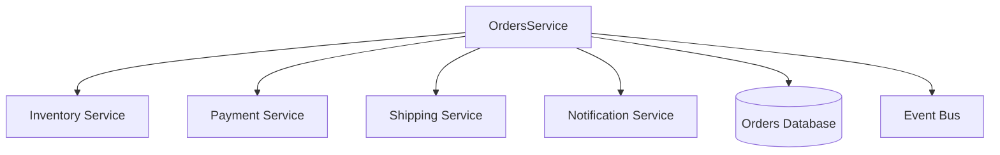

This runbook provides operational procedures for the OrdersService, which is responsible for managing the entire lifecycle of customer orders in the FlowMart e-commerce platform.


## Architecture

The OrdersService is responsible for:
- Creating and processing customer orders
- Tracking order status throughout fulfillment
- Coordinating with other services (Inventory, Payment, Shipping)
- Managing order history and amendments

### Service Dependencies



## Monitoring and Alerting

### Key Metrics

| Metric | Description | Warning Threshold | Critical Threshold |
|--------|-------------|-------------------|-------------------|
| `order_creation_rate` | Orders created per minute | < 5 | < 1 |
| `order_creation_latency` | Time to create an order | > 2s | > 5s |
| `order_error_rate` | Percentage of failed orders | > 1% | > 5% |
| `database_connection_pool` | Database connection pool utilization | > 70% | > 90% |
| `memory_usage` | Container memory usage | > 80% | > 90% |
| `cpu_usage` | Container CPU usage | > 70% | > 85% |

### Dashboards

- [OrdersService Overview](https://grafana.flowmart.com/d/orders-overview)
- [OrdersService API Metrics](https://grafana.flowmart.com/d/orders-api)
- [OrdersService Error Tracking](https://grafana.flowmart.com/d/orders-errors)

### Common Alerts

| Alert | Description | Troubleshooting Steps |
|-------|-------------|----------------------|
| `OrdersServiceHighLatency` | API latency exceeds thresholds | See [High Latency](#high-latency) |
| `OrdersServiceHighErrorRate` | Error rate exceeds thresholds | See [High Error Rate](#high-error-rate) |
| `OrdersServiceDatabaseConnectionIssues` | Database connection issues | See [Database Issues](#database-issues) |

## Troubleshooting Guides

### High Latency

If the service is experiencing high latency:

1. **Check system metrics**:
   ```bash
   kubectl top pods -n orders
   ```

2. **Check database metrics** in the MongoDB dashboard to identify slow queries.

3. **Check dependent services** to see if delays are caused by downstream systems:
   ```bash
   curl -X GET https://api.internal.flowmart.com/inventory/health
   curl -X GET https://api.internal.flowmart.com/payment/health
   ```

4. **Analyze recent changes** that might have impacted performance.

5. **Scale the service** if needed:
   ```bash
   kubectl scale deployment orders-service -n orders --replicas=5
   ```

### High Error Rate

If the service is experiencing a high error rate:

1. **Check application logs**:
   ```bash
   kubectl logs -l app=orders-service -n orders --tail=100
   ```

2. **Check for recent deployments** that might have introduced issues:
   ```bash
   kubectl rollout history deployment/orders-service -n orders
   ```

3. **Verify database connectivity**:
   ```bash
   kubectl exec -it $(kubectl get pods -l app=orders-service -n orders -o jsonpath='{.items[0].metadata.name}') -n orders -- node -e "const mongoose = require('mongoose'); mongoose.connect(process.env.MONGODB_URI).then(() => console.log('Connected!')).catch(err => console.error('Connection error', err));"
   ```

4. **Check dependent services** for failures:
   ```bash
   curl -X GET https://api.internal.flowmart.com/inventory/health
   curl -X GET https://api.internal.flowmart.com/payment/health
   ```

5. **Consider rolling back** if issues persist:
   ```bash
   kubectl rollout undo deployment/orders-service -n orders
   ```

### Database Issues

If there are database connection issues:

1. **Check MongoDB status**:
   ```bash
   kubectl exec -it $(kubectl get pods -l app=mongodb -n data -o jsonpath='{.items[0].metadata.name}') -n data -- mongo admin -u admin -p $MONGODB_PASSWORD --eval "db.serverStatus()"
   ```

2. **Verify network connectivity**:
   ```bash
   kubectl exec -it $(kubectl get pods -l app=orders-service -n orders -o jsonpath='{.items[0].metadata.name}') -n orders -- ping mongodb.data.svc.cluster.local
   ```

3. **Check MongoDB resource usage**:
   ```bash
   kubectl top pods -l app=mongodb -n data
   ```

4. **Review MongoDB logs**:
   ```bash
   kubectl logs -l app=mongodb -n data --tail=100
   ```

## Common Operational Tasks

### Scaling the Service

To scale the service horizontally:

```bash
kubectl scale deployment orders-service -n orders --replicas=<number>
```

### Restarting the Service

To restart all pods:

```bash
kubectl rollout restart deployment orders-service -n orders
```

### Viewing Recent Orders

To view recent orders in the database:

```bash
kubectl exec -it $(kubectl get pods -l app=orders-service -n orders -o jsonpath='{.items[0].metadata.name}') -n orders -- node -e "const mongoose = require('mongoose'); const Order = require('./models/order'); mongoose.connect(process.env.MONGODB_URI).then(async () => { const orders = await Order.find().sort({createdAt: -1}).limit(10); console.log(JSON.stringify(orders, null, 2)); process.exit(0); });"
```

### Manually Processing Stuck Orders

If orders are stuck in a particular state:

1. Identify stuck orders:
   ```bash
   kubectl exec -it $(kubectl get pods -l app=orders-service -n orders -o jsonpath='{.items[0].metadata.name}') -n orders -- node -e "const mongoose = require('mongoose'); const Order = require('./models/order'); mongoose.connect(process.env.MONGODB_URI).then(async () => { const stuckOrders = await Order.find({status: 'PROCESSING', updatedAt: {$lt: new Date(Date.now() - 30*60*1000)}}); console.log(JSON.stringify(stuckOrders, null, 2)); process.exit(0); });"
   ```

2. Manually trigger processing for a specific order:
   ```bash
   curl -X POST https://api.internal.flowmart.com/orders/process -H "Content-Type: application/json" -d '{"orderId": "ORDER_ID", "force": true}'
   ```

## Recovery Procedures

### Database Failure Recovery

If the MongoDB database becomes unavailable:

1. Verify the status of the MongoDB cluster:
   ```bash
   kubectl get pods -l app=mongodb -n data
   ```

2. If the primary node is down, initiate a manual failover if necessary:
   ```bash
   kubectl exec -it mongodb-0 -n data -- mongo admin -u admin -p $MONGODB_PASSWORD --eval "rs.stepDown()"
   ```

3. If the entire cluster is unavailable, create an incident and notify the Database Team.

4. Once database availability is restored, validate the OrdersService functionality:
   ```bash
   curl -X GET https://api.internal.flowmart.com/orders/health
   ```

### Event Bus Failure Recovery

If the Event Bus is unavailable:

1. The OrdersService implements the Circuit Breaker pattern and will queue messages locally.

2. When the Event Bus is restored, check the backlog of events:
   ```bash
   kubectl exec -it $(kubectl get pods -l app=orders-service -n orders -o jsonpath='{.items[0].metadata.name}') -n orders -- curl localhost:9090/metrics | grep event_queue
   ```

3. Manually trigger event processing if necessary:
   ```bash
   curl -X POST https://api.internal.flowmart.com/orders/admin/process-event-queue -H "Authorization: Bearer $ADMIN_TOKEN"
   ```

## Disaster Recovery

### Complete Service Failure

In case of a complete service failure:

1. Initiate incident response by notifying the on-call team through PagerDuty.

2. Check for region-wide AWS issues on the AWS Status page.

3. If necessary, trigger the DR plan to fail over to the secondary region:
   ```bash
   ./scripts/dr-failover.sh orders-service
   ```

4. Update Route53 DNS to point to the secondary region if global failover is needed:
   ```bash
   aws route53 change-resource-record-sets --hosted-zone-id $HOSTED_ZONE_ID --change-batch file://dr-dns-change.json
   ```

## Maintenance Tasks

### Deploying New Versions

```bash
kubectl set image deployment/orders-service -n orders orders-service=ecr.aws/flowmart/orders-service:$VERSION
```

### Database Maintenance

Scheduled database maintenance should be performed during off-peak hours:

1. Notify stakeholders through the #maintenance Slack channel.

2. Set OrdersService to maintenance mode:
   ```bash
   curl -X POST https://api.internal.flowmart.com/orders/admin/maintenance -H "Authorization: Bearer $ADMIN_TOKEN" -H "Content-Type: application/json" -d '{"maintenanceMode": true, "message": "Scheduled maintenance"}'
   ```

3. Perform database maintenance operations.

4. Turn off maintenance mode:
   ```bash
   curl -X POST https://api.internal.flowmart.com/orders/admin/maintenance -H "Authorization: Bearer $ADMIN_TOKEN" -H "Content-Type: application/json" -d '{"maintenanceMode": false}'
   ```

## Contact Information

**Primary On-Call:** Orders Team (rotating schedule)  
**Secondary On-Call:** Platform Team  
**Escalation Path:** Orders Team Lead > Engineering Manager > CTO

**Slack Channels:**
- #orders-support (primary support channel)
- #orders-alerts (automated alerts)
- #incident-response (for major incidents)

## Reference Information

- [OrdersService API Documentation](https://docs.internal.flowmart.com/orders/api)
- [Architecture Diagram](https://docs.internal.flowmart.com/architecture/orders)
- [Service Level Objectives (SLOs)](https://docs.internal.flowmart.com/slo/orders) 