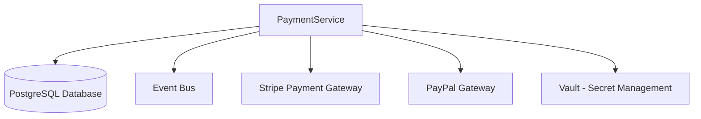

This runbook provides operational procedures for the PaymentService, which is responsible for processing payments, refunds, and managing financial transactions in the FlowMart e-commerce platform.

## Architecture

The PaymentService is responsible for:
- Processing customer payments
- Managing refunds and chargebacks
- Integrating with external payment gateways
- Storing payment transactions
- Handling subscription billing

### Service Dependencies



## Monitoring and Alerting

### Key Metrics

| Metric | Description | Warning Threshold | Critical Threshold |
|--------|-------------|-------------------|-------------------|
| `payment_processing_rate` | Payments processed per minute | < 5 | < 1 |
| `payment_success_rate` | Percentage of successful payments | < 95% | < 90% |
| `payment_processing_latency` | Time to process a payment | > 3s | > 8s |
| `refund_processing_latency` | Time to process a refund | > 5s | > 15s |
| `gateway_error_rate` | Payment gateway errors | > 2% | > 5% |
| `fraud_detection_latency` | Time for fraud checks | > 1s | > 3s |

### Dashboards

- [PaymentService Overview](https://grafana.flowmart.com/d/payment-overview)
- [Payment Gateway Status](https://grafana.flowmart.com/d/payment-gateways)
- [Transaction Success Rates](https://grafana.flowmart.com/d/payment-success-rates)

### Common Alerts

| Alert | Description | Troubleshooting Steps |
|-------|-------------|----------------------|
| `PaymentServiceHighErrorRate` | Payment failure rate above threshold | See [High Error Rate](#high-error-rate) |
| `PaymentServiceGatewayFailure` | Payment gateway connection issues | See [Gateway Issues](#payment-gateway-issues) |
| `PaymentServiceHighLatency` | Payment processing latency issues | See [High Latency](#high-latency) |
| `PaymentServiceDatabaseIssues` | Database connection issues | See [Database Issues](#database-issues) |

## Troubleshooting Guides

### High Error Rate

If the service is experiencing a high payment error rate:

1. **Check application logs** for error patterns:
   ```bash
   kubectl logs -l app=payment-service -n payment --tail=100
   ```

2. **Check payment gateway status** on their status pages:
   - [Stripe Status](https://status.stripe.com/)
   - [PayPal Status](https://status.paypal.com/)

3. **Check for patterns in failed transactions**:
   ```bash
   kubectl exec -it $(kubectl get pods -l app=payment-service -n payment -o jsonpath='{.items[0].metadata.name}') -n payment -- node scripts/query-failed-transactions.js --last-hour
   ```

4. **Check for recent deployments** that might have introduced issues:
   ```bash
   kubectl rollout history deployment/payment-service -n payment
   ```

5. **Verify if the issue is specific to a payment method** (credit card, PayPal, etc.):
   ```bash
   kubectl exec -it $(kubectl get pods -l app=payment-service -n payment -o jsonpath='{.items[0].metadata.name}') -n payment -- node scripts/payment-method-success-rates.js
   ```

### Payment Gateway Issues

If there are issues with payment gateways:

1. **Check gateway connectivity**:
   ```bash
   kubectl exec -it $(kubectl get pods -l app=payment-service -n payment -o jsonpath='{.items[0].metadata.name}') -n payment -- curl -o /dev/null -s -w "%{http_code}\n" https://api.stripe.com/v1/charges -H "Authorization: Bearer $STRIPE_TEST_KEY"
   ```

2. **Check payment gateway API keys** rotation status:
   ```bash
   kubectl exec -it $(kubectl get pods -l app=payment-service -n payment -o jsonpath='{.items[0].metadata.name}') -n payment -- node scripts/check-api-key-rotation.js
   ```

3. **Check gateway timeouts** in application logs:
   ```bash
   kubectl logs -l app=payment-service -n payment | grep "gateway timeout"
   ```

4. **Verify if the issue is isolated to a specific gateway**:
   ```bash
   kubectl exec -it $(kubectl get pods -l app=payment-service -n payment -o jsonpath='{.items[0].metadata.name}') -n payment -- node scripts/gateway-health-check.js
   ```

5. **Switch to backup payment gateway** if primary is down:
   ```bash
   kubectl exec -it $(kubectl get pods -l app=payment-service -n payment -o jsonpath='{.items[0].metadata.name}') -n payment -- curl -X POST localhost:3000/internal/api/payment/switch-gateway -H "Content-Type: application/json" -d '{"primaryGateway": "paypal", "reason": "Stripe outage"}'
   ```

### High Latency

If the service is experiencing high latency:

1. **Check system metrics**:
   ```bash
   kubectl top pods -n payment
   ```

2. **Check database connection pool**:
   ```bash
   kubectl exec -it $(kubectl get pods -l app=payment-service -n payment -o jsonpath='{.items[0].metadata.name}') -n payment -- node scripts/db-pool-stats.js
   ```

3. **Check slow queries** in the payment database:
   ```bash
   kubectl exec -it $(kubectl get pods -l app=postgresql -n data -o jsonpath='{.items[0].metadata.name}') -n data -- psql -U postgres -d payments -c "SELECT query, calls, mean_exec_time, max_exec_time FROM pg_stat_statements WHERE mean_exec_time > 100 ORDER BY mean_exec_time DESC LIMIT 10;"
   ```

4. **Check payment gateway response times**:
   ```bash
   kubectl exec -it $(kubectl get pods -l app=payment-service -n payment -o jsonpath='{.items[0].metadata.name}') -n payment -- node scripts/gateway-latency-check.js
   ```

5. **Scale the service** if needed:
   ```bash
   kubectl scale deployment payment-service -n payment --replicas=5
   ```

### Database Issues

If there are database issues:

1. **Check PostgreSQL status**:
   ```bash
   kubectl exec -it $(kubectl get pods -l app=postgresql -n data -o jsonpath='{.items[0].metadata.name}') -n data -- pg_isready -U postgres -d payments
   ```

2. **Check for long-running transactions**:
   ```bash
   kubectl exec -it $(kubectl get pods -l app=postgresql -n data -o jsonpath='{.items[0].metadata.name}') -n data -- psql -U postgres -d payments -c "SELECT pid, now() - xact_start AS duration, state, query FROM pg_stat_activity WHERE state != 'idle' ORDER BY duration DESC LIMIT 10;"
   ```

3. **Check for database locks**:
   ```bash
   kubectl exec -it $(kubectl get pods -l app=postgresql -n data -o jsonpath='{.items[0].metadata.name}') -n data -- psql -U postgres -d payments -c "SELECT relation::regclass, mode, pid, granted FROM pg_locks l JOIN pg_stat_activity a ON l.pid = a.pid WHERE relation = 'payments.transactions'::regclass;"
   ```

4. **Restart database connections** if needed:
   ```bash
   kubectl exec -it $(kubectl get pods -l app=payment-service -n payment -o jsonpath='{.items[0].metadata.name}') -n payment -- curl -X POST localhost:3000/internal/api/system/refresh-db-connections
   ```

## Common Operational Tasks

### Managing API Keys

#### Rotating Payment Gateway API Keys

1. **Generate new API keys** in the payment gateway admin portal.

2. **Store the new keys** in AWS Secrets Manager:
   ```bash
   aws secretsmanager update-secret --secret-id flowmart/payment/stripe-api-key --secret-string '{"api_key": "sk_live_NEW_KEY", "webhook_secret": "whsec_NEW_SECRET"}'
   ```

3. **Trigger key rotation** in the service:
   ```bash
   kubectl exec -it $(kubectl get pods -l app=payment-service -n payment -o jsonpath='{.items[0].metadata.name}') -n payment -- curl -X POST localhost:3000/internal/api/system/reload-api-keys
   ```

4. **Verify the new keys are active**:
   ```bash
   kubectl exec -it $(kubectl get pods -l app=payment-service -n payment -o jsonpath='{.items[0].metadata.name}') -n payment -- node scripts/verify-api-keys.js
   ```

### Managing Refunds

#### Processing Manual Refunds

For special cases requiring manual intervention:

```bash
curl -X POST https://api.internal.flowmart.com/payment/transactions/{transactionId}/refund \
  -H "Authorization: Bearer $ADMIN_TOKEN" \
  -H "Content-Type: application/json" \
  -d '{"amount": 1999, "reason": "Customer service request", "refundToOriginalMethod": true}'
```

#### Finding Failed Refunds

To identify and retry failed refunds:

```bash
kubectl exec -it $(kubectl get pods -l app=payment-service -n payment -o jsonpath='{.items[0].metadata.name}') -n payment -- node scripts/list-failed-refunds.js --last-24h
```

### Handling Chargebacks

To record and process a new chargeback:

```bash
curl -X POST https://api.internal.flowmart.com/payment/transactions/{transactionId}/chargeback \
  -H "Authorization: Bearer $ADMIN_TOKEN" \
  -H "Content-Type: application/json" \
  -d '{"chargebackReference": "CB12345", "amount": 1999, "reason": "Unauthorized transaction"}'
```

### Payment Reconciliation

To trigger payment reconciliation with payment gateway:

```bash
kubectl exec -it $(kubectl get pods -l app=payment-service -n payment -o jsonpath='{.items[0].metadata.name}') -n payment -- node scripts/reconcile-payments.js --gateway=stripe --date=2023-05-15
```

## Recovery Procedures

### Failed Transactions Recovery

If transactions are stuck or failed:

1. **Identify stuck transactions**:
   ```bash
   kubectl exec -it $(kubectl get pods -l app=payment-service -n payment -o jsonpath='{.items[0].metadata.name}') -n payment -- node scripts/find-stuck-transactions.js
   ```

2. **Check transaction status** with the payment gateway:
   ```bash
   kubectl exec -it $(kubectl get pods -l app=payment-service -n payment -o jsonpath='{.items[0].metadata.name}') -n payment -- node scripts/check-gateway-transaction.js --transaction-id=TXN123456
   ```

3. **Resolve transactions** that completed at gateway but failed in our system:
   ```bash
   kubectl exec -it $(kubectl get pods -l app=payment-service -n payment -o jsonpath='{.items[0].metadata.name}') -n payment -- node scripts/resolve-stuck-transaction.js --transaction-id=TXN123456 --status=completed
   ```

### Payment Gateway Failure Recovery

If a payment gateway is unavailable:

1. **Enable fallback gateway** mode:
   ```bash
   kubectl exec -it $(kubectl get pods -l app=payment-service -n payment -o jsonpath='{.items[0].metadata.name}') -n payment -- curl -X POST localhost:3000/internal/api/system/enable-fallback-gateway
   ```

2. **Monitor gateway status** for recovery:
   ```bash
   kubectl exec -it $(kubectl get pods -l app=payment-service -n payment -o jsonpath='{.items[0].metadata.name}') -n payment -- node scripts/monitor-gateway-health.js --gateway=stripe
   ```

3. **Disable fallback mode** once the primary gateway is restored:
   ```bash
   kubectl exec -it $(kubectl get pods -l app=payment-service -n payment -o jsonpath='{.items[0].metadata.name}') -n payment -- curl -X POST localhost:3000/internal/api/system/disable-fallback-gateway
   ```

### Database Failure Recovery

If the PostgreSQL database becomes unavailable:

1. Verify the status of the PostgreSQL cluster:
   ```bash
   kubectl get pods -l app=postgresql -n data
   ```

2. Check if automatic failover has occurred:
   ```bash
   kubectl exec -it $(kubectl get pods -l app=postgresql-patroni -n data -o jsonpath='{.items[0].metadata.name}') -n data -- patronictl list
   ```

3. Once database availability is restored, validate the PaymentService functionality:
   ```bash
   curl -X GET https://api.internal.flowmart.com/payment/health
   ```

## Disaster Recovery

### Complete Service Failure

In case of a complete service failure:

1. Initiate incident response by notifying the on-call team through PagerDuty.

2. If necessary, deploy to the disaster recovery environment:
   ```bash
   ./scripts/dr-failover.sh payment-service
   ```

3. Update DNS records to point to the DR environment:
   ```bash
   aws route53 change-resource-record-sets --hosted-zone-id $HOSTED_ZONE_ID --change-batch file://dr-dns-change.json
   ```

4. Enable simplified payment flow (if necessary):
   ```bash
   kubectl exec -it $(kubectl get pods -l app=payment-service -n payment -o jsonpath='{.items[0].metadata.name}') -n payment -- curl -X POST localhost:3000/internal/api/system/enable-simplified-flow
   ```

5. Regularly check primary environment recovery status.

## Maintenance Tasks

### Deploying New Versions

```bash
kubectl set image deployment/payment-service -n payment payment-service=ecr.aws/flowmart/payment-service:$VERSION
```

### Database Migrations

For database schema updates:

1. Notify stakeholders through the #maintenance Slack channel.

2. Create a migration plan and backup the database:
   ```bash
   kubectl exec -it $(kubectl get pods -l app=postgresql -n data -o jsonpath='{.items[0].metadata.name}') -n data -- pg_dump -U postgres -d payments > payments_backup_$(date +%Y%m%d).sql
   ```

3. Apply database migrations:
   ```bash
   kubectl apply -f payment-migration-job.yaml
   ```

4. Verify migration completion:
   ```bash
   kubectl logs -l job-name=payment-db-migration -n payment
   ```

### Compliance and Auditing

To generate PCI compliance reports:

```bash
kubectl exec -it $(kubectl get pods -l app=payment-service -n payment -o jsonpath='{.items[0].metadata.name}') -n payment -- node scripts/generate-pci-audit-report.js --month=2023-05
```

## Contact Information

**Primary On-Call:** Payments Team (rotating schedule)  
**Secondary On-Call:** Platform Team  
**Escalation Path:** Payments Team Lead > Engineering Manager > CTO

**Slack Channels:**
- #payments-support (primary support channel)
- #payments-alerts (automated alerts)
- #incident-response (for major incidents)

**External Contacts:**
- Stripe Support: support@stripe.com, 1-888-555-1234
- PayPal Support: merchant-support@paypal.com, 1-888-555-5678

## Reference Information

- [PaymentService API Documentation](https://docs.internal.flowmart.com/payment/api)
- [Architecture Diagram](https://docs.internal.flowmart.com/architecture/payment)
- [Service Level Objectives (SLOs)](https://docs.internal.flowmart.com/slo/payment)
- [PCI Compliance Documentation](https://docs.internal.flowmart.com/security/payment-pci)
- [Payment Gateway Integration Guides](https://docs.internal.flowmart.com/payment/gateway-integration) 