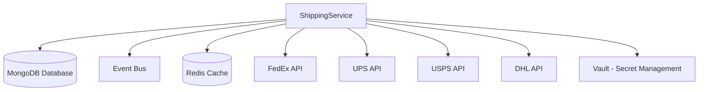

This runbook provides operational procedures for the ShippingService, which is responsible for managing shipping options, carrier integration, and delivery tracking in the FlowMart e-commerce platform.


## Architecture

The ShippingService is responsible for:
- Calculating shipping costs and delivery estimates
- Managing shipping carriers and integration
- Generating shipping labels
- Tracking shipments
- Handling delivery exceptions and returns

### Service Dependencies



## Monitoring and Alerting

### Key Metrics

| Metric | Description | Warning Threshold | Critical Threshold |
|--------|-------------|-------------------|-------------------|
| `shipping_rate_calculation_rate` | Rate calculations per minute | < 10 | < 2 |
| `shipping_label_generation_success` | Label generation success % | < 98% | < 95% |
| `carrier_api_response_time` | Carrier API response time | > 2s | > 5s |
| `carrier_api_error_rate` | Carrier API errors % | > 2% | > 5% |
| `tracking_update_processing_rate` | Tracking updates processed per minute | < 50 | < 10 |
| `shipment_tracking_lag` | Delay in tracking information | > 15m | > 1h |

### Dashboards

- [Shipping Service Overview](https://grafana.flowmart.com/d/shipping-overview)
- [Carrier API Status](https://grafana.flowmart.com/d/shipping-carriers)
- [Delivery Performance](https://grafana.flowmart.com/d/shipping-delivery-performance)

### Common Alerts

| Alert | Description | Troubleshooting Steps |
|-------|-------------|----------------------|
| `ShippingServiceHighErrorRate` | Shipping API error rate above threshold | See [High Error Rate](#high-error-rate) |
| `ShippingCarrierAPIDown` | Carrier API connection issues | See [Carrier API Issues](#carrier-api-issues) |
| `ShippingServiceHighLatency` | Shipping service latency issues | See [High Latency](#high-latency) |
| `ShippingServiceDatabaseIssues` | Database connection issues | See [Database Issues](#database-issues) |

## Troubleshooting Guides

### High Error Rate

If the service is experiencing a high error rate:

1. **Check application logs** for error patterns:
   ```bash
   kubectl logs -l app=shipping-service -n shipping --tail=100
   ```

2. **Check specific error types**:
   ```bash
   kubectl exec -it $(kubectl get pods -l app=shipping-service -n shipping -o jsonpath='{.items[0].metadata.name}') -n shipping -- java -jar /app/tools/error-analyzer.jar --last-hour
   ```

3. **Check for patterns in failed shipments**:
   ```bash
   kubectl exec -it $(kubectl get pods -l app=shipping-service -n shipping -o jsonpath='{.items[0].metadata.name}') -n shipping -- java -jar /app/tools/failed-shipments-analyzer.jar
   ```

4. **Check for recent deployments** that might have introduced issues:
   ```bash
   kubectl rollout history deployment/shipping-service -n shipping
   ```

5. **Verify if the issue is specific to a carrier** (FedEx, UPS, etc.):
   ```bash
   kubectl exec -it $(kubectl get pods -l app=shipping-service -n shipping -o jsonpath='{.items[0].metadata.name}') -n shipping -- java -jar /app/tools/carrier-success-rates.jar
   ```

### Carrier API Issues

If there are issues with carrier APIs:

1. **Check carrier API connectivity**:
   ```bash
   kubectl exec -it $(kubectl get pods -l app=shipping-service -n shipping -o jsonpath='{.items[0].metadata.name}') -n shipping -- java -jar /app/tools/carrier-health-check.jar
   ```

2. **Check carrier API credentials** and rotation status:
   ```bash
   kubectl exec -it $(kubectl get pods -l app=shipping-service -n shipping -o jsonpath='{.items[0].metadata.name}') -n shipping -- java -jar /app/tools/check-carrier-credentials.jar
   ```

3. **Check carrier status pages** for announced outages:
   - [FedEx Status](https://www.fedex.com/en-us/service-alerts.html)
   - [UPS Status](https://www.ups.com/service-alerts)
   - [USPS Status](https://about.usps.com/newsroom/service-alerts/)

4. **Check carrier timeouts** in application logs:
   ```bash
   kubectl logs -l app=shipping-service -n shipping | grep "carrier timeout"
   ```

5. **Enable fallback shipping carrier**:
   ```bash
   kubectl exec -it $(kubectl get pods -l app=shipping-service -n shipping -o jsonpath='{.items[0].metadata.name}') -n shipping -- curl -X POST localhost:8080/internal/api/shipping/enable-fallback-carrier -H "Content-Type: application/json" -d '{"primaryCarrier": "fedex", "fallbackCarrier": "ups", "reason": "FedEx API outage"}'
   ```

### High Latency

If the service is experiencing high latency:

1. **Check system metrics**:
   ```bash
   kubectl top pods -n shipping
   ```

2. **Check JVM memory and GC metrics**:
   ```bash
   kubectl exec -it $(kubectl get pods -l app=shipping-service -n shipping -o jsonpath='{.items[0].metadata.name}') -n shipping -- java -jar /app/tools/jvm-metrics.jar
   ```

3. **Check MongoDB performance**:
   ```bash
   kubectl exec -it $(kubectl get pods -l app=mongodb -n data -o jsonpath='{.items[0].metadata.name}') -n data -- mongo --eval "db.currentOp()"
   ```

4. **Check carrier API response times**:
   ```bash
   kubectl exec -it $(kubectl get pods -l app=shipping-service -n shipping -o jsonpath='{.items[0].metadata.name}') -n shipping -- java -jar /app/tools/carrier-response-times.jar
   ```

5. **Scale the service** if needed:
   ```bash
   kubectl scale deployment shipping-service -n shipping --replicas=5
   ```

### Database Issues

If there are MongoDB issues:

1. **Check MongoDB status**:
   ```bash
   kubectl exec -it $(kubectl get pods -l app=mongodb -n data -o jsonpath='{.items[0].metadata.name}') -n data -- mongo --eval "rs.status()"
   ```

2. **Check for slow queries**:
   ```bash
   kubectl exec -it $(kubectl get pods -l app=mongodb -n data -o jsonpath='{.items[0].metadata.name}') -n data -- mongo --eval "db.currentOp({ 'active': true, 'secs_running': { '$gt': 5 } })"
   ```

3. **Check database connection pool**:
   ```bash
   kubectl exec -it $(kubectl get pods -l app=shipping-service -n shipping -o jsonpath='{.items[0].metadata.name}') -n shipping -- java -jar /app/tools/db-pool-stats.jar
   ```

4. **Restart database connections** if needed:
   ```bash
   kubectl exec -it $(kubectl get pods -l app=shipping-service -n shipping -o jsonpath='{.items[0].metadata.name}') -n shipping -- curl -X POST localhost:8080/internal/api/system/refresh-db-connections
   ```

## Common Operational Tasks

### Managing Carrier API Credentials

#### Rotating Carrier API Keys

1. **Generate new API keys** in the carrier portal:
   - FedEx Developer Portal: [https://developer.fedex.com](https://developer.fedex.com)
   - UPS Developer Portal: [https://developer.ups.com](https://developer.ups.com)
   - USPS Web Tools: [https://www.usps.com/business/web-tools-apis](https://www.usps.com/business/web-tools-apis)

2. **Store the new keys** in AWS Secrets Manager:
   ```bash
   aws secretsmanager update-secret --secret-id flowmart/shipping/fedex-api-key --secret-string '{"api_key": "NEW_KEY", "password": "NEW_PASSWORD", "account_number": "ACCOUNT_NUMBER"}'
   ```

3. **Trigger key rotation** in the service:
   ```bash
   kubectl exec -it $(kubectl get pods -l app=shipping-service -n shipping -o jsonpath='{.items[0].metadata.name}') -n shipping -- curl -X POST localhost:8080/internal/api/system/reload-carrier-credentials
   ```

4. **Verify the new keys are working** by testing label generation:
   ```bash
   kubectl exec -it $(kubectl get pods -l app=shipping-service -n shipping -o jsonpath='{.items[0].metadata.name}') -n shipping -- java -jar /app/tools/test-label-generation.jar --carrier=fedex
   ```

### Managing Shipping Rates

#### Updating Shipping Rate Tables

When carrier rates change:

1. **Prepare the new rate table** in the required JSON format.

2. **Upload the rate table** to S3:
   ```bash
   aws s3 cp new-fedex-rates.json s3://flowmart-configs/shipping/rates/
   ```

3. **Trigger rate table reload**:
   ```bash
   kubectl exec -it $(kubectl get pods -l app=shipping-service -n shipping -o jsonpath='{.items[0].metadata.name}') -n shipping -- curl -X POST localhost:8080/internal/api/shipping/reload-rate-tables -H "Content-Type: application/json" -d '{"carrier": "fedex"}'
   ```

4. **Verify rate calculations** with test scenarios:
   ```bash
   kubectl exec -it $(kubectl get pods -l app=shipping-service -n shipping -o jsonpath='{.items[0].metadata.name}') -n shipping -- java -jar /app/tools/test-rate-calculation.jar
   ```

### Shipping Label Generation Troubleshooting

#### Debugging Failed Label Generation

If labels are failing to generate:

```bash
# Find recent failed label generation attempts
kubectl exec -it $(kubectl get pods -l app=shipping-service -n shipping -o jsonpath='{.items[0].metadata.name}') -n shipping -- java -jar /app/tools/find-failed-labels.jar --hours=2

# Get detailed error for a specific shipment
kubectl exec -it $(kubectl get pods -l app=shipping-service -n shipping -o jsonpath='{.items[0].metadata.name}') -n shipping -- java -jar /app/tools/label-error-details.jar --shipment-id=SHIP123456
```

#### Manual Label Generation

For special cases requiring manual intervention:

```bash
curl -X POST https://api.internal.flowmart.com/shipping/shipments/{shipmentId}/generate-label \
  -H "Authorization: Bearer $ADMIN_TOKEN" \
  -H "Content-Type: application/json" \
  -d '{"carrier": "fedex", "service": "PRIORITY_OVERNIGHT", "forceGeneration": true}'
```

### Tracking Updates

#### Triggering Manual Tracking Updates

To manually trigger tracking updates:

```bash
kubectl exec -it $(kubectl get pods -l app=shipping-service -n shipping -o jsonpath='{.items[0].metadata.name}') -n shipping -- java -jar /app/tools/sync-tracking.jar --shipment-id=SHIP123456

# For bulk tracking updates
kubectl exec -it $(kubectl get pods -l app=shipping-service -n shipping -o jsonpath='{.items[0].metadata.name}') -n shipping -- java -jar /app/tools/sync-tracking.jar --status=in_transit --hours=24
```

#### Tracking Webhook Troubleshooting

If tracking webhooks from carriers are failing:

```bash
# Check recent webhook failures
kubectl logs -l app=shipping-webhook-service -n shipping | grep "Webhook failure"

# Replay failed webhooks
kubectl exec -it $(kubectl get pods -l app=shipping-webhook-service -n shipping -o jsonpath='{.items[0].metadata.name}') -n shipping -- java -jar /app/tools/replay-webhooks.jar --hours=2
```

## Recovery Procedures

### Failed Shipment Recovery

If shipments are stuck or failed:

1. **Identify stuck shipments**:
   ```bash
   kubectl exec -it $(kubectl get pods -l app=shipping-service -n shipping -o jsonpath='{.items[0].metadata.name}') -n shipping -- java -jar /app/tools/find-stuck-shipments.jar
   ```

2. **Check shipment status** with the carrier:
   ```bash
   kubectl exec -it $(kubectl get pods -l app=shipping-service -n shipping -o jsonpath='{.items[0].metadata.name}') -n shipping -- java -jar /app/tools/check-carrier-shipment.jar --shipment-id=SHIP123456
   ```

3. **Resolve shipments** that completed at carrier but failed in our system:
   ```bash
   kubectl exec -it $(kubectl get pods -l app=shipping-service -n shipping -o jsonpath='{.items[0].metadata.name}') -n shipping -- java -jar /app/tools/resolve-shipment.jar --shipment-id=SHIP123456 --tracking-number=1Z999AA10123456784 --status=label_created
   ```

### Carrier API Failure Recovery

If a carrier API is unavailable:

1. **Enable automatic carrier fallback**:
   ```bash
   kubectl exec -it $(kubectl get pods -l app=shipping-service -n shipping -o jsonpath='{.items[0].metadata.name}') -n shipping -- curl -X POST localhost:8080/internal/api/system/enable-carrier-fallback
   ```

2. **Monitor carrier API status** for recovery:
   ```bash
   kubectl exec -it $(kubectl get pods -l app=shipping-service -n shipping -o jsonpath='{.items[0].metadata.name}') -n shipping -- java -jar /app/tools/monitor-carrier-health.jar --carrier=fedex
   ```

3. **Switch back to primary carrier** once it's restored:
   ```bash
   kubectl exec -it $(kubectl get pods -l app=shipping-service -n shipping -o jsonpath='{.items[0].metadata.name}') -n shipping -- curl -X POST localhost:8080/internal/api/system/disable-carrier-fallback
   ```

### Database Failure Recovery

If the MongoDB database becomes unavailable:

1. **Verify the status of the MongoDB cluster**:
   ```bash
   kubectl get pods -l app=mongodb -n data
   ```

2. **Check if automatic failover has occurred**:
   ```bash
   kubectl exec -it $(kubectl get pods -l app=mongodb -n data -o jsonpath='{.items[0].metadata.name}') -n data -- mongo --eval "rs.status()"
   ```

3. **Once database availability is restored, validate ShippingService functionality**:
   ```bash
   curl -X GET https://api.internal.flowmart.com/shipping/health
   ```

## Disaster Recovery

### Complete Service Failure

In case of a complete service failure:

1. **Initiate incident response** by notifying the on-call team through PagerDuty.

2. **Deploy to the disaster recovery environment** if necessary:
   ```bash
   ./scripts/dr-failover.sh shipping-service
   ```

3. **Update DNS records** to point to the DR environment:
   ```bash
   aws route53 change-resource-record-sets --hosted-zone-id $HOSTED_ZONE_ID --change-batch file://dr-dns-change.json
   ```

4. **Enable simplified shipping flow** (if necessary):
   ```bash
   kubectl exec -it $(kubectl get pods -l app=shipping-service -n shipping -o jsonpath='{.items[0].metadata.name}') -n shipping -- curl -X POST localhost:8080/internal/api/system/enable-simplified-flow
   ```

5. **Regularly check primary environment recovery status**.

## Maintenance Tasks

### Deploying New Versions

```bash
kubectl set image deployment/shipping-service -n shipping shipping-service=ecr.aws/flowmart/shipping-service:$VERSION
```

### Database Maintenance

#### MongoDB Index Maintenance

Periodically verify and optimize MongoDB indexes:

```bash
# Check current indexes
kubectl exec -it $(kubectl get pods -l app=mongodb -n data -o jsonpath='{.items[0].metadata.name}') -n data -- mongo --eval "db.shipments.getIndexes()"

# Add new index (example)
kubectl exec -it $(kubectl get pods -l app=mongodb -n data -o jsonpath='{.items[0].metadata.name}') -n data -- mongo --eval "db.shipments.createIndex({carrier: 1, status: 1, createdAt: -1})"
```

#### Database Backups

Verify scheduled MongoDB backups:

```bash
# Check recent backups
aws s3 ls s3://flowmart-mongodb-backups/shipping/ --human-readable

# Trigger manual backup if needed
kubectl apply -f shipping-db-backup-job.yaml
```

### Carrier Integration Updates

When a carrier updates their API:

1. **Test the API changes** in the staging environment:
   ```bash
   kubectl exec -it $(kubectl get pods -l app=shipping-service-staging -n shipping-staging -o jsonpath='{.items[0].metadata.name}') -n shipping-staging -- java -jar /app/tools/test-carrier-integration.jar --carrier=fedex --mode=new
   ```

2. **Update integration configuration** if needed:
   ```bash
   kubectl apply -f updated-fedex-integration-config.yaml
   ```

3. **Validate the updated integration**:
   ```bash
   kubectl exec -it $(kubectl get pods -l app=shipping-service -n shipping -o jsonpath='{.items[0].metadata.name}') -n shipping -- java -jar /app/tools/validate-carrier-integration.jar --carrier=fedex
   ```

## Contact Information

**Primary On-Call:** Logistics Team (rotating schedule)  
**Secondary On-Call:** Platform Team  
**Escalation Path:** Logistics Team Lead > Engineering Manager > CTO

**Slack Channels:**
- #shipping-support (primary support channel)
- #shipping-alerts (automated alerts)
- #incident-response (for major incidents)

**External Contacts:**
- FedEx API Support: apisupport@fedex.com, 1-800-555-1234
- UPS Developer Support: developer@ups.com, 1-800-555-5678
- USPS Web Tools Support: uspstechsupport@usps.gov, 1-800-555-9012

## Reference Information

- [ShippingService API Documentation](https://docs.internal.flowmart.com/shipping/api)
- [Architecture Diagram](https://docs.internal.flowmart.com/architecture/shipping)
- [Service Level Objectives (SLOs)](https://docs.internal.flowmart.com/slo/shipping)
- [Carrier Integration Guides](https://docs.internal.flowmart.com/shipping/carrier-integration)
- [Rate Calculation Documentation](https://docs.internal.flowmart.com/shipping/rate-calculation) 