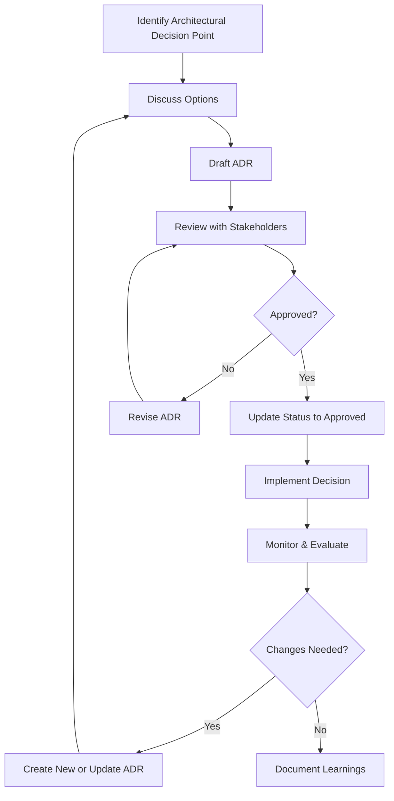

## What is an Architecture Decision Record (ADR)?

<Tiles columns={2}>
    <Tile icon="CommandLineIcon" iconColor="black" href="/docs" title="Explore examples on GitHub" description="Delve into our documentation for more insights." />
    <Tile icon="UsersIcon" iconColor="black" href="/docs" title="Request a review" description="Request a review from the team. Reviews for ADRs are from the design authority, and can take a week." />
</Tiles>

Architecture Decision Records (ADRs) are documents that capture important architectural decisions made during the development of a software system. Each ADR describes a choice the team has made, the context in which it was made, and the consequences of that choice.

## Why ADRs are Important

:::tip
Use this template to create your own ADRs. Once you read this page you can submit new ADRs to the [Architecture Decision Records](https://github.com/eventcatalog/eventcatalog/issues/new?assignees=&labels=architecture&template=architecture-decision-record.mdx&title=ADR%3A+) repository.
:::

ADRs help teams:
- Document decisions for future reference
- Communicate architectural choices across the organization
- Onboard new team members by providing insight into past decisions
- Track the evolution of the system architecture over time
- Establish a process for making and documenting significant technical decisions

## ADR Format

Our ADRs follow this structure:
- **Title**: A descriptive name for the decision
- **Status**: Current status (Proposed, Accepted, Superseded, etc.)
- **Context**: The factors that influenced the decision
- **Decision**: The choice that was made
- **Consequences**: The resulting outcomes, both positive and negative
- **Compliance Requirements**: Any regulatory or policy requirements that must be met
- **Implementation Details**: How and when the decision will be implemented
- **Alternatives**: Other options that were considered
- **References**: Resources that support or provide more information
- **Decision History**: The record of changes to the ADR

