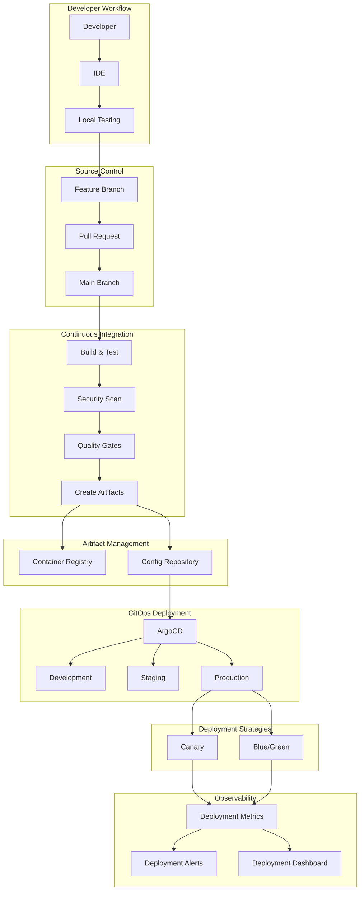
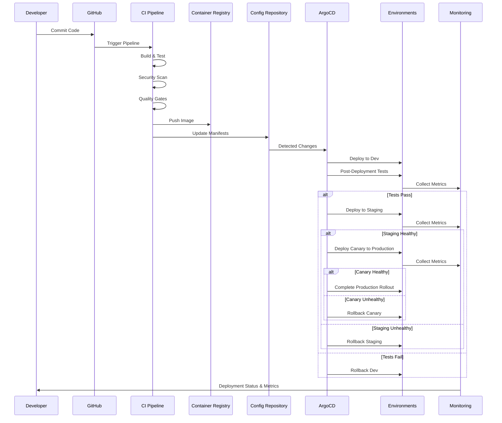
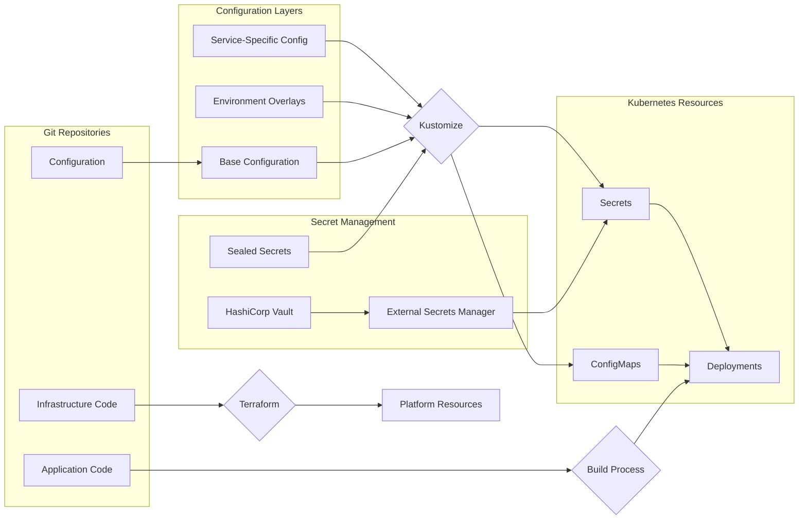

# DRAFT - NOT YET APPROVED

:::warning
This is a draft ADR. It is not yet approved and should not be used as a reference.
:::

## ADR-008: CI/CD and Deployment Strategy for FlowMart E-commerce Platform

### Status

Draft (Last Updated: 2024-10-05)

### Context

As we transition to a microservices architecture with dozens of independently deployable services, our current deployment approach presents several challenges:

1. **Manual Deployment Processes**: Deployments are largely manual, requiring significant coordination and causing deployment anxiety.

2. **Environment Inconsistency**: Configuration differences between environments lead to environment-specific bugs and "works on my machine" issues.

3. **Long Lead Times**: The process from code commit to production deployment takes days or weeks due to manual testing and approval gates.

4. **Deployment Coupling**: Services must be deployed together in coordinated releases, slowing down the delivery of all features.

5. **Limited Testing Automation**: Insufficient automated testing leads to quality issues discovered late in the delivery process.

6. **Configuration Management**: Configuration is managed inconsistently across environments and services.

7. **Deployment Visibility**: Limited visibility into deployment status, history, and metrics.

8. **Rollback Challenges**: Rolling back problematic deployments is difficult and error-prone.

Our current approach does not support the rapid, independent delivery of microservices that is essential for our new architecture. We need a comprehensive CI/CD and deployment strategy that enables teams to deliver high-quality services with velocity and confidence.

### Decision

We will implement a **GitOps-based CI/CD and deployment strategy** with **continuous deployment to production** for our microservices architecture. Key aspects of this strategy include:

1. **Trunk-Based Development Model**:
   - Short-lived feature branches merged frequently to main/trunk
   - Feature toggles for in-progress work
   - Automated code quality checks and linting on pull requests
   - Main branch always deployable

2. **Continuous Integration Pipeline**:
   - Automated builds triggered on every commit
   - Comprehensive automated testing suite
   - Security scanning (SAST, SCA, secrets scanning)
   - Container image building and signing
   - Test environments provisioned on demand for PR validation

3. **GitOps Deployment Approach**:
   - Declarative infrastructure and application configuration in Git
   - ArgoCD as primary GitOps operator
   - Environment-specific configuration via Kustomize overlays
   - Git as single source of truth for deployed state
   - Automatic drift detection and remediation

4. **Deployment Progression Strategy**:
   - Automated deployments through dev and test environments
   - Production deployments with optional approval (human in the loop)
   - Environment promotion rather than rebuilding artifacts
   - Canary deployments for high-risk services
   - Blue/green deployments for critical components

5. **Configuration Management**:
   - Externalized configuration in Git repositories
   - Kubernetes ConfigMaps and Secrets for application configuration
   - Sealed Secrets for sensitive information
   - HashiCorp Vault for secrets rotation and dynamic credentials
   - Environment-specific configuration via layered overlays

6. **Deployment Safety Mechanisms**:
   - Progressive delivery with canary deployments
   - Automated pre-deployment validation
   - Automated post-deployment testing
   - Automated rollback on failure
   - Circuit breakers for dependent services

7. **Release Coordination**:
   - API versioning and backwards compatibility requirements
   - Service-level dependency management
   - Deployment sequencing for interdependent services
   - Deployment windows for critical services

8. **Deployment Metrics and Observability**:
   - Deployment frequency tracking
   - Change lead time measurement
   - Mean time to recovery monitoring
   - Change failure rate tracking
   - Deployment health dashboards

### Technology Stack

| Component | Primary Technology | Alternative/Backup | Purpose |
|-----------|-------------------|-------------------|---------|
| Source Control | GitHub | GitLab | Version control and collaboration |
| CI Pipeline | GitHub Actions | Jenkins | Build, test, and validation |
| Artifact Registry | AWS ECR | GitHub Packages | Container image storage |
| GitOps Operator | ArgoCD | Flux | Kubernetes-based deployment automation |
| Secrets Management | Sealed Secrets + Vault | AWS Secrets Manager | Secure configuration management |
| Deployment Orchestration | ArgoCD + Argo Rollouts | Spinnaker | Controlled deployment progression |
| Feature Flags | LaunchDarkly | Flagsmith | Runtime feature enablement/disablement |
| Testing Framework | Jest, Cypress, k6 | Various | Automated testing across layers |
| Deployment Monitoring | Prometheus + Grafana | Datadog | Deployment metrics and alerting |

### Consequences

#### Positive

1. **Accelerated Delivery**: Reduced lead time from commit to production deployment.

2. **Improved Quality**: Comprehensive automated testing and validation.

3. **Increased Deployment Frequency**: Teams can deploy independently at their own pace.

4. **Enhanced Reliability**: Consistent, repeatable deployment processes with automated rollbacks.

5. **Better Visibility**: Clear audit trail and status of all deployments.

6. **Reduced Coordination Overhead**: Less need for cross-team deployment coordination.

7. **Improved Developer Experience**: Self-service deployments with rapid feedback.

8. **Environment Consistency**: Reproducible environments with minimal drift.

#### Negative

1. **Learning Curve**: Teams need to adapt to new tools and processes.

2. **Initial Setup Complexity**: Significant effort to establish the complete CI/CD pipeline.

3. **Infrastructure Requirements**: Additional infrastructure to support the CI/CD toolchain.

4. **Potential Deployment Sprawl**: Multiple services deploying independently can create coordination challenges.

5. **Testing Complexity**: Comprehensive testing across distributed services is challenging.

6. **Feature Flag Management**: Complexity of managing feature flags across services.

7. **Observability Requirements**: Need for sophisticated monitoring to detect deployment issues.

### Mitigation Strategies

1. **Platform Team Support**:
   - Create a dedicated platform engineering team focused on CI/CD
   - Provide standardized pipeline templates and documentation
   - Enable self-service capabilities with guardrails

2. **Phased Implementation**:
   - Start with less critical services
   - Gradually increase automation and reduce manual gates
   - Measure and demonstrate improved outcomes

3. **Developer Enablement**:
   - Comprehensive documentation and examples
   - Regular training sessions and office hours
   - Inner-source model for pipeline improvements

4. **Testing Strategy**:
   - Standard test libraries and frameworks
   - Service virtualization for dependencies
   - Comprehensive end-to-end testing strategy

5. **Change Management**:
   - Clear communication about process changes
   - Regular retrospectives and continuous improvement
   - Celebrate success stories and share lessons learned

### Implementation Details

#### Phase 1: Foundation (Q4 2024)

1. Establish CI pipeline standardization
2. Implement container build and security scanning
3. Set up artifact repositories and image signing
4. Deploy ArgoCD and initial GitOps workflows
5. Implement trunk-based development practices

#### Phase 2: Advanced Delivery (Q1 2025)

1. Enable canary and blue/green deployments
2. Implement comprehensive automated testing
3. Set up feature flag management
4. Deploy secrets management solution
5. Create deployment metrics dashboards

#### Phase 3: Continuous Deployment (Q2 2025)

1. Implement continuous deployment to production
2. Enable automated rollbacks and circuit breakers
3. Set up deployment SLOs and monitoring
4. Implement sophisticated deployment strategies
5. Optimize deployment performance and efficiency

### Deployment Process Flow

The following outlines our target deployment process flow from code commit to production:

1. **Code Commit & PR**:
   - Developer creates branch and commits changes
   - Pull request created with automated linting and checks
   - CI pipeline validates build, tests, and security

2. **CI Verification**:
   - Automated unit and integration tests
   - Security scanning (SAST, SCA, container scanning)
   - Code quality metrics and coverage checks
   - On-demand test environment provisioning

3. **Artifact Creation**:
   - Container images built and tagged
   - Images signed and pushed to registry
   - Deployment manifests generated
   - Configuration updates prepared

4. **Development Deployment**:
   - Automatic deployment to development environment
   - Post-deployment testing and validation
   - Integration testing with other services
   - Performance and security validation

5. **Staging Deployment**:
   - Promotion of verified artifacts to staging
   - Environment-specific configuration applied
   - System-level testing and validation
   - Performance testing against production-like load

6. **Production Deployment**:
   - Optional approval gate for high-risk services
   - Canary or blue/green deployment strategy
   - Incremental traffic shifting
   - Health check verification at each step

7. **Post-Deployment Validation**:
   - Automated smoke tests
   - Synthetic transaction monitoring
   - Key metric monitoring and alerting
   - Automated rollback if metrics deviate

### Considered Alternatives

#### 1. Traditional Release-Based Deployment Model

**Pros**: Familiar approach, coordinated releases, comprehensive testing cycles  
**Cons**: Slow delivery, limited independence, large batch sizes increasing risk

This approach would not provide the delivery velocity required for our business needs and would limit the benefits of our microservices architecture.

#### 2. Pure Environment Promotion Model

**Pros**: Artifact consistency, simplified promotion process, reduced build time  
**Cons**: Limited environment-specific customization, potential configuration complexity

While we adopt aspects of this approach, we need the flexibility of environment-specific configuration that a pure promotion model limits.

#### 3. Central Deployment Team

**Pros**: Standardized processes, specialized expertise, controlled deployments  
**Cons**: Potential bottleneck, reduced team autonomy, slower feedback loops

This approach would create a deployment bottleneck and reduce the ownership and autonomy of our product teams.

#### 4. Fully Automated No-Approval Deployments

**Pros**: Maximum velocity, reduced human intervention, forced quality automation  
**Cons**: Increased risk for critical systems, cultural resistance, advanced testing requirements

While this is our long-term goal, we need to balance velocity with appropriate controls, especially for critical payment and order processing systems.

### References

1. Forsgren, N., Humble, J., & Kim, G. "Accelerate: The Science of Lean Software and DevOps" (IT Revolution Press)
2. Humble, J. & Farley, D. "Continuous Delivery" (Addison-Wesley)
3. [GitOps Working Group](https://github.com/gitops-working-group/gitops-working-group)
4. [Argo CD Documentation](https://argo-cd.readthedocs.io/)
5. [Kubernetes Deployment Strategies](https://kubernetes.io/docs/concepts/workloads/controllers/deployment/#strategy)
6. [Trunk Based Development](https://trunkbaseddevelopment.com/)

### Decision Record History

| Date | Version | Description | Author |
|------|---------|-------------|--------|
| 2024-09-28 | 0.1 | Initial draft | Jason Miller |
| 2024-10-03 | 0.2 | Added implementation phases and deployment flow | Thomas Wong |
| 2024-10-05 | 0.3 | Incorporated feedback from DevOps and development teams | David Boyne |
| TBD | 1.0 | Pending approval | Architecture Board |

## Appendix A: CI/CD Pipeline Architecture

## Appendix B: Deployment Pipeline Flow

## Appendix C: Environment Configuration Strategy

