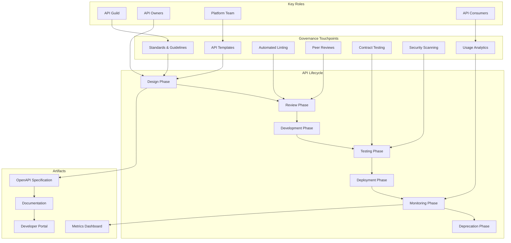
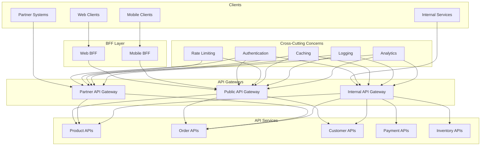
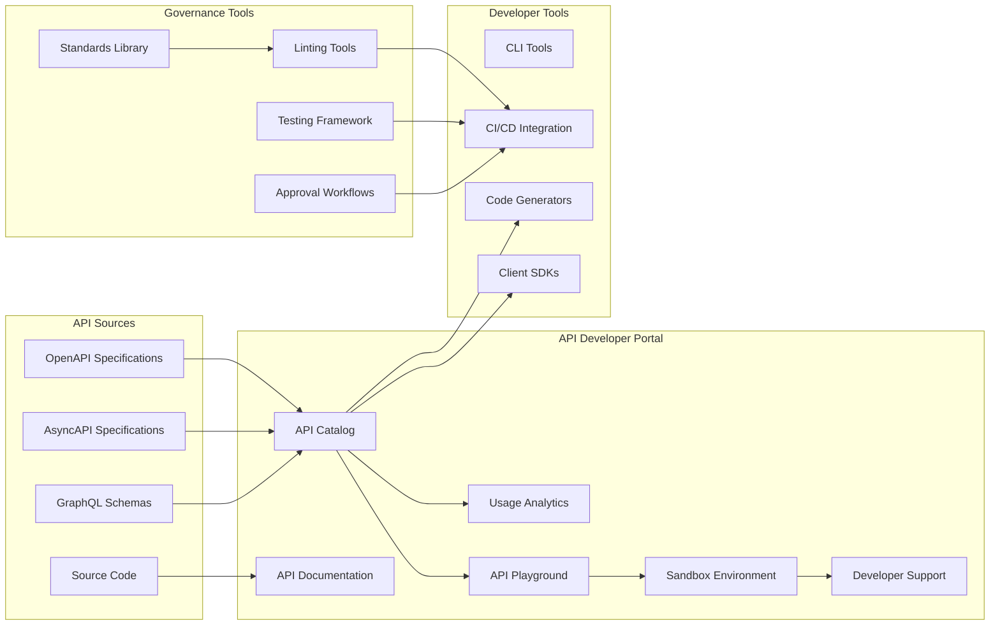

# DRAFT - NOT YET APPROVED

## ADR-009: API Management and Governance Strategy

### Status

Draft (Last Updated: 2024-10-07)

### Context

As we expand our microservices architecture for the FlowMart e-commerce platform, we need a comprehensive approach to API management and governance. We are facing several challenges with our current approach to APIs:

1. **Proliferation of APIs**: With our transition to microservices, we anticipate having 50+ internal APIs and multiple external-facing APIs within the next year.

2. **Inconsistent Design Patterns**: Teams are implementing APIs with inconsistent patterns, naming conventions, error handling, and response formats.

3. **Documentation Gaps**: API documentation is inconsistent, often outdated, and frequently exists only in code comments or team wikis.

4. **Discoverability Issues**: Developers struggle to find existing APIs, leading to duplication of functionality.

5. **Security Concerns**: APIs lack consistent security controls, authentication mechanisms, and authorization models.

6. **Version Management**: No clear strategy for versioning APIs, handling breaking changes, or maintaining backward compatibility.

7. **Performance Visibility**: Limited visibility into API performance, usage patterns, and availability.

8. **Cross-Cutting Concerns**: Features like rate limiting, caching, and observability are implemented inconsistently across services.

9. **Developer Experience**: Onboarding to consume APIs is complex and time-consuming, both for internal teams and external partners.

FlowMart is transitioning from a monolithic architecture to microservices, with a growing ecosystem of APIs. We need a cohesive approach to ensure these APIs are secure, discoverable, consistent, and manageable at scale.

### Decision

We will implement a comprehensive **API Management and Governance Strategy** with the following key components:

1. **API Gateway Architecture**:
   - Implement Kong as our primary API gateway for both internal and external APIs
   - Deploy separate gateway instances for external, internal, and partner traffic
   - Utilize a mesh pattern for internal service-to-service communication
   - Implement a Backend for Frontend (BFF) pattern for frontend-specific aggregation

2. **API Design Standards**:
   - Adopt OpenAPI (formerly Swagger) as our API specification standard
   - Establish comprehensive REST API design guidelines
   - Implement a design-first approach for all new APIs
   - Define standard patterns for resource naming, query parameters, pagination, filtering, and error responses
   - Standardize on JSON:API specification for response formatting

3. **API Lifecycle Management**:
   - Define clear stages: Design → Review → Development → Testing → Deployment → Deprecation → Retirement
   - Implement automated API contract testing in CI/CD pipelines
   - Require specification update for any API changes
   - Establish deprecation and sunsetting policies with clear timelines

4. **API Governance Model**:
   - Create an API Guild with representatives from each team
   - Establish an API review process for all new APIs and significant changes
   - Implement automated linting and compliance checking against standards
   - Define metrics for API quality and compliance
   - Regular review of API portfolio for duplication and consolidation opportunities

5. **API Documentation and Discovery**:
   - Deploy a central API developer portal using Backstage
   - Ensure all APIs have OpenAPI specifications
   - Implement automated documentation generation from OpenAPI specs
   - Create a searchable API catalog with metadata, ownership, and usage examples
   - Develop interactive API playground environments

6. **API Security Framework**:
   - Standardize on OAuth 2.0 and OpenID Connect for authentication
   - Implement role-based and attribute-based access control
   - Deploy centralized API key management
   - Establish security scanning and penetration testing for APIs
   - Implement API request validation based on schemas

7. **API Monitoring and Analytics**:
   - Deploy comprehensive API metrics collection
   - Create dashboards for performance, availability, and usage
   - Implement distributed tracing for end-to-end request flows
   - Set up alerting on API SLOs and error rates
   - Establish usage analytics for product and developer experience improvement

8. **API Versioning Strategy**:
   - Adopt semantic versioning (major.minor.patch) for all APIs
   - Support at least one previous major version for backward compatibility
   - Use URI versioning for major versions (/v1/, /v2/)
   - Implement feature flags for progressive rollout of API changes
   - Establish clear communication channels for API changes

### Technology Stack

| Component | Primary Technology | Alternative/Backup | Purpose |
|-----------|-------------------|-------------------|---------|
| API Gateway | Kong | Apigee, Amazon API Gateway | Traffic management, routing, policies |
| API Specification | OpenAPI 3.0 | AsyncAPI (for event-driven) | API contract and documentation |
| Developer Portal | Backstage | SwaggerHub, Readme.io | Discovery, documentation, onboarding |
| Identity Provider | Auth0 | Keycloak, AWS Cognito | Authentication and authorization |
| API Testing | Postman + Newman | SoapUI, Karate | Automated API testing |
| API Monitoring | Datadog | New Relic, Prometheus | Observability and analytics |
| Contract Testing | Pact | Spring Cloud Contract | Consumer-driven contract testing |
| GraphQL Federation | Apollo Federation | Netflix DGS | GraphQL implementation |
| API Design Tooling | Stoplight Studio | SwaggerHub, Insomnia | Design-first workflow |

### Consequences

#### Positive

1. **Improved Developer Experience**: Consistent, well-documented APIs accelerate development.

2. **Enhanced Security**: Standardized authentication and authorization patterns.

3. **Better Visibility**: Comprehensive monitoring and analytics of API usage and performance.

4. **Reduced Duplication**: Central catalog prevents redundant API implementations.

5. **Faster Integration**: Partners and internal teams can onboard more quickly.

6. **Higher Quality**: Standardized design patterns and automated testing improve quality.

7. **Future-Proofing**: Versioning strategy ensures backward compatibility.

8. **Operational Efficiency**: Centralized management of cross-cutting concerns.

#### Negative

1. **Initial Overhead**: Additional processes and governance may slow initial development.

2. **Learning Curve**: Teams need to adapt to new standards and practices.

3. **Migration Effort**: Existing APIs need to be refactored to meet new standards.

4. **Tooling Investment**: Significant investment in API management infrastructure.

5. **Governance Challenges**: Maintaining compliance across teams requires persistent effort.

6. **Potential Bottlenecks**: API review processes could become a bottleneck if not well-designed.

7. **Operational Complexity**: Additional infrastructure components to maintain.

### Mitigation Strategies

1. **Phased Implementation**:
   - Start with high-priority, externally facing APIs
   - Gradually implement standards for internal APIs
   - Provide flexible transition periods for existing APIs

2. **Developer Enablement**:
   - Create comprehensive training materials and workshops
   - Develop starter templates and code generators
   - Provide API design consultation services
   - Create self-service tools for standards compliance

3. **Governance Optimization**:
   - Implement automated compliance checking
   - Create lightweight review processes for low-risk changes
   - Empower teams with self-service validation tools
   - Focus governance on enablement rather than control

4. **Migration Support**:
   - Develop clear migration guidelines and timelines
   - Provide tooling to assist with API migrations
   - Allow grandfathering of legacy APIs with clear deprecation plans
   - Prioritize high-value, high-impact APIs for migration

5. **Platform Team Support**:
   - Create a dedicated API platform team
   - Offer consulting services to teams implementing or consuming APIs
   - Develop reusable components for common API patterns
   - Continuously evolve standards based on feedback

### Implementation Details

#### Phase 1: Foundation (Q4 2024)

1. Establish API design standards and guidelines
2. Deploy API gateway for external-facing services
3. Implement initial developer portal
4. Create API governance process and guild
5. Define API security standards

#### Phase 2: Expansion (Q1 2025)

1. Extend API gateway to internal services
2. Implement comprehensive monitoring and analytics
3. Deploy automated compliance checking
4. Develop API versioning framework
5. Create self-service API documentation tooling

#### Phase 3: Optimization (Q2 2025)

1. Implement advanced BFF patterns
2. Deploy GraphQL federation for complex client needs
3. Establish API performance optimization framework
4. Create advanced analytics and business insights
5. Develop partner API developer experiences

### API Design Principles

Our API design will adhere to the following principles:

1. **Resource-Oriented Design**: Model APIs around business resources rather than operations.

2. **Consistency**: APIs should behave consistently across the platform.

3. **Least Privilege**: APIs should request only the permissions they need.

4. **Robustness**: APIs should handle error cases gracefully and provide clear error messages.

5. **Forward Compatibility**: Design APIs to be extended without breaking existing clients.

6. **Discoverability**: APIs should be self-documenting and easily discoverable.

7. **Performance**: APIs should be designed with performance considerations in mind.

8. **Security by Design**: Security should be considered at every stage of the API lifecycle.

### API Governance Model

Our API governance model follows these principles:

1. **Federated Ownership**: Teams own their APIs but follow central standards.

2. **Standards over Rules**: Prefer guidance and patterns over strict enforcement.

3. **Automated Compliance**: Automate standards checking wherever possible.

4. **Continuous Improvement**: Regularly review and refine standards based on feedback.

5. **Value-Driven**: Focus governance efforts on high-value, high-risk APIs.

6. **Developer Experience**: Prioritize developer experience in governance decisions.

7. **Transparency**: Make governance processes and decisions transparent to all teams.

### Considered Alternatives

#### 1. Decentralized API Management

**Pros**: Maximum team autonomy, reduced coordination overhead  
**Cons**: Inconsistent developer experience, potential security gaps, duplicated effort

This approach would give teams complete freedom but would result in an inconsistent and potentially insecure API landscape that would be difficult to navigate and maintain.

#### 2. Centralized API Development Team

**Pros**: Maximum consistency, specialized expertise, controlled quality  
**Cons**: Development bottleneck, reduced team ownership, slower delivery

While this would ensure consistency, it would create bottlenecks and reduce the autonomy and ownership of our product teams, contradicting our microservices philosophy.

#### 3. Multiple API Gateways by Domain

**Pros**: Domain isolation, reduced blast radius, team autonomy  
**Cons**: Management complexity, potential inconsistencies, higher operational overhead

This approach offers benefits for large organizations but introduces unnecessary complexity for our current scale. We may revisit this approach as we grow.

#### 4. GraphQL-First Approach

**Pros**: Flexible client queries, reduced over-fetching, schema registry  
**Cons**: Learning curve, performance concerns for some use cases, security complexity

GraphQL offers benefits for certain use cases, but we believe a REST-first approach with GraphQL for specific complex client needs provides a better balance for our organization.

### References

1. "Web API Design: The Missing Link" by API Academy
2. "REST API Design Rulebook" by Mark Masse
3. [Google API Design Guide](https://cloud.google.com/apis/design)
4. [Microsoft REST API Guidelines](https://github.com/microsoft/api-guidelines/blob/vNext/Guidelines.md)
5. [JSON:API Specification](https://jsonapi.org/)
6. [API Governance: What, Why, and How](https://swagger.io/resources/articles/api-governance-what-why-how/)

### Decision Record History

| Date | Version | Description | Author |
|------|---------|-------------|--------|
| 2024-09-30 | 0.1 | Initial draft | Sarah Johnson |
| 2024-10-04 | 0.2 | Added governance model and phasing | Michael Chen |
| 2024-10-07 | 0.3 | Incorporated feedback from API Guild | David Boyne |
| TBD | 1.0 | Pending approval | Architecture Board |

## Appendix A: API Governance Process

## Appendix B: API Management Architecture

## Appendix C: API Developer Portal Architecture

