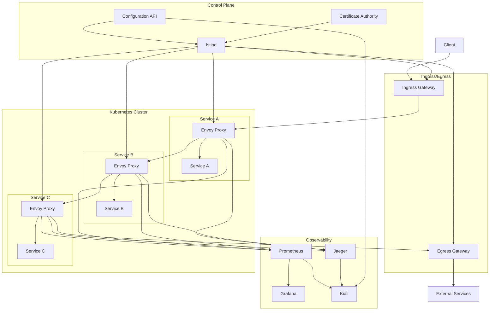
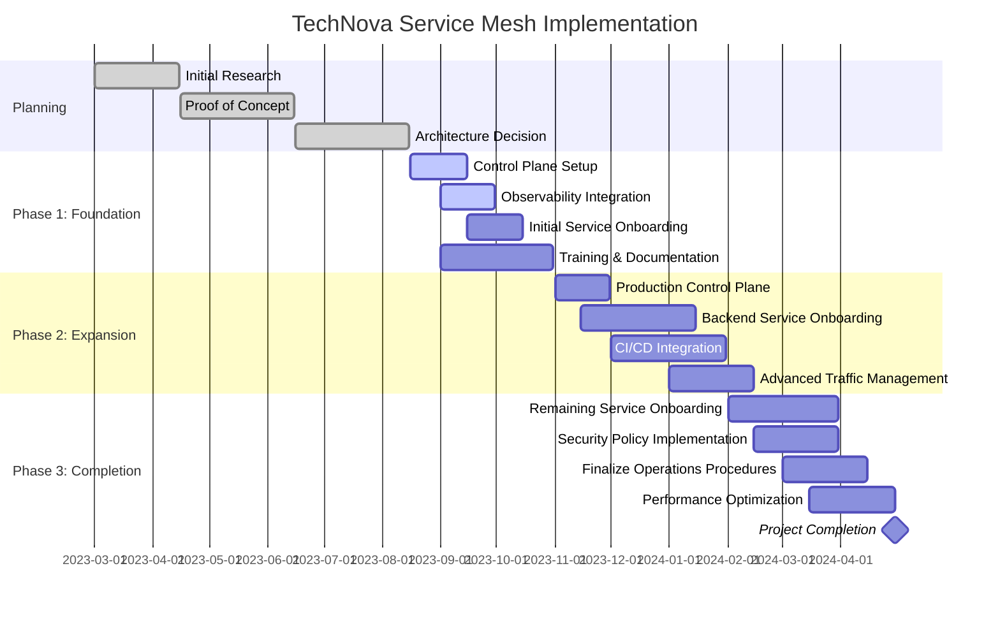

## ADR-2023-05: Service Mesh Adoption for TechNova Cloud Platform

### Status

Approved (2023-08-15)

### Context

TechNova's cloud platform has grown to include over 75 microservices developed and maintained by 12 different teams. As our platform has scaled, we've encountered several challenges:

1. **Service-to-Service Communication Complexity**: Managing service-to-service communication has become increasingly complex, with inconsistent implementation of patterns like circuit breaking, retries, and timeout handling.

2. **Security Concerns**: Service-to-service authentication and authorization is implemented inconsistently, creating potential security vulnerabilities.

3. **Observability Gaps**: Tracking request flows across services is difficult, making troubleshooting and performance optimization challenging.

4. **Traffic Management Challenges**: We lack sophisticated traffic control capabilities such as traffic splitting, canary deployments, and blue/green releases.

5. **Certificate Management**: Managing and rotating TLS certificates for service-to-service communication has become an operational burden.

6. **Network Policy Enforcement**: Network access controls are difficult to implement and maintain consistently across services.

Our engineering teams currently spend approximately 25% of their development effort on these cross-cutting concerns, diverting resources from building business functionality.

### Decision

We will adopt **Istio** as our service mesh solution for the TechNova Cloud Platform. Specifically:

1. **Sidecar Deployment Model**: We will deploy Istio using the sidecar proxy architecture to minimize disruption to existing services.

2. **Gradual Implementation**: We will introduce the service mesh incrementally, starting with non-critical services and gradually expanding to include all services.

3. **Standardized Patterns**: We will establish company-wide standards for:
   - Circuit breaking configurations
   - Retry policies
   - Timeout configurations
   - Mutual TLS implementation
   - Traffic management patterns
   - Observability integrations

4. **Platform Team Ownership**: A dedicated platform team will own the service mesh infrastructure, including:
   - Istio version management and upgrades
   - Performance monitoring and optimization
   - Security policy definition and enforcement
   - Training and documentation

5. **Integration with Existing Tooling**:
   - Prometheus and Grafana for metrics and dashboarding
   - Jaeger for distributed tracing
   - Kiali for service mesh visualization
   - Cert-Manager for certificate management

6. **Control Plane Configuration**: We will deploy Istio with:
   - High availability control plane (3 replicas)
   - Split along environment boundaries (separate control planes for production and non-production)
   - Regular automated backups of control plane configuration

### Consequences

#### Positive

1. **Simplified Service Code**: Application developers can focus on business logic rather than communication concerns.

2. **Enhanced Security**: Consistent mTLS implementation will improve our security posture.

3. **Improved Observability**: End-to-end request tracing and detailed service metrics will enhance troubleshooting.

4. **Advanced Traffic Management**: Capabilities for canary deployments and traffic steering will reduce deployment risk.

5. **Certificate Automation**: Automated certificate management will reduce operational overhead.

6. **Standardized Networking Policies**: Centralized network policy enforcement will improve security and compliance.

#### Negative

1. **Increased Complexity**: Service mesh adds architectural complexity and new failure modes.

2. **Resource Overhead**: Sidecar proxies consume additional CPU and memory resources (~10-15% based on POC testing).

3. **Learning Curve**: Teams will need to learn new concepts, tooling, and debugging approaches.

4. **Deployment Changes**: CI/CD pipelines will need updates to accommodate service mesh configuration.

5. **Potential Performance Impact**: Additional network hops may increase latency (observed ~5-10ms per hop in testing).

6. **Operational Changes**: Incident response and troubleshooting procedures will need updates.

### Mitigation Strategies

1. **Comprehensive Education Program**:
   - Create internal training curriculum for all engineering teams
   - Schedule hands-on workshops focusing on practical use cases
   - Develop troubleshooting playbooks and runbooks

2. **Gradual Rollout Plan**:
   - Phase 1 (Q3 2023): Deploy to non-critical services and gather metrics
   - Phase 2 (Q4 2023): Expand to backend services with low customer impact
   - Phase 3 (Q1 2024): Roll out to critical customer-facing services

3. **Resource Optimization**:
   - Tune proxy resource requests based on actual usage patterns
   - Implement horizontal pod autoscaling for proxies
   - Monitor and optimize control plane resource utilization

4. **Performance Monitoring**:
   - Establish baseline performance metrics before service mesh adoption
   - Implement detailed performance monitoring dashboards
   - Set alerting on latency increases beyond acceptable thresholds

5. **Escape Hatch Mechanisms**:
   - Document procedures for temporarily bypassing the service mesh if issues arise
   - Create fast rollback capabilities for service mesh configurations

### Implementation Details

#### Phase 1: Foundation (Q3 2023)

1. Deploy Istio control plane in non-production environments
2. Implement mTLS for a subset of non-critical services
3. Set up integration with observability stack
4. Develop initial training materials and documentation
5. Create standard Istio configuration templates

#### Phase 2: Expansion (Q4 2023)

1. Deploy production control plane
2. Expand to backend services
3. Implement traffic management capabilities
4. Develop automated testing for service mesh configurations
5. Integrate service mesh configurations into CI/CD pipelines

#### Phase 3: Completion (Q1 2024)

1. Roll out to remaining services
2. Implement advanced security policies
3. Complete comprehensive monitoring and alerting
4. Finalize operational procedures and runbooks
5. Document lessons learned and best practices

### Considered Alternatives

#### 1. Linkerd

**Pros**: Lighter weight, simpler operations, lower resource overhead  
**Cons**: Fewer features, smaller community, less integration with enterprise tools

While Linkerd offers a more lightweight approach, we found that its limited feature set would not address all our requirements, particularly around sophisticated traffic management and extensibility.

#### 2. AWS App Mesh

**Pros**: Native AWS integration, managed control plane, simplified operations  
**Cons**: AWS-specific, limited feature set compared to Istio, less community support

AWS App Mesh would align well with our AWS infrastructure but lacks some advanced features we require and would limit our multi-cloud flexibility.

#### 3. Custom Solution with Envoy

**Pros**: Tailored to our exact needs, potentially lower overhead  
**Cons**: High development and maintenance cost, lack of community support, reinventing the wheel

Building our own solution would require significant engineering resources and ongoing maintenance, which would outweigh the benefits of customization.

#### 4. No Service Mesh (Status Quo)

**Pros**: No additional complexity or overhead, familiar patterns  
**Cons**: Continued inconsistency across services, growing technical debt, security risks

Maintaining the status quo would fail to address our current challenges and would further increase technical debt as our platform continues to grow.

### References

1. [Istio Documentation](https://istio.io/latest/docs/)
2. "The Service Mesh Era" - Cloud Native Computing Foundation Whitepaper
3. Internal POC Report: "Service Mesh Performance and Compatibility Testing" (TechNova Engineering, June 2023)
4. [CNCF Service Mesh Comparison](https://servicemesh.es/)
5. [Envoy Proxy Documentation](https://www.envoyproxy.io/docs/envoy/latest/)
6. "Production Istio" - O'Reilly Media, 2022

### Decision Record History

| Date | Version | Description | Author |
|------|---------|-------------|--------|
| 2023-05-10 | 0.1 | Initial draft | Alexander Chen, Principal Architect |
| 2023-06-22 | 0.2 | Updated based on POC results | Sophia Rodriguez, Platform Engineering |
| 2023-07-15 | 0.3 | Added phased implementation plan | Marcus Johnson, Engineering Director |
| 2023-08-15 | 1.0 | Approved by Architecture Review Board | TechNova ARB |

## Appendix A: Service Mesh Architecture

## Appendix B: Service Mesh Implementation Timeline

## Appendix C: Estimated Resource Requirements

| Component | CPU Request | Memory Request | Replicas | Environment | Notes |
|-----------|-------------|---------------|----------|-------------|-------|
| Istiod | 500m | 2Gi | 3 | Production | HA configuration |
| Istiod | 500m | 2Gi | 1 | Non-Production | Single replica |
| Ingress Gateway | 500m | 1Gi | 3 | Production | External traffic entry |
| Ingress Gateway | 200m | 512Mi | 1 | Non-Production | Development testing |
| Egress Gateway | 500m | 1Gi | 2 | Production | External service access |
| Envoy Proxy | 100m | 256Mi | 1 per pod | All | Sidecar containers |
| Prometheus | 1000m | 8Gi | 2 | Production | Metric collection |
| Grafana | 200m | 1Gi | 2 | Production | Dashboarding |
| Jaeger | 500m | 4Gi | 2 | Production | Distributed tracing |
| Kiali | 200m | 1Gi | 2 | Production | Mesh visualization |

*Note: These values are initial estimates based on our proof of concept and may be adjusted based on actual usage patterns.* 