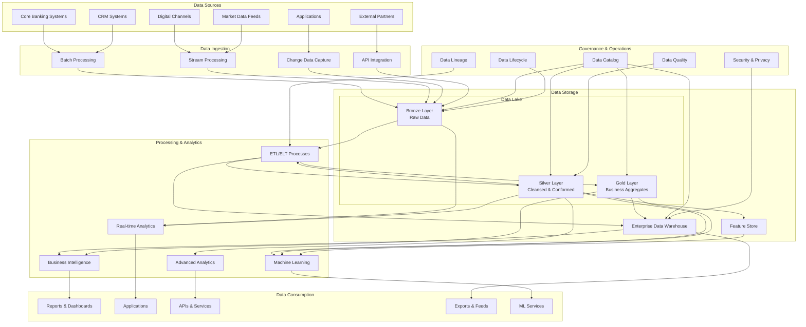
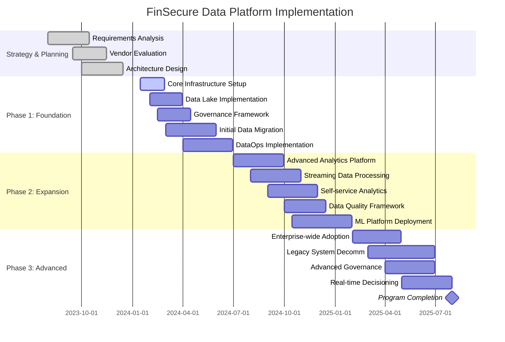
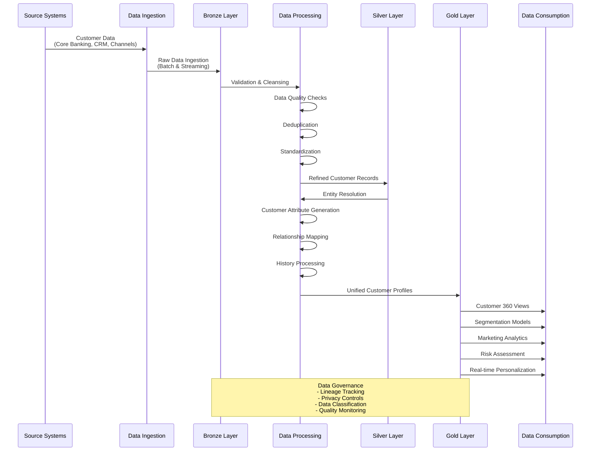

## ADR-2023-12: Modern Data Platform Strategy for FinSecure

### Status

Approved (2023-12-18)

### Context

FinSecure is experiencing significant challenges with our current data architecture:

1. **Data Silos**: Customer, transaction, and risk data are siloed across multiple legacy systems with inconsistent data models.

2. **Limited Analytics Capabilities**: Rigid data warehousing solutions limit our ability to perform advanced analytics and machine learning.

3. **Scalability Constraints**: Current data processing infrastructure is struggling to handle increasing data volumes (now exceeding 5TB daily).

4. **Compliance Complexity**: Meeting GDPR, CCPA, and financial regulatory requirements across fragmented data systems is increasingly difficult.

5. **Slow Time-to-Insight**: Business teams wait 2-3 weeks for new analytics dashboards or data models to be developed.

6. **Technical Debt**: Legacy ETL processes are complex, brittle, and expensive to maintain.

7. **Limited Real-time Capabilities**: Current architecture is primarily batch-oriented with limited ability to process streaming data for fraud detection and real-time decisioning.

8. **Data Quality Issues**: Inconsistent data quality across systems impacts business decisions and customer experience.

These challenges are limiting our ability to leverage data as a strategic asset and inhibiting our digital transformation initiatives aimed at enhancing customer experiences and operational efficiency.

### Decision

We will implement a **modern, cloud-based data platform** with a **lakehouse architecture**. Key components include:

1. **Data Lake Foundation**:
   - Azure Data Lake Storage Gen2 as the foundation for our data lake
   - Databricks Delta Lake for ACID transactions and data reliability
   - Structured organization with bronze (raw), silver (refined), and gold (business) layers

2. **Data Ingestion and Processing**:
   - Azure Data Factory for orchestration and batch data movement
   - Kafka and Azure Event Hubs for real-time data ingestion
   - Databricks for large-scale data processing
   - Stream processing with Spark Structured Streaming

3. **Semantic Layer and Data Serving**:
   - Databricks SQL Warehouses for analytics workloads
   - Azure Synapse Analytics for enterprise data warehousing needs
   - Power BI as primary business intelligence tool
   - REST APIs for serving data to applications

4. **Data Governance and Security**:
   - Azure Purview for data catalog and lineage
   - Column-level encryption for sensitive data
   - Role-based access control aligned with data classification
   - Automated data retention and purging based on policies

5. **Machine Learning Platform**:
   - MLflow for experiment tracking and model registry
   - Databricks ML for model development and deployment
   - Model monitoring and retraining pipelines
   - Feature store for reusable feature engineering

6. **DataOps and Automation**:
   - Infrastructure as Code using Terraform
   - CI/CD pipelines for data pipelines and transformations
   - Automated testing for data quality and pipeline integrity
   - Comprehensive monitoring and alerting

### Platform Architecture by Domain

| Domain | Data Types | Primary Tools | Access Patterns | Special Requirements |
|--------|------------|--------------|-----------------|----------------------|
| Customer 360 | Customer profiles, interactions, preferences | Delta Lake, Databricks SQL | Batch analytics, Real-time lookups | GDPR compliance, Entity resolution |
| Transaction Processing | Payment transactions, transfers, statements | Kafka, Delta Lake, Azure Synapse | Real-time streaming, Batch reporting | PCI-DSS compliance, 7-year retention |
| Risk Management | Credit scores, market data, exposure calculations | Databricks, Delta Lake, ML models | Batch processing, Model inference | Auditability, Model governance |
| Fraud Detection | Transaction patterns, behavioral signals | Kafka, Spark Streaming, ML models | Real-time streaming, Low-latency scoring | Sub-second latency, High availability |
| Regulatory Reporting | Aggregated financial data, compliance metrics | Azure Synapse, Power BI | Scheduled batch, Ad-hoc analysis | Immutability, Approval workflows |
| Marketing Analytics | Campaign data, customer segments, attribution | Databricks, Delta Lake, Power BI | Interactive queries, ML-based segmentation | Identity resolution, Attribution models |

### Consequences

#### Positive

1. **Unified Data Access**: Single platform for accessing enterprise data with consistent governance.

2. **Enhanced Analytical Capabilities**: Support for advanced analytics, machine learning, and AI initiatives.

3. **Improved Scalability**: Cloud-native architecture can scale to handle growing data volumes.

4. **Reduced Time-to-Insight**: Self-service capabilities and streamlined data pipelines reduce time to deliver insights.

5. **Better Data Governance**: Centralized data catalog, lineage tracking, and security controls.

6. **Real-time Capabilities**: Support for both batch and real-time processing using the same platform.

7. **Cost Optimization**: Pay-for-use cloud model with ability to scale resources as needed.

8. **Regulatory Compliance**: Improved ability to implement and demonstrate regulatory compliance.

#### Negative

1. **Implementation Complexity**: Significant effort required to migrate from legacy systems.

2. **Skills Gap**: New technologies require reskilling of existing teams.

3. **Initial Cost Increase**: Short-term investment in new technology and parallel running of systems.

4. **Data Migration Challenges**: Data quality and mapping issues during migration.

5. **Operational Changes**: New operational procedures and support models needed.

6. **Integration Complexity**: Connecting legacy systems to new platform requires careful planning.

7. **Organization Change Management**: New workflows and responsibilities across business and technical teams.

### Mitigation Strategies

1. **Phased Implementation Approach**:
   - Start with highest-value, least-critical data domains
   - Implement foundational capabilities before complex use cases
   - Run legacy and new systems in parallel during transition
   - Create clear success criteria for each phase

2. **Talent and Skill Development**:
   - Develop comprehensive training program for existing staff
   - Strategic hiring for key specialized roles
   - Partner with platform vendors for enablement
   - Create centers of excellence for key technologies

3. **Modern Data Governance**:
   - Establish data governance council with cross-functional representation
   - Define clear data ownership and stewardship model
   - Implement automated data quality monitoring
   - Create comprehensive data classification framework

4. **Financial Management**:
   - Detailed cloud cost monitoring and optimization
   - Business-aligned chargeback model
   - Clear ROI tracking for data initiatives
   - Regular cost optimization reviews

5. **Change Management Program**:
   - Executive sponsorship and visible leadership
   - Regular communication and success stories
   - Early involvement of business stakeholders
   - Incentives aligned with adoption goals

### Implementation Details

#### Phase 1: Foundation (Q1-Q2 2024)

1. Establish cloud environment and core infrastructure
2. Implement data lake foundation with initial data domains
3. Deploy data catalog and basic governance tools
4. Migrate first non-critical data workloads
5. Establish DataOps practices and pipelines

#### Phase 2: Expansion (Q3-Q4 2024)

1. Migrate core analytical workloads to the platform
2. Implement real-time data processing capabilities
3. Deploy self-service analytics for business users
4. Enhance data quality frameworks and monitoring
5. Develop initial ML use cases on the platform

#### Phase 3: Advanced Capabilities (Q1-Q2 2025)

1. Full enterprise adoption across all data domains
2. Advanced ML capabilities and feature store
3. Comprehensive data governance implementation
4. Legacy system decommissioning
5. Advanced real-time analytics and decisioning

### Considered Alternatives

#### 1. Modernize Existing Data Warehouse

**Pros**: Lower initial disruption, familiar technology, focused scope  
**Cons**: Limited flexibility, higher long-term costs, limited real-time capabilities

This approach would not address our fundamental needs for real-time processing, advanced analytics, and managing unstructured data.

#### 2. Traditional Data Lake Architecture

**Pros**: Lower cost storage, support for varied data types, scalability  
**Cons**: Complexity in ensuring data quality, limited transactional support, governance challenges

A traditional data lake without the lakehouse capabilities would create significant challenges for data reliability, performance, and governance.

#### 3. Multiple Purpose-Built Systems

**Pros**: Optimized solutions for specific use cases, potentially best-in-class capabilities  
**Cons**: Increased integration complexity, data duplication, inconsistent governance

This approach would perpetuate our data silo issues and create ongoing integration and consistency challenges.

#### 4. Maintain and Incrementally Improve Current Systems

**Pros**: Minimal disruption, lower initial investment, familiar technology  
**Cons**: Perpetuates technical debt, limited capability improvement, increasing maintenance costs

This would fail to address our fundamental challenges and put us at a competitive disadvantage as data volumes and complexity increase.

### References

1. "Designing Data-Intensive Applications" by Martin Kleppmann
2. [Databricks Lakehouse Platform Documentation](https://docs.databricks.com/lakehouse/index.html)
3. [Azure Data Factory Documentation](https://docs.microsoft.com/en-us/azure/data-factory/)
4. "Data Mesh: Delivering Data-Driven Value at Scale" by Zhamak Dehghani
5. FinSecure Internal Report: "Data Platform Requirements Analysis" (October 2023)
6. [DAMA Data Management Body of Knowledge](https://www.dama.org/cpages/body-of-knowledge)

### Decision Record History

| Date | Version | Description | Author |
|------|---------|-------------|--------|
| 2023-10-15 | 0.1 | Initial draft | Jennifer Wu, Chief Data Officer |
| 2023-11-08 | 0.2 | Updated based on technical review | Raj Patel, Data Engineering Lead |
| 2023-12-02 | 0.3 | Added implementation phases and cost estimates | Michael Torres, Enterprise Architect |
| 2023-12-18 | 1.0 | Approved by Executive Technology Committee | FinSecure ETC |

## Appendix A: Data Platform Architecture

## Appendix B: Data Platform Implementation Timeline

## Appendix C: Target State Data Flow - Customer 360 Example

## Appendix D: Key Performance Indicators

| KPI | Current State | Target (2025) | Measurement Method |
|-----|---------------|---------------|-------------------|
| Data Integration Cycle Time | 7-14 days | <24 hours | Average time from source change to data availability |
| Self-service BI Adoption | 15% of business users | >60% of business users | Monthly active users in self-service tools |
| Data Quality Score | ~75% | >95% | Composite score from automated quality checks |
| Cost per TB of Analytics Storage | $2,500/TB | <$500/TB | Total cost of ownership / storage volume |
| Time to New Analytics | 2-3 weeks | <3 days | Time from request to dashboard availability |
| Data Platform Availability | 99.5% | 99.95% | Measured service uptime |
| Regulatory Report Production Time | 10-15 days | 1-2 days | Time to produce monthly regulatory reports |
| Real-time Decision Latency | Not available | <250ms | Response time for real-time decision APIs |
| ML Model Deployment Time | 4-6 weeks | <1 week | Time from model approval to production deployment |
| Data Engineer Productivity | ~30% on new features | >70% on new features | Time allocation analysis |

*Note: Metrics will be tracked quarterly and reported to the Data Governance Council.* 