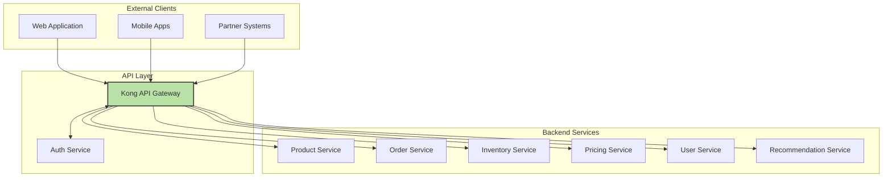
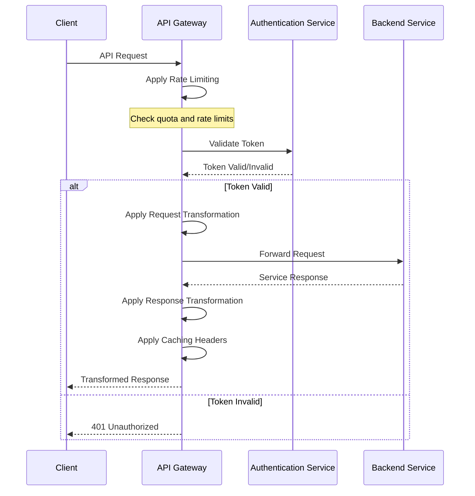

## ADR-001: Adoption of API Gateway Pattern for FlowMart E-commerce Platform

### Status

Approved (2024-06-10)

### Context

As we migrate to a microservices-based architecture for our e-commerce platform, we face several challenges in managing API endpoints:

1. **API Proliferation**: Each microservice exposes its own APIs, leading to a large number of endpoints that clients need to interact with.
2. **Cross-cutting Concerns**: Common functionality like authentication, logging, and rate limiting needs to be implemented consistently across all services.
3. **Client Complexity**: Mobile apps, web frontends, and third-party integrations would need to understand the topology of our microservices ecosystem.
4. **Protocol Diversity**: Some internal services may use protocols (gRPC, AMQP) that aren't suitable for direct client consumption.
5. **Network Performance**: Multiple direct client-to-service calls increase network overhead, especially on mobile networks.
6. **Security Exposure**: Direct exposure of microservices increases the attack surface of our platform.

We need a solution that simplifies our API landscape while maintaining the benefits of our microservices architecture.

### Decision

We will implement an **API Gateway Pattern** as the primary entry point for all client applications interacting with the FlowMart e-commerce platform. Specifically:

1. **Gateway Implementation**: We will use **Kong API Gateway** as our primary implementation due to its robust plugin ecosystem, performance characteristics, and open-source foundation.

2. **Gateway Responsibilities**:
   - **Request Routing**: Directing requests to appropriate backend services
   - **Authentication & Authorization**: Validating user identity and permissions
   - **Rate Limiting**: Protecting services from excessive load
   - **Request/Response Transformation**: Adapting data formats between clients and services
   - **Caching**: Reducing backend load for frequently requested data
   - **Logging & Monitoring**: Centralized request tracking
   - **Circuit Breaking**: Preventing cascading failures
   - **Protocol Translation**: Supporting REST, GraphQL, and gRPC as needed

3. **Gateway Topology**:
   - **Edge Gateway**: A public-facing gateway for all external clients
   - **Internal Gateway**: For service-to-service communication within our private network

4. **API Composition**: The gateway will aggregate responses from multiple services when needed to reduce client-side complexity.

5. **Backend-for-Frontend (BFF) Pattern**: We will implement specific gateway configurations for different client platforms (web, mobile iOS, mobile Android) to optimize payloads and calls.

6. **API Versioning**: The gateway will support multiple API versions to enable graceful evolution of our services.

### Consequences

#### Positive

1. **Simplified Client Development**: Clients only need to know about a single entry point rather than multiple service endpoints.

2. **Consistent Security Enforcement**: Authentication, authorization, and other security controls can be implemented uniformly.

3. **Operational Visibility**: Centralized logging and monitoring of all API traffic.

4. **Performance Optimization**: Opportunity for response caching, request collapsing, and other optimizations.

5. **Flexible Evolution**: Backend services can be refactored, replaced, or decomposed without changing client implementations.

6. **Traffic Control**: Ability to throttle, prioritize, or redirect traffic based on various conditions.

#### Negative

1. **Potential Single Point of Failure**: The gateway becomes critical infrastructure that must be highly available.

2. **Increased Latency**: Adding another network hop introduces some additional latency.

3. **Gateway Complexity**: The gateway configuration grows in complexity as the number of services increases.

4. **Operational Overhead**: Additional infrastructure to monitor, maintain, and scale.

5. **Deployment Coupling**: Gateway configuration changes may need coordination with service deployments.

6. **Performance Bottleneck Risk**: Without proper scaling, the gateway could become a bottleneck under high load.

### Mitigation Strategies

1. **High Availability**: Deploy the API Gateway in a redundant, auto-scaling configuration across multiple availability zones.

2. **Performance Optimization**: Implement efficient caching strategies and regular performance testing.

3. **Circuit Breakers**: Implement circuit breakers to prevent cascading failures if backend services are unavailable.

4. **Automated Configuration**: Use infrastructure as code to manage gateway configuration, with automated testing.

5. **API Governance**: Establish clear ownership and review processes for gateway configuration changes.

6. **Observability**: Implement comprehensive monitoring and alerting specifically for the gateway.

### Implementation Details

#### Phase 1: Core Infrastructure (Q2 2024)

1. Deploy Kong API Gateway in development and staging environments
2. Implement basic routing for 2-3 core services
3. Set up authentication and authorization
4. Establish monitoring and logging
5. Create CI/CD pipeline for gateway configuration

#### Phase 2: Feature Expansion (Q3 2024)

1. Migrate all existing APIs to the gateway
2. Implement rate limiting and circuit breaking
3. Add response caching for appropriate endpoints
4. Develop BFF configurations for web and mobile
5. Implement comprehensive end-to-end testing

#### Phase 3: Advanced Capabilities (Q4 2024)

1. Implement GraphQL support for specific use cases
2. Add advanced analytics and API usage dashboards
3. Integrate with service mesh for internal service communication
4. Implement advanced security features (WAF, etc.)
5. Optimize for global performance

### Considered Alternatives

#### 1. Direct Client-to-Microservice Communication

**Pros**: Simplicity, no additional network hop, no central bottleneck  
**Cons**: Client complexity, inconsistent policy enforcement, security challenges

This approach would expose our internal service architecture directly to clients, creating significant complexity and security concerns.

#### 2. Service Mesh Only (no API Gateway)

**Pros**: Great for service-to-service communication, built-in resilience  
**Cons**: Not designed for edge traffic, less focus on client-specific concerns

While we plan to use a service mesh for internal communication, it doesn't address the client-facing concerns that an API Gateway solves.

#### 3. Bespoke API Gateway

**Pros**: Custom-built for our exact needs, no license costs  
**Cons**: Development and maintenance overhead, feature gaps, opportunity cost

Building our own gateway would divert significant resources from our core business and likely result in a less robust solution than established products.

#### 4. Alternative Gateway Products (Apigee, AWS API Gateway)

**Pros**: Managed services (reduced operational burden), rich feature sets  
**Cons**: Higher costs, potential vendor lock-in, less customization

These were viable alternatives, but Kong offered the best balance of features, flexibility, and cost for our requirements.

### References

1. Richardson, Chris. "Pattern: API Gateway / Backends for Frontends." [Microservices.io](https://microservices.io/patterns/apigateway.html)
2. Fowler, Martin. "BFF: Backend for Frontend." [martinfowler.com](https://martinfowler.com/articles/gateway-pattern.html)
3. [Kong API Gateway Documentation](https://docs.konghq.com/)
4. Newman, Sam. Building Microservices (O'Reilly)
5. API Gateway Pattern, Microsoft Azure Architecture Center. [Microsoft Docs](https://docs.microsoft.com/en-us/azure/architecture/microservices/design/gateway)

### Decision Record History

| Date | Version | Description | Author |
|------|---------|-------------|--------|
| 2024-05-15 | 0.1 | Initial draft | James Wilson |
| 2024-05-25 | 0.2 | Added implementation phases and alternatives | Sarah Chen |
| 2024-06-05 | 0.3 | Incorporated feedback from architecture review | David Boyne |
| 2024-06-10 | 1.0 | Approved by Architecture Board | Architecture Board |

## Appendix A: API Gateway Architecture

## Appendix B: Gateway Policy Application Flow

## Appendix C: Gateway Feature Rollout

| Feature | Target Date | Priority | Dependencies | Owner |
|---------|-------------|----------|--------------|-------|
| Basic Routing | Q2 2024 | Critical | Gateway Infrastructure | DevOps Team |
| Authentication | Q2 2024 | Critical | Auth Service | Security Team |
| Monitoring & Logging | Q2 2024 | High | Observability Platform | DevOps Team |
| Rate Limiting | Q3 2024 | High | None | Platform Team |
| Request/Response Transformation | Q3 2024 | Medium | API Standards | API Team |
| Circuit Breaking | Q3 2024 | Medium | Service Health Metrics | Platform Team |
| Caching | Q3 2024 | Medium | Cache Invalidation Strategy | Performance Team |
| GraphQL Support | Q4 2024 | Low | GraphQL Schema | API Team |
| Advanced Analytics | Q4 2024 | Low | Data Platform | Data Team | 