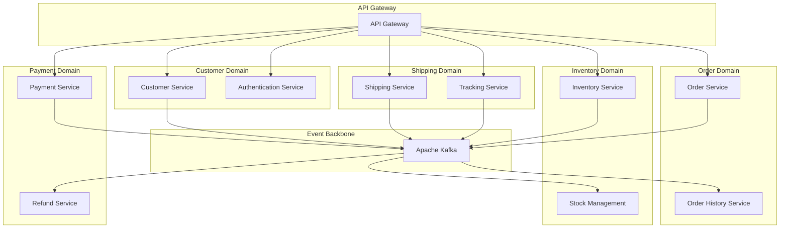
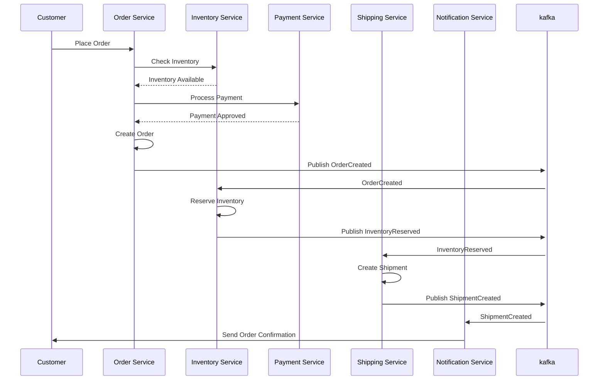
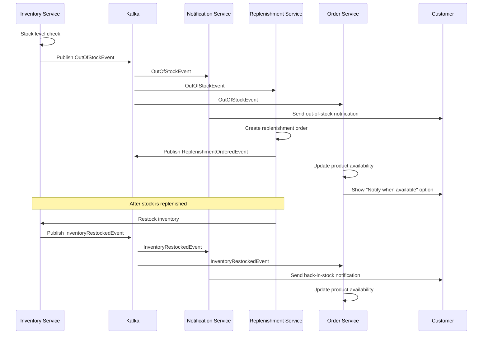

## ADR-001: Adoption of Event-Driven Architecture for FlowMart E-commerce Platform

### Status

Approved (2024-07-15)

### Context

FlowMart is building a new e-commerce platform to replace our legacy monolithic application. The current system faces several challenges:

1. **Scalability Issues**: During peak shopping periods (e.g., Black Friday, holiday season), the system struggles to handle increased traffic, resulting in degraded performance and occasional outages.
2. **Maintenance Complexity**: Adding new features or modifying existing ones requires extensive regression testing and often leads to unexpected side effects.
3. **Technology Constraints**: The monolithic architecture limits our ability to adopt new technologies or update components independently.
4. **Data Consistency**: Ensuring data consistency across different parts of the application has become increasingly difficult.
5. **Team Independence**: Multiple development teams working on different aspects of the application frequently block each other.

We need an architecture that addresses these challenges while enabling rapid innovation and scaling to meet our projected growth over the next 3-5 years.

### Decision

We will adopt an **Event-Driven Architecture (EDA)** using a microservices approach for the new FlowMart e-commerce platform. Specifically:

1. **Domain-Driven Design (DDD)**: We will organize our services around business domains (Orders, Inventory, Payment, Shipping, etc.) with clearly defined bounded contexts.

2. **Event Sourcing**: Critical business transactions will be stored as a sequence of immutable events that can be used to reconstruct the system state at any point in time.

3. **Command Query Responsibility Segregation (CQRS)**: We will separate read and write operations where appropriate to optimize for different performance and scaling requirements.

4. **Apache Kafka** will serve as our primary event streaming platform for asynchronous communication between services.

5. **Eventual Consistency Model**: We acknowledge that the system will prioritize availability and partition tolerance over immediate consistency (following the CAP theorem), with mechanisms to ensure eventual consistency.

6. **Service Autonomy**: Each service will:
   - Have its own database
   - Be independently deployable
   - Have well-defined APIs and event contracts
   - Be responsible for publishing domain events when state changes occur

7. **Choreography Over Orchestration**: Services will primarily react to events rather than being orchestrated by a central coordinator, though we will use orchestration for complex workflows when necessary.

### Consequences

#### Positive

1. **Improved Scalability**: Individual services can scale independently based on demand, allowing us to allocate resources more efficiently.

2. **Better Fault Isolation**: Failures in one service are less likely to cascade across the entire system, improving overall reliability.

3. **Technology Flexibility**: Teams can choose the most appropriate technologies for their specific domains, allowing for incremental adoption of new technologies.

4. **Team Autonomy**: Domain-aligned teams can develop, test, and deploy their services independently, reducing cross-team dependencies.

5. **Enhanced Auditability**: Event sourcing provides a complete audit trail of all system changes, which is valuable for debugging, compliance, and business analytics.

6. **Improved Extensibility**: New capabilities can be added by creating new consumers of existing events without modifying the original producers.

#### Negative

1. **Increased Complexity**: Distributed systems are inherently more complex to develop, test, debug, and operate compared to monolithic applications.

2. **Learning Curve**: The team will need to learn new patterns, technologies, and operational practices, which may slow initial development.

3. **Eventual Consistency Challenges**: Business operations and UI design must account for data that might not be immediately consistent across services.

4. **Operational Overhead**: Managing multiple services, event streams, and databases requires more sophisticated monitoring, deployment, and operational tools.

5. **Transaction Management**: Ensuring transactional integrity across service boundaries requires careful design and implementation of compensation patterns.

6. **Testing Complexity**: End-to-end testing becomes more challenging, requiring new testing strategies and tools.

### Compliance Requirements

Our implementation must adhere to the following requirements:

1. **Data Privacy**: Personal customer data must be handled in compliance with GDPR, CCPA, and other applicable regulations.

2. **PCI DSS**: Payment processing components must comply with Payment Card Industry Data Security Standards.

3. **Audit Trail**: All critical business transactions must be traceable and auditable for a minimum of 7 years.

4. **Security**: Authentication, authorization, and data encryption standards must be consistently applied across all services.

### Implementation Details

#### Phase 1: Core Domain Decomposition (Q3 2024)

1. Identify and define core domain boundaries
2. Establish event schemas and contracts
3. Implement Kafka infrastructure and operational tooling
4. Migrate the first domain (Orders) to the new architecture
5. Set up CI/CD pipelines and monitoring

#### Phase 2: Domain Expansion (Q4 2024)

1. Migrate Inventory and Payment domains
2. Implement event sourcing for critical domains
3. Develop read models for reporting and analytics
4. Establish cross-domain consistency patterns

#### Phase 3: Legacy Decommissioning (Q1-Q2 2025)

1. Migrate remaining domains
2. Implement advanced monitoring and alerting
3. Gradually decommission legacy system components
4. Complete performance tuning and optimization

### Considered Alternatives

#### 1. Modular Monolith

**Pros**: Simpler development model, transactional integrity, easier testing  
**Cons**: Limited independent scaling, technology constraints, deployment coupling

This approach would address some concerns (maintainability, modularity) but would not solve our scalability and team independence challenges.

#### 2. Microservices with REST-only Communication

**Pros**: Well-understood patterns, synchronous communication simplicity  
**Cons**: Tighter coupling, limited resilience, cascading failures

This approach would improve modularity but would not adequately address resilience and scalability concerns.

#### 3. Serverless Architecture

**Pros**: Minimal infrastructure management, high elasticity, pay-per-use model  
**Cons**: Vendor lock-in, cold start latency, limited control over infrastructure

While appealing for certain scenarios, this approach would not provide the control and predictability needed for our core business functions.

### References

1. Building Event-Driven Microservices (Adam Bellemare, O'Reilly)
2. Domain-Driven Design (Eric Evans, Addison-Wesley)
3. Enterprise Integration Patterns (Gregor Hohpe, Bobby Woolf, Addison-Wesley)
4. [Kafka Documentation](https://kafka.apache.org/documentation/)
5. [CQRS Pattern](https://martinfowler.com/bliki/CQRS.html) (Martin Fowler)
6. [Event Sourcing Pattern](https://martinfowler.com/eaaDev/EventSourcing.html) (Martin Fowler)

### Decision Record History

| Date | Version | Description | Author |
|------|---------|-------------|--------|
| 2024-06-22 | 0.1 | Initial draft | David Boyne |
| 2024-06-30 | 0.2 | Incorporate feedback from architecture review | Amy Smith |
| 2024-07-10 | 0.3 | Added implementation phasing and compliance requirements | Kiran Patel |
| 2024-07-15 | 1.0 | Approved by Architecture Board | Architecture Board |

## Appendix A: High-Level Architecture Diagram

## Appendix B: Key Event Flows

### Order Placement Flow

### Out-of-Stock Handling Flow

## Appendix C: Service Ownership

| Domain | Service | Team |
|--------|---------|------|
| Customer | Customer Service | Full Stack Team |
| Customer | Authentication Service | Security Team |
| Order | Order Service | Order Management Team |
| Order | Order History Service | Order Management Team |
| Inventory | Inventory Service | Full Stack Team |
| Inventory | Stock Management | Full Stack Team |
| Payment | Payment Service | Payment Team |
| Payment | Refund Service | Payment Team |
| Shipping | Shipping Service | Logistics Team |
| Shipping | Tracking Service | Logistics Team |

