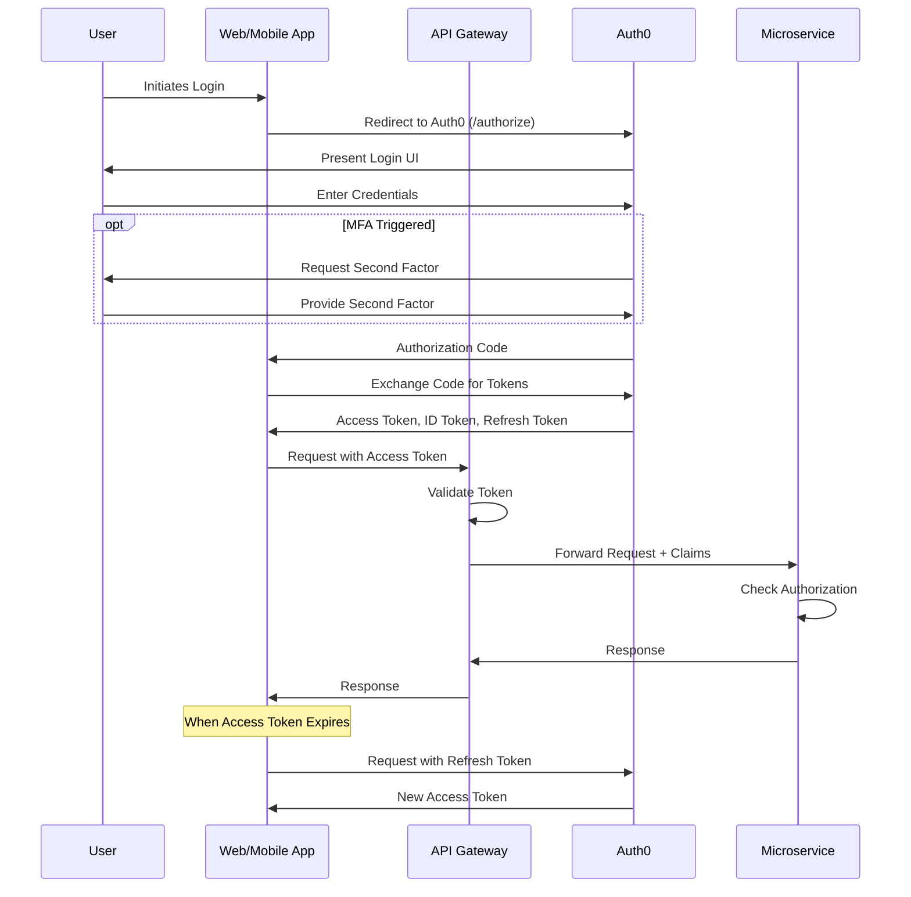
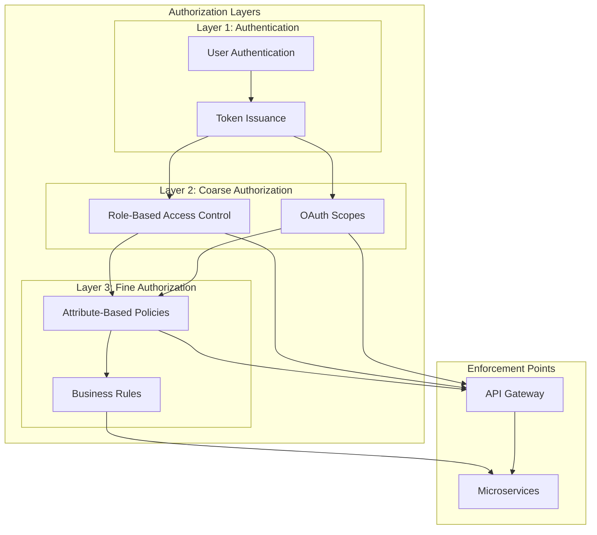

## ADR-003: Authentication and Authorization Strategy for FlowMart E-commerce Platform

### Status

Approved (2024-08-01)

### Context

As we move to a microservices architecture for our e-commerce platform, we need a robust, scalable, and secure approach to authentication and authorization. The current monolithic application uses a custom auth solution with session-based authentication, which presents several challenges in a distributed environment:

1. **Session Stickiness**: Requires load balancer configuration to route users to the same server.
2. **Scalability Constraints**: Session state storage becomes challenging as we scale horizontally.
3. **Cross-Service Authentication**: No standardized way for services to validate user identity and permissions.
4. **Partner and Third-Party Integration**: Difficult to securely expose APIs to external systems.
5. **Multiple Authentication Factors**: Need to support various authentication methods (passwords, social logins, biometrics).
6. **Varying Authorization Requirements**: Different resources require different permission models.
7. **Compliance Requirements**: GDPR, PCI-DSS, and industry regulations impose strict requirements on handling authentication data.

We need an authentication and authorization strategy that works effectively in a distributed microservices environment while maintaining high security standards.

### Decision

We will implement a token-based authentication and authorization strategy using **OAuth 2.0** and **OpenID Connect (OIDC)** standards with **Auth0** as our identity provider. Specifically:

1. **Authentication Pattern**:
   - **JWT (JSON Web Tokens)** for representing claims between parties
   - **Stateless authentication** where possible to improve scalability
   - **OAuth 2.0 Authorization Code Flow with PKCE** for web applications
   - **OAuth 2.0 Resource Owner Password Grant** (limited to legacy/internal applications)
   - **OAuth 2.0 Client Credentials Grant** for service-to-service communication

2. **Authorization Pattern**:
   - **Role-Based Access Control (RBAC)** as the primary mechanism for coarse-grained permissions
   - **Attribute-Based Access Control (ABAC)** for fine-grained access decisions
   - **Policy Enforcement Points (PEP)** implemented at the API Gateway level for common policies
   - **Service-level authorization** for domain-specific access control

3. **User Management**:
   - Centralized user directory in Auth0
   - Self-service user registration and profile management
   - Admin-managed role assignments and permissions
   - Progressive profiling to collect user information gradually

4. **Multi-Factor Authentication (MFA)**:
   - Required for administrative accounts and sensitive operations
   - Optional but encouraged for standard user accounts
   - Risk-based authentication triggers (unusual location, device, behavior)

5. **Service-to-Service Authentication**:
   - Mutual TLS (mTLS) for service mesh communication
   - Client credentials OAuth flow with short-lived tokens for cross-boundary requests

6. **API Security**:
   - Token validation at the API Gateway
   - Scoped access tokens for limiting API permissions
   - Token introspection for high-security operations

### Consequences

#### Positive

1. **Improved Scalability**: Stateless authentication allows for better horizontal scaling without session replication.

2. **Standardized Security**: Using established security protocols (OAuth 2.0/OIDC) provides well-tested security patterns.

3. **Reduced Development Burden**: Auth0 handles many security concerns (token issuance, validation, revocation, etc.).

4. **Flexible Integration**: Easier to integrate with third-party systems and identity providers.

5. **Centralized Policy Management**: Authorization policies can be managed centrally and applied consistently.

6. **Enhanced User Experience**: Support for modern authentication patterns (social login, passwordless, etc.).

7. **Compliance Support**: Built-in features for consent management, audit logging, and other compliance requirements.

#### Negative

1. **Increased Complexity**: More moving parts in the authentication flow compared to simple session-based auth.

2. **Token Management Overhead**: Need to handle token lifecycle, refresh, and invalidation carefully.

3. **External Dependency**: Reliance on Auth0 as a critical service and potential single point of failure.

4. **Performance Considerations**: Token validation and policy evaluation add some latency to requests.

5. **Cost**: Subscription fees for Auth0 based on active users and features used.

6. **Learning Curve**: Team needs to understand OAuth 2.0 flows and token-based authentication patterns.

### Mitigation Strategies

1. **Caching and Performance Optimization**:
   - Implement efficient token validation with local caching
   - Use token introspection only when necessary
   - Optimize policy evaluation paths

2. **Resilience Planning**:
   - Implement graceful degradation if Auth0 is temporarily unavailable
   - Consider a multi-region Auth0 deployment for critical workloads
   - Regular disaster recovery testing

3. **Security Hardening**:
   - Set appropriate token lifetimes (shorter for sensitive operations)
   - Implement proper token storage in clients (secure cookies, encrypted storage)
   - Regular security reviews and penetration testing

4. **Developer Experience**:
   - Create SDKs and libraries to abstract authentication complexity
   - Comprehensive documentation and training
   - Authentication dev sandbox environment

### Implementation Details

#### Phase 1: Core Authentication Infrastructure (Q3 2024)

1. Set up Auth0 tenant and configure core settings
2. Implement login, registration, and password reset flows
3. Migrate existing user accounts (passwords securely hashed)
4. Integrate with API Gateway for token validation
5. Set up basic roles and permissions

#### Phase 2: Advanced Authorization (Q4 2024)

1. Implement fine-grained ABAC policies
2. Develop centralized policy management tools
3. Set up delegated administration capabilities
4. Implement audit logging and monitoring
5. Configure MFA for administrative accounts

#### Phase 3: Partner and Integration Capabilities (Q1 2025)

1. Implement client credentials for service-to-service
2. Set up partner authentication portal
3. Configure rate limiting and throttling
4. Implement token exchange capabilities
5. Set up public developer documentation

### Considered Alternatives

#### 1. Custom Authentication Solution

**Pros**: Complete control, no external dependencies, potentially lower direct costs  
**Cons**: Development time, security risks, maintenance burden, limited features

Building our own solution would require significant security expertise and ongoing maintenance, with higher risk of vulnerabilities.

#### 2. Keycloak (Open Source Identity Provider)

**Pros**: Open source, flexible, no subscription fees, self-hosted control  
**Cons**: Operational overhead, scalability challenges, fewer integrations

Keycloak would reduce subscription costs but increase operational complexity and require more internal expertise.

#### 3. AWS Cognito

**Pros**: Tight AWS integration, managed service, good scalability  
**Cons**: Less flexible than Auth0, fewer enterprise features, AWS lock-in

Cognito would be suitable if we were fully committed to AWS, but we needed more flexibility for our multi-cloud strategy.

#### 4. Session-Based Authentication with Distributed Cache

**Pros**: Simpler architecture, familiar pattern, less paradigm shift  
**Cons**: Scalability challenges, higher operational complexity, less standardized

This would maintain our current approach but with scalability improvements, though it wouldn't address many of our requirements.

### Standards Compliance

Our implementation will comply with the following standards and regulations:

1. **OAuth 2.0 (RFC 6749)**: The authorization framework
2. **OpenID Connect 1.0**: Identity layer on top of OAuth 2.0
3. **JWT (RFC 7519)**: Compact token format
4. **GDPR**: For EU user data protection
5. **PCI-DSS**: For payment-related authentication
6. **NIST 800-63B**: Digital Identity Guidelines

### References

1. [OAuth 2.0 RFC 6749](https://tools.ietf.org/html/rfc6749)
2. [OpenID Connect Core 1.0](https://openid.net/specs/openid-connect-core-1_0.html)
3. [Auth0 Architecture Scenarios](https://auth0.com/docs/architecture-scenarios)
4. [JWT Introduction](https://jwt.io/introduction)
5. Nate Barbettini, "OAuth 2.0 and OpenID Connect in Plain English" ([YouTube](https://www.youtube.com/watch?v=996OiexHze0))
6. "API Security in Action" by Neil Madden (Manning Publications)

### Decision Record History

| Date | Version | Description | Author |
|------|---------|-------------|--------|
| 2024-07-01 | 0.1 | Initial draft | Elena Rodriguez |
| 2024-07-15 | 0.2 | Added implementation phases and alternatives | Michael Chang |
| 2024-07-25 | 0.3 | Incorporated security team feedback | Sarah Chen |
| 2024-08-01 | 1.0 | Approved by Architecture and Security Boards | Architecture Board |

## Appendix A: Authentication Flows

## Appendix B: Authorization Model

## Appendix C: Role and Permission Mapping

| Role | Description | Permissions | MFA Required |
|------|-------------|------------|--------------|
| Anonymous | Unauthenticated user | Browse catalog, View public content | No |
| Customer | Registered shopper | Place orders, Manage profile, Write reviews | Optional |
| Premium Customer | Paid tier customer | Customer + Early access, Special discounts | Optional |
| Customer Service | Support staff | View orders, Issue refunds, Update customer info | Yes |
| Store Manager | Retail location manager | Customer Service + Inventory management, Staff management | Yes |
| Admin | System administrator | All permissions | Yes |
| API Partner | External system | Specific API access based on agreement | No (mTLS) |
| Service Account | Internal service | Specific service-to-service communication | No (mTLS) | 