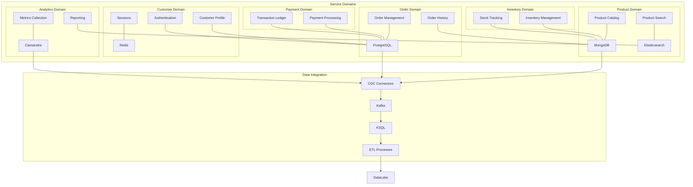
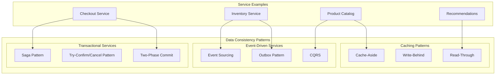
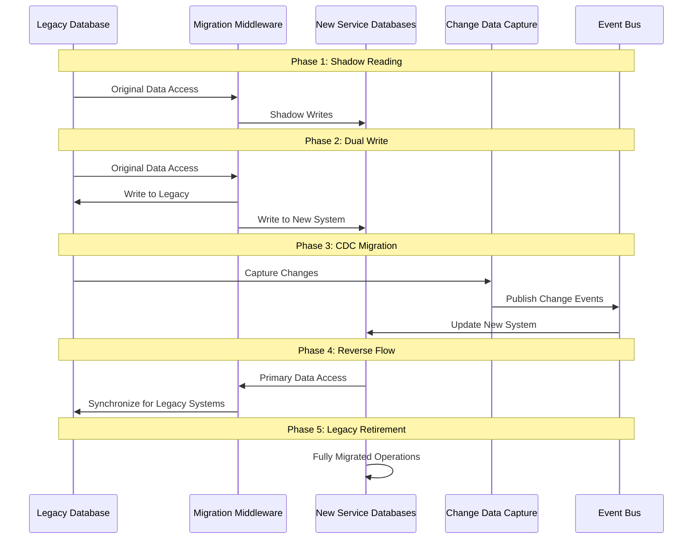

## ADR-004: Database Strategy for Microservices in FlowMart E-commerce Platform

### Status

Approved (2024-08-20)

### Context

Our transition from a monolithic architecture to microservices necessitates a reassessment of our database strategy. The existing monolithic application uses a centralized Oracle database with hundreds of tables spanning multiple business domains. This approach has created several challenges:

1. **Schema Coupling**: Changes to database schemas require careful coordination across teams to avoid breaking dependent services.
2. **Scalability Limitations**: The relational database becomes a bottleneck during high-traffic periods, affecting all application features.
3. **One-Size-Fits-All Approach**: Different data access patterns are all forced into the same relational model, leading to suboptimal performance.
4. **Operational Overhead**: Database administration is complex due to competing requirements from different application components.
5. **Development Bottlenecks**: Teams must coordinate database changes, slowing down development velocity.
6. **Cost Efficiency**: The enterprise database licensing model is expensive and doesn't scale cost-effectively with our varying workloads.

As we decompose our application into microservices, we need a database strategy that promotes service autonomy while ensuring data consistency, performance, and operational efficiency.

### Decision

We will adopt a **polyglot persistence strategy** for our microservices architecture, following the principle of "right database for the right job." Key aspects of this strategy include:

1. **Database-per-Service Pattern**:
   - Each microservice will own and exclusively manage its database
   - No direct database access from other services
   - Services interact via well-defined APIs, not shared databases

2. **Primary Database Technologies**:
   - **PostgreSQL**: Primary relational database for services with complex transactional requirements
   - **MongoDB**: Document database for services with flexible schema requirements and read-heavy workloads
   - **Redis**: In-memory data store for caching, session management, and real-time features
   - **Elasticsearch**: Search engine for product catalog and content search
   - **Apache Cassandra**: Wide-column store for high-volume time-series data and analytics
   - **Amazon DynamoDB**: Managed NoSQL for highly scalable microservices with predictable access patterns

3. **Data Consistency Patterns**:
   - **Saga Pattern**: For coordinating transactions across multiple services
   - **Event Sourcing**: For critical business domains requiring complete audit trails
   - **CQRS**: For services with asymmetric read/write loads
   - **Outbox Pattern**: For reliable event publishing during state changes

4. **Data Migration and Evolution**:
   - Versioned database schemas
   - Backward-compatible schema changes
   - Blue/green deployment for database changes
   - Incremental data migration approach

5. **Data Governance**:
   - Centralized data catalog and lineage tracking
   - Common data models for shared business entities
   - Standard approach to master data management
   - Automated data quality monitoring

6. **Operational Excellence**:
   - Infrastructure as Code (IaC) for all database resources
   - Automated backup and recovery procedures
   - Standardized monitoring and alerting
   - Database reliability engineering practices

### Database Selection Criteria by Domain

| Domain | Database Type | Primary Factors | Secondary Considerations |
|--------|---------------|-----------------|--------------------------|
| Product Catalog | MongoDB + Elasticsearch | Schema flexibility, Search capabilities | High read-to-write ratio, Caching |
| Order Management | PostgreSQL | ACID transactions, Complex queries | Event sourcing for audit trail |
| Customer Profile | PostgreSQL | Data consistency, Relational integrity | Privacy compliance, Scalable reads |
| Inventory | MongoDB | Frequent schema evolution, High write throughput | Eventual consistency model |
| Cart & Checkout | Redis + PostgreSQL | Low latency, High availability | Transaction support for checkout |
| Payment Processing | PostgreSQL | Strong consistency, Transaction support | Compliance requirements, Security |
| Analytics | Cassandra | High write throughput, Time-series data | Analytical query patterns |
| Recommendations | Redis + MongoDB | Low latency reads, Flexible data model | Machine learning feature support |
| User Sessions | Redis | Ultra-low latency, Expiration support | High availability, Cross-region replication |
| Content Management | MongoDB | Flexible schema, Document structure | Full-text search capability |

### Consequences

#### Positive

1. **Service Autonomy**: Teams can independently select, optimize, and evolve their databases without cross-team coordination.

2. **Optimized Performance**: Each service can use a database technology optimized for its specific data access patterns.

3. **Independent Scaling**: Database resources can be scaled according to the specific needs of each service.

4. **Improved Resilience**: Database failures are isolated to specific services rather than affecting the entire system.

5. **Fit-for-Purpose Solutions**: Different data models (relational, document, key-value, etc.) can be applied where most appropriate.

6. **Cost Optimization**: Resources can be allocated based on the specific needs of each service.

7. **Incremental Adoption**: New database technologies can be introduced for new services without migrating legacy data.

#### Negative

1. **Increased Operational Complexity**: Managing multiple database technologies requires broader expertise and more sophisticated tooling.

2. **Data Consistency Challenges**: Maintaining consistency across service boundaries requires careful design and implementation.

3. **Learning Curve**: Development teams need to learn multiple database technologies and data access patterns.

4. **Distributed Transactions**: Business processes spanning multiple services require more complex transaction management.

5. **Increased Infrastructure Costs**: Running and maintaining multiple database systems may increase overall infrastructure costs.

6. **Data Duplication**: Some data may need to be duplicated across services, creating synchronization challenges.

7. **Monitoring and Troubleshooting Complexity**: Different databases require different monitoring approaches and expertise.

### Mitigation Strategies

1. **Platform Database Service**:
   - Create an internal platform team that provides database-as-a-service capabilities
   - Standardize on a limited set of supported database technologies
   - Provide automated provisioning, backup, and monitoring

2. **Data Access Layer Pattern**:
   - Create standardized libraries for common database access patterns
   - Abstract database-specific details behind consistent interfaces
   - Implement retry logic, circuit breakers, and observability

3. **Data Synchronization Framework**:
   - Implement a standardized approach to CDC (Change Data Capture)
   - Create reusable components for the Outbox Pattern
   - Develop standard data synchronization workflows

4. **Database Reliability Engineering**:
   - Establish dedicated database reliability engineers
   - Create runbooks for common database operations
   - Implement chaos engineering practices for database failure testing

5. **Developer Training and Support**:
   - Comprehensive training program for supported database technologies
   - Internal knowledge base and best practice documentation
   - Database design review process for new services

### Implementation Details

#### Phase 1: Foundation (Q3-Q4 2024)

1. Establish database platform team and core services
2. Set up standard PostgreSQL and MongoDB offerings
3. Implement database CI/CD pipelines
4. Develop initial monitoring and alerting
5. Create database provisioning automation

#### Phase 2: Expansion (Q1-Q2 2025)

1. Add Redis and Elasticsearch to supported offerings
2. Implement data synchronization framework
3. Develop CQRS and Event Sourcing patterns
4. Create data governance tooling
5. Expand monitoring capabilities

#### Phase 3: Advanced Capabilities (Q3-Q4 2025)

1. Add Cassandra and specialized databases
2. Implement advanced high availability features
3. Develop cross-region replication capabilities
4. Create advanced analytics integration
5. Implement predictive scaling and optimization

### Considered Alternatives

#### 1. Shared Database Approach

**Pros**: Simplicity, familiar model, transactional integrity, easier reporting  
**Cons**: Tight coupling, scalability limitations, schema coordination challenges

This approach would minimize short-term changes but would recreate many of the current issues in our new architecture.

#### 2. Single Database Technology (PostgreSQL Only)

**Pros**: Operational simplicity, consistent expertise, familiar tooling  
**Cons**: Not optimal for all workloads, potential performance compromises

While PostgreSQL is versatile, it isn't the best choice for all our diverse data requirements.

#### 3. Database-as-a-Service Only (e.g., AWS RDS/DynamoDB)

**Pros**: Reduced operational overhead, managed scaling, built-in high availability  
**Cons**: Vendor lock-in, potential cost concerns, less flexibility

While we'll use managed services where appropriate, we need the flexibility to run certain databases on our own infrastructure.

#### 4. Fully Centralized Data Lake Approach

**Pros**: Centralized analytics, simplified data governance, consistent data model  
**Cons**: Complex real-time synchronization, potential performance issues, development overhead

This approach works well for analytics but isn't suitable for operational data needs.

### References

1. Kleppmann, Martin. "Designing Data-Intensive Applications" (O'Reilly Media)
2. Vernon, Vaughn. "Implementing Domain-Driven Design" (Addison-Wesley)
3. Fowler, Martin. "PolyglotPersistence" [martinfowler.com](https://martinfowler.com/bliki/PolyglotPersistence.html)
4. Richardson, Chris. "Microservices Patterns" (Manning Publications)
5. [Database per Service Pattern](https://microservices.io/patterns/data/database-per-service.html)
6. [Saga Pattern](https://microservices.io/patterns/data/saga.html)

### Decision Record History

| Date | Version | Description | Author |
|------|---------|-------------|--------|
| 2024-07-20 | 0.1 | Initial draft | Robert Kim |
| 2024-08-02 | 0.2 | Added domain-specific database recommendations | Maria Garcia |
| 2024-08-15 | 0.3 | Incorporated feedback from architecture review | David Boyne |
| 2024-08-20 | 1.0 | Approved by Architecture Board | Architecture Board |

## Appendix A: Database Architecture Overview

## Appendix B: Data Consistency Patterns by Service Type

## Appendix C: Database Migration Strategy

