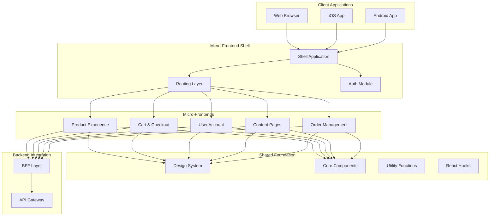
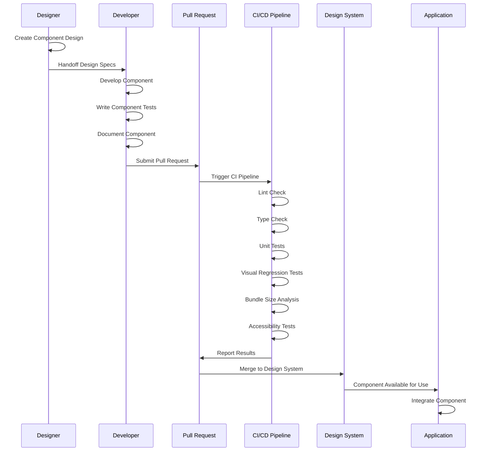
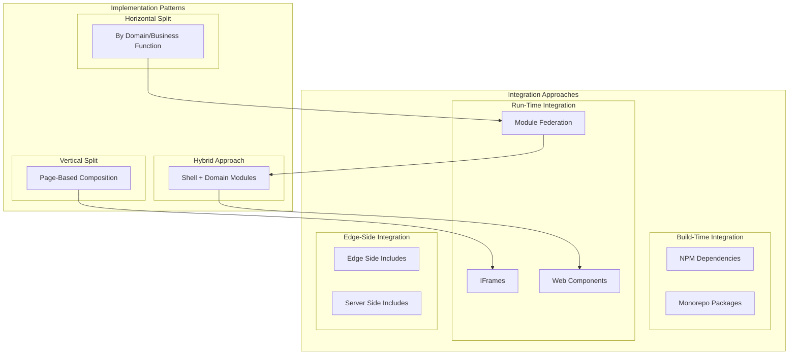

## ADR-005: Frontend Architecture for FlowMart E-commerce Platform

### Status

Approved (2024-09-05)

### Context

The frontend of our current monolithic e-commerce application faces numerous challenges:

1. **Performance Issues**: The current server-rendered application has slow page loads and poor mobile performance.
2. **Developer Productivity**: Shared frontend codebase creates development bottlenecks and team dependencies.
3. **Inconsistent User Experience**: Different parts of the application have divergent design patterns and interaction models.
4. **Limited Reusability**: Components are tightly coupled to specific pages, making code reuse difficult.
5. **Testing Challenges**: The current codebase has limited test coverage and is difficult to test effectively.
6. **Technology Constraints**: Outdated technology stack limits our ability to leverage modern frontend capabilities.
7. **Scalability Concerns**: Our current approach doesn't scale well with increasing development team size.
8. **Mobile Experience**: The responsive web approach doesn't deliver optimal mobile experiences.

As we transition to a microservices backend architecture, we need a complementary frontend strategy that addresses these challenges while supporting our business goals of improved customer experience, faster time-to-market, and technical agility.

### Decision

We will adopt a **modern, component-based frontend architecture** with the following key characteristics:

1. **Micro-Frontend Approach**:
   - Decompose the frontend into domain-aligned micro-frontends
   - Enable independent development and deployment of frontend components
   - Provide clear ownership boundaries aligned with backend microservices

2. **Core Technology Stack**:
   - **React**: Primary UI library for component development
   - **Next.js**: Framework for server-rendering and static generation
   - **TypeScript**: For type safety and improved developer experience
   - **Styled Components**: For component-scoped styling
   - **React Query**: For data fetching and state management
   - **Cypress & React Testing Library**: For testing

3. **Design System**:
   - Create a comprehensive design system with reusable UI components
   - Implement a living style guide and component documentation
   - Establish design tokens for consistent theming
   - Support multiple brands and white-labeling capabilities

4. **Architecture Patterns**:
   - **Module Federation**: For sharing components between micro-frontends
   - **Composition Layer**: Shell application for integrating micro-frontends
   - **BFF Pattern**: Backend-for-Frontend APIs for optimized data access
   - **State Management**: Local state when possible, shared state when necessary
   - **Feature Flags**: For controlled feature rollout and A/B testing

5. **Performance Optimization**:
   - Server-side rendering for initial page load performance
   - Client-side rendering for rich interactive experiences
   - Code splitting and lazy loading for optimized bundle sizes
   - Aggressive caching strategies for static assets
   - Optimized media delivery with responsive images and lazy loading

6. **Mobile Strategy**:
   - Progressive Web App (PWA) capabilities for mobile web
   - Responsive design with mobile-first approach
   - Native app shell with React Native for iOS/Android applications
   - Shared business logic between web and native through abstraction layers

### Frontend Domain Decomposition

| Domain | Micro-Frontend | Primary Responsibilities | Team |
|--------|---------------|--------------------------|------|
| Product Discovery | product-browser | Product listing, search, filtering, recommendations | Catalog Team |
| Product Details | product-details | Product information, options, reviews, related items | Catalog Team |
| Shopping Cart | cart-experience | Cart management, saved items, quick checkout | Checkout Team |
| Checkout | checkout-flow | Multi-step checkout, address management, payment | Checkout Team |
| User Account | account-portal | Profile management, preferences, order history | Customer Team |
| Content | content-pages | CMS-managed content, landing pages, promotional content | Marketing Team |
| Store Locator | store-finder | Store search, maps integration, store details | Location Team |
| Order Management | order-tracker | Order status, tracking, returns management | Order Team |

### Consequences

#### Positive

1. **Improved Development Velocity**: Teams can work independently on their domains without blocking each other.

2. **Better Performance**: Optimized loading strategies and modern frontend practices will improve user experience.

3. **Enhanced Reusability**: Shared component library and design system enable consistent, reusable UI elements.

4. **Independent Deployments**: Micro-frontends can be deployed independently, reducing release coordination.

5. **Technology Flexibility**: Different domains can adopt new technologies at their own pace.

6. **Better Testing**: Smaller, more focused codebases are easier to test thoroughly.

7. **Improved User Experience**: Consistent design language and optimized interactions improve customer satisfaction.

8. **Team Autonomy**: Clear ownership boundaries enable teams to take full responsibility for their domains.

#### Negative

1. **Increased Complexity**: Micro-frontend architectures add operational and integration complexity.

2. **Learning Curve**: Teams need to adapt to new patterns and technologies.

3. **Potential Duplication**: Without careful governance, similar solutions may be implemented multiple times.

4. **Integration Challenges**: Ensuring consistent behavior across micro-frontends requires careful coordination.

5. **Performance Overhead**: Micro-frontend composition can introduce additional runtime overhead if not carefully managed.

6. **Increased Infrastructure Needs**: More sophisticated build, deployment, and monitoring infrastructure required.

7. **Governance Challenges**: Balancing team autonomy with architectural consistency requires active governance.

### Mitigation Strategies

1. **Frontend Platform Team**:
   - Create a dedicated platform team to provide shared infrastructure and tools
   - Develop reusable patterns and documentation for micro-frontend implementation
   - Provide developer tooling and simplified local development experience

2. **Comprehensive Design System**:
   - Invest in a robust design system with clear guidelines and components
   - Create automated tools for design compliance checking
   - Regular design system sessions to ensure alignment across teams

3. **Performance Budgeting**:
   - Establish clear performance metrics and budgets for each micro-frontend
   - Automated performance testing in CI/CD pipeline
   - Regular performance reviews and optimization workshops

4. **Developer Experience**:
   - Create standardized templates and generators for new micro-frontends
   - Provide comprehensive documentation and internal training
   - Establish frontend community of practice for knowledge sharing

5. **Governance Model**:
   - Create a frontend architecture council with representatives from each team
   - Regular architecture reviews and pattern sharing
   - Clear guidelines for when to share vs. create new components

### Implementation Details

#### Phase 1: Foundation (Q4 2024)

1. Create core design system and component library
2. Establish micro-frontend shell architecture
3. Develop initial build and deployment pipeline
4. Implement authentication and session management
5. Create developer documentation and examples

#### Phase 2: Domain Migration (Q1-Q2 2025)

1. Migrate high-priority domains to micro-frontend architecture
2. Implement analytics and monitoring strategy
3. Develop advanced patterns for cross-domain interaction
4. Enhance performance optimization capabilities
5. Create specialized mobile experiences

#### Phase 3: Advanced Capabilities (Q3-Q4 2025)

1. Implement personalization framework
2. Develop advanced A/B testing capabilities
3. Enhance internationalization and localization
4. Create specialized native experiences
5. Implement advanced analytics and behavior tracking

### Considered Alternatives

#### 1. Monolithic Single-Page Application (SPA)

**Pros**: Simpler architecture, unified codebase, shared state management  
**Cons**: Development bottlenecks, scaling challenges, larger bundle sizes

This approach would be simpler initially but would recreate many of our current scaling challenges.

#### 2. Server-Side Rendering Only

**Pros**: Simpler technology stack, better SEO by default, reduced client-side JavaScript  
**Cons**: Limited interactivity, slower subsequent navigation, poorer offline capabilities

While this would improve initial load performance, it would limit our ability to create rich interactive experiences.

#### 3. Native Mobile Apps Only for Mobile

**Pros**: Optimal mobile experience, full native capabilities, offline functionality  
**Cons**: Development cost, platform duplication, release friction

This would deliver better mobile experiences but at significantly higher development and maintenance costs.

#### 4. Framework-Agnostic Approach

**Pros**: Maximum team autonomy, best-tool-for-job flexibility  
**Cons**: Duplication of efforts, inconsistent experiences, integration challenges

While offering maximum flexibility, this would lead to significant inconsistency and integration challenges.

### References

1. [Micro Frontends](https://martinfowler.com/articles/micro-frontends.html) (Martin Fowler)
2. [Module Federation](https://webpack.js.org/concepts/module-federation/) (Webpack Documentation)
3. ["Building Micro-Frontends" by Luca Mezzalira](https://www.oreilly.com/library/view/building-micro-frontends/9781492082989/)
4. [Frontend Design Systems](https://designsystemsrepo.com/design-systems)
5. [Atomic Design](https://atomicdesign.bradfrost.com/) by Brad Frost
6. [React Documentation](https://reactjs.org/docs/getting-started.html)
7. [Next.js Documentation](https://nextjs.org/docs)

### Decision Record History

| Date | Version | Description | Author |
|------|---------|-------------|--------|
| 2024-08-10 | 0.1 | Initial draft | Jennifer Lee |
| 2024-08-20 | 0.2 | Added implementation phases and domain decomposition | Alex Johnson |
| 2024-08-30 | 0.3 | Incorporated feedback from UX and frontend teams | Sarah Chen |
| 2024-09-05 | 1.0 | Approved by Architecture and UX Boards | Architecture Board |

## Appendix A: Frontend Architecture Overview

## Appendix B: Component Development Workflow

## Appendix C: Micro-Frontend Integration Patterns

