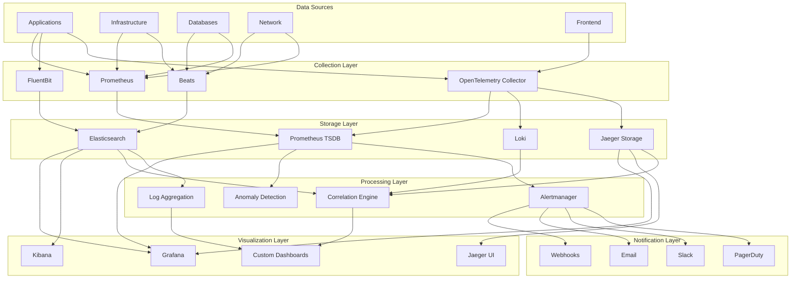
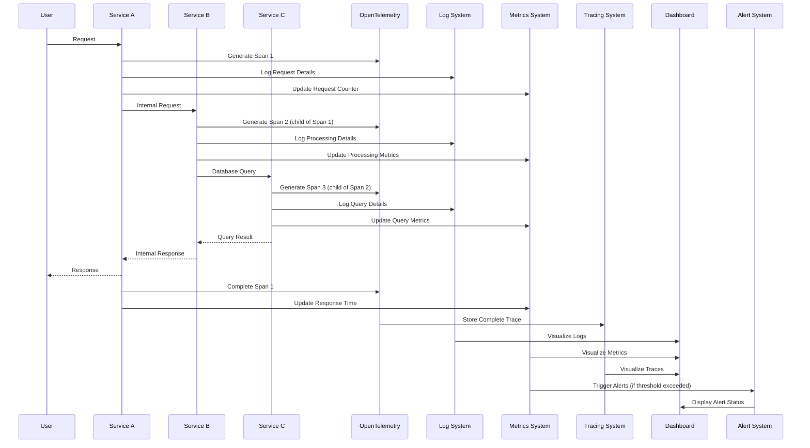

## ADR-006: Observability Strategy for FlowMart E-commerce Platform

### Status

Approved (2024-09-15)

### Context

As we transition from a monolithic architecture to a distributed microservices-based e-commerce platform, traditional monitoring approaches are no longer sufficient. The increased complexity of our architecture introduces several challenges:

1. **Distributed Systems Complexity**: With dozens of microservices communicating asynchronously, understanding system behavior becomes significantly more difficult.

2. **Increased Failure Points**: A distributed architecture introduces more potential failure points and complex failure modes.

3. **Service Interdependencies**: Issues in one service can cascade to others, making root cause analysis challenging.

4. **Multiple Technologies**: Different services use different languages, frameworks, and datastores, requiring diverse instrumentation approaches.

5. **Deployment Frequency**: With continuous deployment across multiple services, correlating issues with specific changes becomes more complex.

6. **Performance Bottlenecks**: Identifying performance bottlenecks in a distributed system requires end-to-end visibility.

7. **Cross-Team Collaboration**: Multiple teams own different services, requiring a common observability approach and shared understanding.

8. **Business Impact Correlation**: Need to connect technical metrics with business outcomes to prioritize improvements.

Our current monitoring strategy is primarily focused on infrastructure metrics and basic application health checks, which is insufficient for effectively operating our new architecture.

### Decision

We will implement a comprehensive **observability strategy** based on the "three pillars" approach (metrics, logs, and traces) with distributed tracing as a foundational element. Key components of this strategy include:

1. **Observability Stack**:
   - **Metrics**: Prometheus for metrics collection and alerting
   - **Logs**: Elasticsearch, Logstash, and Kibana (ELK) for log aggregation and analysis
   - **Traces**: Jaeger for distributed tracing
   - **Dashboard**: Grafana for unified visualization and dashboarding
   - **Alerting**: Prometheus Alertmanager with PagerDuty integration

2. **Instrumentation Standards**:
   - **Distributed Tracing**: OpenTelemetry as the standard instrumentation framework
   - **Structured Logging**: JSON-formatted logs with standardized fields across all services
   - **Metrics Naming**: Consistent metrics naming convention following Prometheus best practices
   - **Service Level Objectives (SLOs)**: Defined for all critical user journeys
   - **Error Budgets**: Established for each service and user journey

3. **Core Observability Capabilities**:
   - **Request Tracing**: End-to-end tracing for all user-initiated actions
   - **Dependency Monitoring**: Monitoring of all external dependencies and services
   - **Business Metrics**: Tracking of key business metrics alongside technical metrics
   - **Synthetic Monitoring**: Regular testing of critical user journeys
   - **Real User Monitoring (RUM)**: Frontend performance and error tracking
   - **Anomaly Detection**: Automated detection of abnormal system behavior
   - **Correlation Engine**: Tools to correlate metrics, logs, and traces during investigation

4. **Data Retention and Sampling**:
   - Critical business transaction traces retained for 30 days
   - High-cardinality metrics sampled at appropriate rates
   - Error logs retained for 90 days
   - Regular logs retained for 30 days
   - Aggregated metrics retained for 13 months for year-over-year analysis

5. **Implementation Approach**:
   - Platform team creates and maintains observability infrastructure
   - Standardized libraries and SDKs for each supported language/framework
   - Observability as code, with instrumentation verified in CI/CD pipelines
   - Service templates with pre-configured observability components
   - Progressive enhancement of observability capabilities

### Observability Requirements by Domain

| Domain | Key Metrics | Special Requirements | SLO Targets |
|--------|------------|----------------------|-------------|
| Product Catalog | Search latency, Cache hit rate | High cardinality data handling | 99.9% availability, p95 < 300ms |
| Order Processing | Order volume, Processing time, Error rate | Comprehensive transaction tracing | 99.95% availability, p95 < 500ms |
| Payment | Transaction volume, Success rate, Fraud detection rate | PCI compliance in logging | 99.99% availability, p95 < 800ms |
| Inventory | Stock level changes, Reservation rate, Stockout events | Event-sourcing visibility | 99.9% availability, p95 < 400ms |
| User Authentication | Login volume, Success rate, MFA usage | Security-focused monitoring | 99.99% availability, p95 < 250ms |
| Checkout | Cart conversion rate, Abandonment points, Session duration | User journey analysis | 99.95% availability, p95 < 600ms |
| Shipping | Fulfillment time, Carrier performance, Tracking accuracy | Third-party integration monitoring | 99.9% availability, p95 < 350ms |
| Content Delivery | Cache hit ratio, Origin fetch time, Asset size | CDN performance visibility | 99.9% availability, p95 < 200ms |

### Consequences

#### Positive

1. **Improved Troubleshooting**: Faster identification and resolution of issues through correlated observability data.

2. **Proactive Detection**: Ability to detect potential issues before they impact users through anomaly detection and trend analysis.

3. **Enhanced Understanding**: Better understanding of system behavior, dependencies, and performance characteristics.

4. **Data-Driven Optimization**: Ability to make targeted performance improvements based on actual usage patterns.

5. **Cross-Team Collaboration**: Common observability platform enables better collaboration during incident response.

6. **Business Alignment**: Correlation between technical metrics and business outcomes helps prioritize technical work.

7. **Resilience Verification**: Ability to verify that resilience mechanisms (circuit breakers, retries, etc.) function properly.

8. **Capacity Planning**: Better data for capacity planning and scaling decisions.

#### Negative

1. **Implementation Overhead**: Adding comprehensive instrumentation requires additional development effort.

2. **Data Volume Challenges**: Managing the volume of observability data requires careful planning and potential sampling.

3. **Performance Impact**: Instrumentation adds some overhead to application performance, which must be managed.

4. **Complexity**: A sophisticated observability stack adds operational complexity and maintenance requirements.

5. **Learning Curve**: Teams need to learn new tools, concepts, and practices for effective use of observability data.

6. **Cost Considerations**: Storage and processing of observability data has significant cost implications at scale.

7. **Privacy and Security**: Observability data may contain sensitive information requiring appropriate controls.

### Mitigation Strategies

1. **Automated Instrumentation**:
   - Use auto-instrumentation agents where possible
   - Create starter templates with instrumentation pre-configured
   - Build instrumentation verification into CI/CD pipelines

2. **Data Management**:
   - Implement appropriate sampling strategies for high-volume data
   - Utilize data compression and aggregation techniques
   - Define appropriate retention policies based on data criticality

3. **Operating Model**:
   - Create an observability platform team to manage the core infrastructure
   - Establish observability champions within each service team
   - Regular observability review and enhancement sessions

4. **Knowledge Sharing**:
   - Comprehensive documentation and training on observability tools
   - Regular workshops on effective use of observability data
   - Shared dashboards and runbooks for common scenarios

5. **Security and Privacy**:
   - Automated PII detection and redaction in logs and traces
   - Role-based access control for observability data
   - Regular audits of observability data for sensitive information

### Implementation Details

#### Phase 1: Foundation (Q4 2024)

1. Deploy core observability infrastructure (Prometheus, ELK, Jaeger, Grafana)
2. Implement standardized logging format and collection pipeline
3. Create initial service dashboards and alerting
4. Develop instrumentation libraries for primary service frameworks
5. Establish basic SLOs for critical services

#### Phase 2: Enhanced Capabilities (Q1 2025)

1. Implement distributed tracing across all critical user journeys
2. Create business metrics dashboards correlated with technical metrics
3. Develop anomaly detection for key system behaviors
4. Implement synthetic monitoring for critical paths
5. Create runbooks integrated with observability tools

#### Phase 3: Advanced Observability (Q2-Q3 2025)

1. Implement ML-based anomaly detection and prediction
2. Create self-service observability platform capabilities
3. Develop advanced correlation between metrics, logs, and traces
4. Implement automated performance testing with observability verification
5. Develop capacity planning and forecasting based on observability data

### Considered Alternatives

#### 1. Commercial APM Solution Only (e.g., Dynatrace, New Relic)

**Pros**: Comprehensive out-of-the-box capabilities, reduced implementation effort, integrated platform  
**Cons**: High cost at scale, reduced flexibility, potential vendor lock-in

While commercial APM tools provide excellent capabilities, we chose an open-source approach for cost flexibility and customization ability. We will reevaluate this decision as our needs evolve.

#### 2. Minimal Custom Instrumentation

**Pros**: Reduced development overhead, simplicity, lower initial investment  
**Cons**: Limited visibility, reactive troubleshooting, challenges scaling observability with system growth

This approach would not provide the depth of insight needed for effective operation of our distributed system.

#### 3. Service Mesh-Based Observability

**Pros**: Reduced application instrumentation, consistent approach, network-level visibility  
**Cons**: Limited application-level context, additional infrastructure complexity, potential performance impact

While we will leverage service mesh observability capabilities, we need application-level instrumentation for complete visibility.

#### 4. Multiple Independent Monitoring Systems

**Pros**: Specialized tools for each domain, team autonomy in tooling decisions  
**Cons**: Fragmented visibility, integration challenges, inconsistent practices

This approach would create silos and make cross-service troubleshooting significantly more difficult.

### References

1. Charity Majors, Liz Fong-Jones, George Miranda, "Observability Engineering" (O'Reilly)
2. Cindy Sridharan, "Distributed Systems Observability" (O'Reilly)
3. [OpenTelemetry Documentation](https://opentelemetry.io/docs/)
4. [Google SRE Book - Monitoring Distributed Systems](https://sre.google/sre-book/monitoring-distributed-systems/)
5. [Prometheus Best Practices](https://prometheus.io/docs/practices/naming/)
6. [Grafana Observability Strategy](https://grafana.com/blog/2019/10/21/whats-next-for-observability/)

### Decision Record History

| Date | Version | Description | Author |
|------|---------|-------------|--------|
| 2024-08-20 | 0.1 | Initial draft | Kevin Zhang |
| 2024-09-01 | 0.2 | Added implementation phases and domain details | Rachel Williams |
| 2024-09-10 | 0.3 | Incorporated feedback from SRE and platform teams | David Boyne |
| 2024-09-15 | 1.0 | Approved by Architecture and Operations Boards | Architecture Board |

## Appendix A: Observability Architecture



## Appendix B: Observability Data Flow



## Appendix C: Service Level Objectives (SLOs) Framework

```mermaid
flowchart TB
    subgraph "SLO Definition Process"
        direction TB
        
        subgraph "1. Identify Critical User Journeys"
            journey1[Product Search]
            journey2[Add to Cart]
            journey3[Checkout]
            journey4[Order Status]
        end
        
        subgraph "2. Define Service Level Indicators (SLIs)"
            availability[Availability %]
            latency[Latency (p50, p95, p99)]
            errors[Error Rate %]
            saturation[Resource Saturation]
        end
        
        subgraph "3. Set Target Objectives"
            slo1[99.9% Availability]
            slo2[p95 < 300ms]
            slo3[Error Rate < 0.1%]
        end
        
        subgraph "4. Establish Error Budgets"
            monthly[Monthly Budget]
            quarterly[Quarterly Budget]
            policy[Error Budget Policy]
        end
    end
    
    subgraph "SLO Monitoring & Reporting"
        direction TB
        
        subgraph "Real-time Dashboards"
            current[Current Status]
            trends[Burn Rate]
            history[Historical Performance]
        end
        
        subgraph "Alerting Strategy"
            warning[Budget Warning (50%)]
            critical[Budget Critical (75%)]
            depleted[Budget Depleted (90%)]
        end
        
        subgraph "Continuous Improvement"
            retro[SLO Reviews]
            adjust[Target Adjustments]
            prioritize[Reliability Work]
        end
    end
    
    journey1 --> availability
    journey1 --> latency
    journey2 --> availability
    journey2 --> latency
    journey3 --> errors
    journey3 --> availability
    journey4 --> latency
    
    availability --> slo1
    latency --> slo2
    errors --> slo3
    
    slo1 --> monthly
    slo2 --> monthly
    slo3 --> monthly
    
    monthly --> current
    monthly --> warning
    
    current --> retro
    warning --> prioritize
``` 