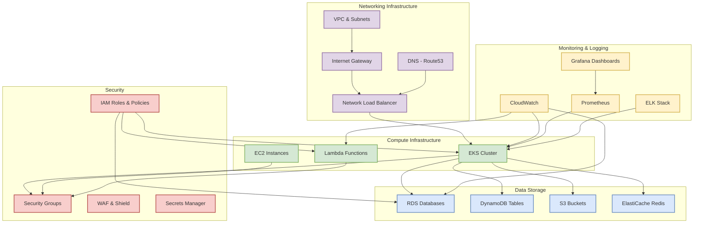

# Infrastructure as Code (IaC) Overview

This document provides an overview of the Infrastructure as Code (IaC) approach used to manage and provision the infrastructure for the FlowMart e-commerce platform.

## What is Infrastructure as Code?

Infrastructure as Code (IaC) is an approach to infrastructure management where infrastructure resources are defined and provisioned through machine-readable definition files, rather than through manual processes or interactive configuration tools. This approach allows us to:

- **Version control** our infrastructure definitions alongside our application code
- **Automate** the provisioning and management of infrastructure
- **Standardize** configurations across different environments
- **Document** our infrastructure setup as living code rather than static documentation
- **Test** infrastructure changes before deploying to production

## Our IaC Tech Stack

For the FlowMart e-commerce platform, we use the following technologies for our infrastructure management:

### Primary Tools

| Tool | Purpose |
|------|---------|
| **Terraform** | Infrastructure provisioning across cloud providers (primary tool) |
| **Kubernetes (K8s)** | Container orchestration |
| **Helm Charts** | Kubernetes application deployment packaging |
| **GitHub Actions** | CI/CD pipeline automation |
| **AWS CloudFormation** | Specific AWS infrastructure components |

### Additional Supporting Tools

| Tool | Purpose |
|------|---------|
| **Terragrunt** | Terraform code organization and management |
| **Packer** | Virtual machine image building |
| **Ansible** | Configuration management |
| **Prometheus & Grafana** | Monitoring and alerting |
| **ELK Stack** | Logging |

## Infrastructure Architecture

Our infrastructure is organized into the following logical components:



## Repository Structure

Our infrastructure code is organized as follows:

```
infrastructure/
│
├── terraform/                  # Terraform configuration
│   ├── environments/           # Environment-specific configurations
│   │   ├── dev/
│   │   ├── staging/
│   │   └── production/
│   ├── modules/                # Reusable Terraform modules
│   │   ├── networking/
│   │   ├── compute/
│   │   ├── database/
│   │   └── monitoring/
│   └── global/                 # Global resources (e.g., Route53)
│
├── kubernetes/                 # Kubernetes manifests
│   ├── base/                   # Base configurations
│   └── overlays/               # Environment-specific overlays (Kustomize)
│
├── helm-charts/                # Helm charts for application deployment
│
├── scripts/                    # Utility scripts
│
└── packer/                     # Packer templates for image building
```

## Deployment Principles

1. **Infrastructure Changes via Pull Requests**: All infrastructure changes must go through a pull request process, with automated testing and reviews.

2. **Environment Promotion**: Changes are first deployed to development, then staging, and finally production, with appropriate testing at each stage.

3. **Immutable Infrastructure**: We prefer to replace rather than modify infrastructure components.

4. **Least Privilege**: We follow the principle of least privilege for all IAM roles and security groups.

5. **Automated Rollbacks**: Our CI/CD pipelines include automated rollback capabilities if deployments fail.

## Next Steps

For more detailed information about our infrastructure as code setup, please refer to the following documents:

- [Terraform Implementation](./02-terraform-implementation.mdx)
- [Environment Setups](./03-environment-setups.mdx)
- [CI/CD Pipelines](./04-cicd-pipelines.mdx) 