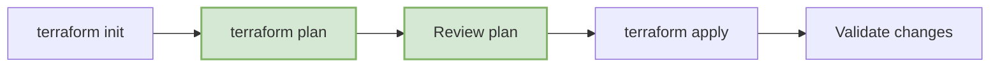
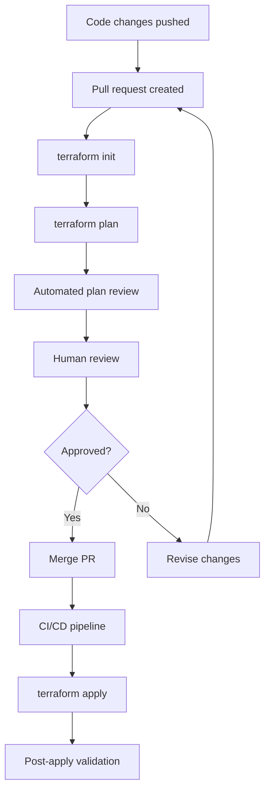

# Terraform Implementation

This document describes how we use Terraform to manage and provision the infrastructure for the FlowMart e-commerce platform.

## Why Terraform?

We chose Terraform as our primary IaC tool for the following reasons:

- **Cloud-agnostic**: While we primarily use AWS, Terraform gives us the flexibility to work with multiple cloud providers if needed
- **Declarative syntax**: Define what you want, not how to get there
- **State management**: Tracks the current state of infrastructure to plan changes
- **Modular approach**: Supports reusable components through modules
- **Strong community support**: Wide adoption means better documentation and resources
- **Extensible**: Can be extended through providers and modules

## Terraform Structure

Our Terraform code follows a structured approach:

### Directory Structure

```
terraform/
│
├── environments/                 # Environment-specific configurations
│   ├── dev/
│   │   ├── main.tf              # Main configuration file
│   │   ├── variables.tf         # Input variables
│   │   ├── outputs.tf           # Output variables
│   │   └── terraform.tfvars     # Variable values
│   ├── staging/
│   │   └── ...
│   └── production/
│       └── ...
│
├── modules/                      # Reusable Terraform modules
│   ├── networking/               # VPC, subnets, routing
│   │   ├── main.tf
│   │   ├── variables.tf
│   │   └── outputs.tf
│   ├── eks/                      # EKS cluster configuration
│   │   └── ...
│   ├── rds/                      # Database configurations
│   │   └── ...
│   ├── lambda/                   # Serverless functions
│   │   └── ...
│   └── monitoring/               # Monitoring resources
│       └── ...
│
└── global/                       # Global resources
    ├── iam/                      # IAM roles and policies
    │   └── ...
    └── route53/                  # DNS configurations
        └── ...
```

### Module Design

Each module follows a consistent pattern:

- **Inputs**: Defined in `variables.tf`
- **Resources**: Defined in `main.tf`
- **Outputs**: Defined in `outputs.tf`

## Core Infrastructure Components

Here's an overview of our main Terraform modules and what they provision:

### Networking Module

The networking module provisions our VPC infrastructure:

```hcl
module "vpc" {
  source = "../../modules/networking"

  name                 = "flowmart-${var.environment}"
  cidr                 = "10.0.0.0/16"
  azs                  = ["us-west-2a", "us-west-2b", "us-west-2c"]
  private_subnets      = ["10.0.1.0/24", "10.0.2.0/24", "10.0.3.0/24"]
  public_subnets       = ["10.0.101.0/24", "10.0.102.0/24", "10.0.103.0/24"]
  database_subnets     = ["10.0.201.0/24", "10.0.202.0/24", "10.0.203.0/24"]
  
  enable_nat_gateway   = true
  single_nat_gateway   = var.environment != "production"
  
  tags = {
    Environment = var.environment
    Project     = "FlowMart"
    ManagedBy   = "Terraform"
  }
}
```

### EKS Module

The EKS module provisions our Kubernetes cluster:

```hcl
module "eks" {
  source = "../../modules/eks"

  cluster_name    = "flowmart-${var.environment}"
  cluster_version = "1.23"
  
  vpc_id          = module.vpc.vpc_id
  subnet_ids      = module.vpc.private_subnets
  
  node_groups = {
    application = {
      desired_capacity = 3
      max_capacity     = 10
      min_capacity     = 2
      instance_types   = ["t3.large"]
      disk_size        = 50
    }
    
    system = {
      desired_capacity = 2
      max_capacity     = 4
      min_capacity     = 2
      instance_types   = ["t3.medium"]
      disk_size        = 20
    }
  }
  
  tags = {
    Environment = var.environment
    Project     = "FlowMart"
    ManagedBy   = "Terraform"
  }
}
```

### Database Module

The database module provisions our RDS instances:

```hcl
module "database" {
  source = "../../modules/rds"

  identifier           = "flowmart-${var.environment}"
  engine               = "postgres"
  engine_version       = "13.4"
  instance_class       = var.environment == "production" ? "db.r5.large" : "db.t3.medium"
  allocated_storage    = 100
  
  name                 = "flowmart"
  username             = "flowmart_admin"
  password             = var.db_password
  
  vpc_security_group_ids = [module.security_groups.database_sg_id]
  subnet_ids             = module.vpc.database_subnets
  
  backup_retention_period = var.environment == "production" ? 30 : 7
  
  tags = {
    Environment = var.environment
    Project     = "FlowMart"
    ManagedBy   = "Terraform"
  }
}
```

### DynamoDB Module

For NoSQL database needs, we use DynamoDB:

```hcl
module "dynamodb" {
  source = "../../modules/dynamodb"

  tables = {
    inventory = {
      name           = "inventory-${var.environment}"
      billing_mode   = "PROVISIONED"
      read_capacity  = var.environment == "production" ? 20 : 5
      write_capacity = var.environment == "production" ? 20 : 5
      hash_key       = "productId"
      attributes = [
        {
          name = "productId"
          type = "S"
        }
      ]
    },
    
    shopping_cart = {
      name           = "shopping-cart-${var.environment}"
      billing_mode   = "PROVISIONED"
      read_capacity  = var.environment == "production" ? 20 : 5
      write_capacity = var.environment == "production" ? 20 : 5
      hash_key       = "sessionId"
      attributes = [
        {
          name = "sessionId"
          type = "S"
        }
      ]
    }
  }
  
  tags = {
    Environment = var.environment
    Project     = "FlowMart"
    ManagedBy   = "Terraform"
  }
}
```

## Terraform Workflows

We follow these workflows when making infrastructure changes:

### Development Workflow



### Terraform in CI/CD Pipeline



## Terraform State Management

We manage Terraform state using a remote backend with the following characteristics:

- **S3 Bucket**: For state storage
- **DynamoDB Table**: For state locking
- **IAM Roles**: For secure access to state files
- **State Encryption**: For security of sensitive data

Example remote backend configuration:

```hcl
terraform {
  backend "s3" {
    bucket         = "flowmart-terraform-state"
    key            = "environments/${var.environment}/terraform.tfstate"
    region         = "us-west-2"
    dynamodb_table = "terraform-lock"
    encrypt        = true
    role_arn       = "arn:aws:iam::ACCOUNT_ID:role/TerraformStateManager"
  }
}
```

## Terraform Best Practices

We follow these best practices for our Terraform codebase:

1. **Version Pinning**: Lock provider and module versions to ensure reproducibility

```hcl
terraform {
  required_providers {
    aws = {
      source  = "hashicorp/aws"
      version = "~> 4.16.0"
    }
  }
  required_version = ">= 1.2.0"
}
```

2. **Resource Tagging**: All resources are tagged for billing and management purposes

```hcl
tags = {
  Environment = var.environment
  Project     = "FlowMart"
  ManagedBy   = "Terraform"
  Service     = "Orders"
}
```

3. **Variable Validation**: Validate inputs to prevent errors

```hcl
variable "environment" {
  description = "The deployment environment (e.g., dev, staging, production)"
  type        = string
  
  validation {
    condition     = contains(["dev", "staging", "production"], var.environment)
    error_message = "Environment must be one of: dev, staging, production."
  }
}
```

4. **Modular Design**: Use modules for reusable components

5. **Minimal Permissions**: Follow the principle of least privilege for IAM roles

## Next Steps

For more information about our IaC implementation, please refer to:

- [Environment Setups](./03-environment-setups.mdx)
- [CI/CD Pipelines](./04-cicd-pipelines.mdx) 