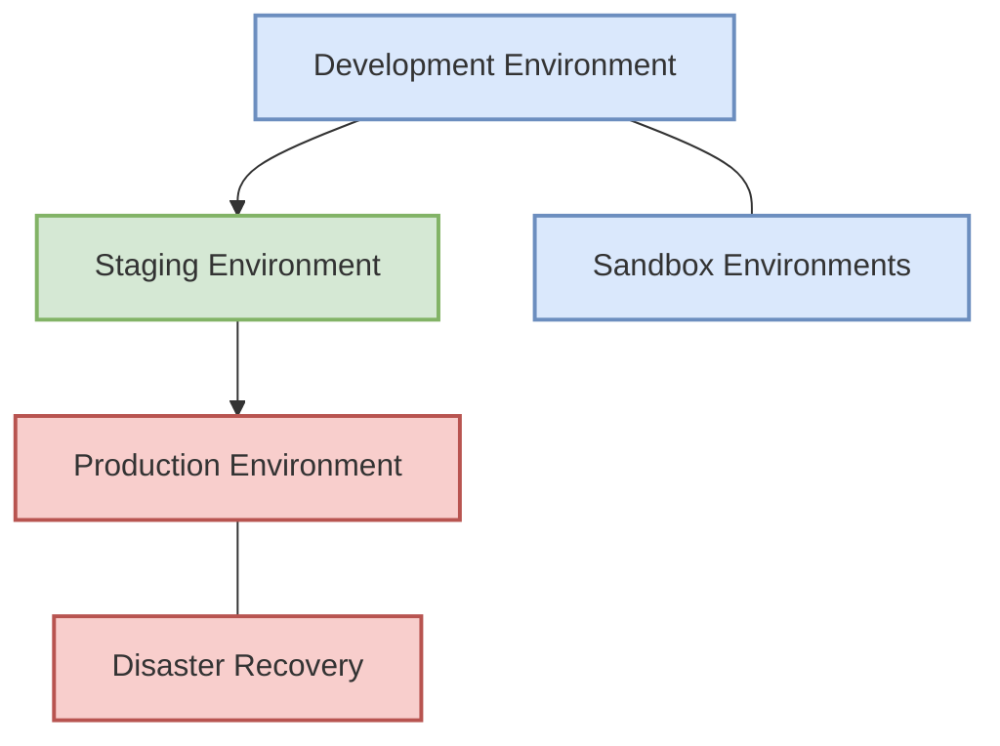
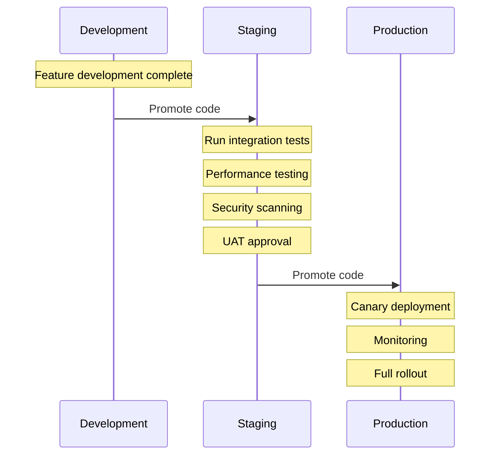
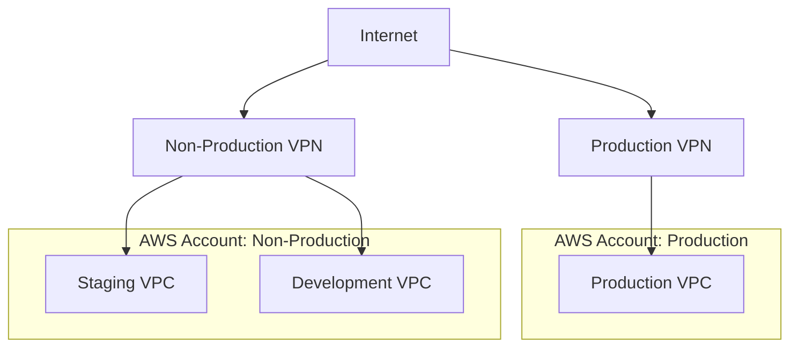
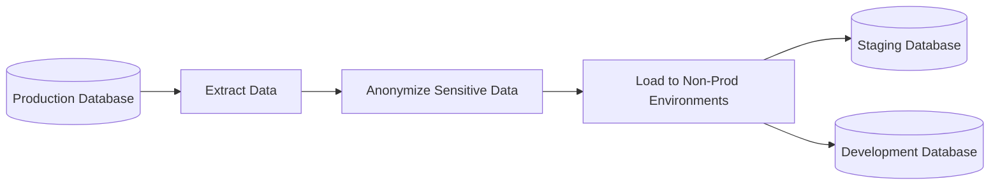

# Environment Setups

This document describes the different environments used in the FlowMart e-commerce platform, their purposes, configurations, and the promotion process between them.

## Environment Strategy

We follow a multi-environment strategy with clear separation and purposes:



## Environment Descriptions

### Development Environment

The development environment is used by developers to test changes and new features.

- **Purpose**: Development, testing, and integration
- **Access**: Development team
- **Data**: Subset of anonymized production data or synthetic data
- **Infrastructure Scale**: Minimal, cost-optimized
- **Deployment Frequency**: Multiple times per day
- **Automated Testing**: Unit tests, API tests

**Key Characteristics**:
- Shared development environment
- Reduced redundancy (e.g., single NAT gateway, smaller instances)
- Feature flags enabled for work-in-progress features
- Debug and verbose logging enabled
- Daily database refresh from anonymized production data

### Staging Environment

The staging environment is a pre-production environment that closely mirrors production.

- **Purpose**: System testing, performance testing, UAT
- **Access**: Development team, QA, selected stakeholders
- **Data**: Full anonymized copy of production data
- **Infrastructure Scale**: Nearly identical to production, but smaller scale
- **Deployment Frequency**: Once per release (multiple times per week)
- **Automated Testing**: Integration tests, performance tests, security scans

**Key Characteristics**:
- Configuration as close to production as possible
- Full feature set enabled
- Production-level logging
- Staged rollout of new features
- Regular (weekly) database refresh from anonymized production data

### Production Environment

The production environment serves real customers and processes real transactions.

- **Purpose**: Serving end-users
- **Access**: Limited access via break-glass procedures
- **Data**: Real customer data
- **Infrastructure Scale**: Full scale, highly available
- **Deployment Frequency**: Multiple times per week, during designated windows
- **Automated Testing**: Smoke tests, canary tests

**Key Characteristics**:
- High availability across multiple availability zones
- Auto-scaling based on demand
- Enhanced security controls
- Full monitoring and alerting
- Regular backups
- Blue/green deployment strategy

### Sandbox Environments

Ephemeral environments for developers to test specific features or changes.

- **Purpose**: Feature development, experimentation
- **Access**: Individual developers or teams
- **Data**: Synthetic data
- **Infrastructure Scale**: Minimal
- **Deployment Frequency**: On-demand
- **Lifetime**: Temporary (hours to days)

### Disaster Recovery Environment

A standby environment that can be activated in case of a major outage in the production environment.

- **Purpose**: Business continuity
- **State**: Warm standby
- **Data**: Regular replication from production
- **Region**: Different from primary production region
- **Activation**: Automated with manual approval

## Environment Configuration

We manage environment-specific configurations through:

1. **Terraform Variables**: Each environment has its own `terraform.tfvars` file
2. **Kubernetes ConfigMaps**: Environment-specific Kubernetes configurations
3. **Environment Variables**: Set at the pod or container level
4. **Feature Flags**: Application-level feature toggles

Example Terraform Variable Differences:

| Variable | Dev | Staging | Production |
|----------|-----|---------|------------|
| `vpc_cidr` | 10.0.0.0/16 | 10.1.0.0/16 | 10.2.0.0/16 |
| `eks_node_count` | 2 | 3 | 5-10 (auto-scaling) |
| `rds_instance_type` | db.t3.medium | db.r5.large | db.r5.2xlarge |
| `rds_multi_az` | false | true | true |
| `enable_waf` | false | true | true |

## Environment Promotion Process

We follow a structured promotion process for changes moving through environments:



### Promotion Guidelines

1. **Development to Staging**:
   - All unit tests pass
   - Code review completed
   - Feature implementation verified in development
   - Feature documentation completed

2. **Staging to Production**:
   - All integration tests pass
   - Performance tests meet SLAs
   - Security scans show no critical or high vulnerabilities
   - UAT completed and signed off
   - Release notes prepared

## Environment Variables Management

We manage environment variables securely using:

1. **AWS Parameter Store**: For non-secret configuration
2. **AWS Secrets Manager**: For sensitive values
3. **Kubernetes Secrets**: Mounted into containers at runtime

Example parameter naming convention:
```
/flowmart/{environment}/{service}/{parameter-name}
```

Example secret access in application code:
```javascript
const AWS = require('aws-sdk');
const ssm = new AWS.SSM();

async function getDatabaseConfig() {
  const params = {
    Name: `/flowmart/${process.env.ENVIRONMENT}/orders-service/db-connection-string`,
    WithDecryption: true
  };
  
  const result = await ssm.getParameter(params).promise();
  return result.Parameter.Value;
}
```

## Network Isolation

Our environments are isolated from each other:



Key security controls:
- Separate AWS accounts for production and non-production
- VPC isolation for each environment
- Separate VPN access for production and non-production
- Restricted traffic between environments
- Different IAM roles for each environment

## Data Management Across Environments

We handle data carefully across environments:

1. **Production**: Real customer data with full security controls
2. **Staging**: Anonymized production data, refreshed weekly
3. **Development**: Subset of anonymized data or synthetic data
4. **Sandbox**: Synthetic data only

Data anonymization process:


## Monitoring and Observability

Each environment has appropriate monitoring:

| Monitoring Aspect | Development | Staging | Production |
|-------------------|-------------|---------|------------|
| Metrics Collection | Basic | Full | Full |
| Logs Retention | 7 days | 14 days | 90 days |
| Alerting | Critical only | High and Critical | All severities |
| Dashboards | Basic | Full | Full with extended |
| Tracing | Sampled (50%) | Sampled (75%) | Sampled (10%) |

## Next Steps

For more information about our environment management and deployment processes, please refer to:

- [CI/CD Pipelines](./04-cicd-pipelines.mdx) 