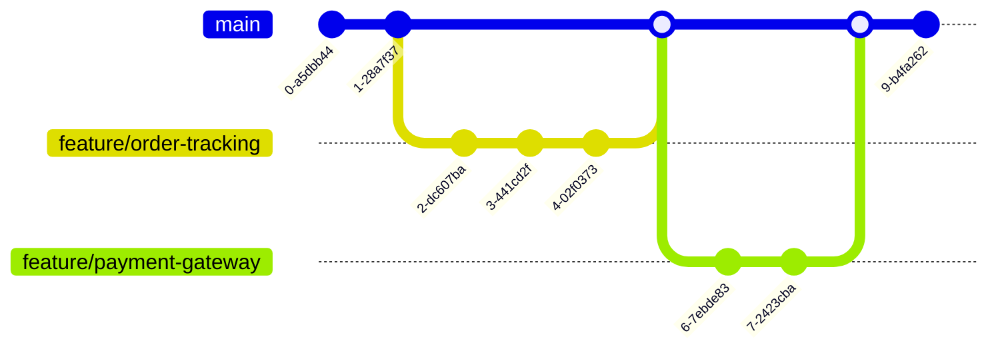

# CI/CD Pipelines

This document provides an overview of the Continuous Integration (CI) and Continuous Deployment (CD) pipelines used to build, test, and deploy the FlowMart e-commerce platform.

## CI/CD Philosophy

Our CI/CD approach follows these key principles:

1. **Automation First**: Automate everything that can be automated
2. **Fast Feedback**: Provide developers with quick feedback on their changes
3. **Consistency**: Ensure consistent builds and deployments across all environments
4. **Security**: Integrate security testing throughout the pipeline
5. **Observability**: Monitor and track all deployments and their impacts
6. **Self-service**: Enable teams to deploy independently, but safely

## CI/CD Technology Stack

Our CI/CD pipeline utilizes the following key technologies:

| Technology | Purpose |
|------------|---------|
| GitHub Actions | Main CI/CD orchestration platform |
| ArgoCD | Kubernetes GitOps deployment tool |
| Helm | Kubernetes package management |
| Docker | Container building and registry |
| Terraform | Infrastructure as Code deployment |
| SonarQube | Code quality and security analysis |
| Jest, JUnit, pytest | Unit testing frameworks |
| Playwright | End-to-end testing |
| K6 | Performance testing |
| OWASP ZAP | Security scanning |
| Snyk | Dependency vulnerability scanning |
| AWS ECR | Container registry |

## CI/CD Pipeline Overview

Our CI/CD pipeline consists of multiple stages with specific responsibilities:


## Pipeline Stages in Detail

### 1. Build & Package

- Triggered by code push or pull request
- Compiles application code
- Installs dependencies using package managers (npm, Maven, pip)
- Generates build artifacts
- Built in isolated environments with cached dependencies

```yaml
# Example GitHub Actions code snippet
build:
  runs-on: ubuntu-latest
  steps:
    - uses: actions/checkout@v3
    - name: Set up Node.js
      uses: actions/setup-node@v3
      with:
        node-version: '16'
        cache: 'npm'
    - name: Install dependencies
      run: npm ci
    - name: Build
      run: npm run build
    - name: Upload build artifacts
      uses: actions/upload-artifact@v3
      with:
        name: build-artifacts
        path: build/
```

### 2. Test

Multiple types of tests run in parallel to provide rapid feedback:

- **Unit Tests**: Test individual components in isolation
- **Integration Tests**: Test component interactions
- **End-to-End Tests**: Test complete user flows
- **Performance Tests**: Test application performance under load
- **Security Tests**: Scan for vulnerabilities in code and dependencies


### 3. Docker Build & Registry Push

- Builds Docker images for all services
- Tags images with git commit SHA and environment
- Pushes images to AWS ECR
- Scans images for vulnerabilities before pushing

```yaml
# Example GitHub Actions code snippet
docker-build:
  runs-on: ubuntu-latest
  needs: [build, test]
  steps:
    - uses: actions/checkout@v3
    - name: Configure AWS credentials
      uses: aws-actions/configure-aws-credentials@v1
      with:
        aws-access-key-id: ${{ secrets.AWS_ACCESS_KEY_ID }}
        aws-secret-access-key: ${{ secrets.AWS_SECRET_ACCESS_KEY }}
        aws-region: us-west-2
    - name: Login to Amazon ECR
      id: login-ecr
      uses: aws-actions/amazon-ecr-login@v1
    - name: Build and push Docker image
      uses: docker/build-push-action@v4
      with:
        context: .
        push: true
        tags: ${{ steps.login-ecr.outputs.registry }}/flowmart-orders-service:${{ github.sha }}
```

### 4. Deployment

We use GitOps with ArgoCD for managing deployments:

- **Development**: Automatic deployment on successful build
- **Staging**: Automatic deployment after integration tests pass
- **Production**: Manual approval required, then automated deployment


### 5. Post-Deployment Verification

- **Smoke Tests**: Quick tests to verify basic functionality
- **Canary Deployment**: Rolling deployment with traffic shifting
- **Monitoring**: Performance and error tracking during and after deployment

## Infrastructure Pipeline

For infrastructure changes, we have a separate pipeline:


## Feature Branch Workflow

We follow a feature branch workflow for development:



## Deployment to Multiple Environments

Our pipeline handles deployments to multiple environments:


## Rollback Strategy

In case of deployment issues, we have an automated rollback strategy:

1. **Immediate Automated Rollback**: Triggered by health checks or error rate spikes
2. **One-Click Manual Rollback**: Available through the deployment dashboard
3. **Previous Version Restoration**: Reverts to the last known good state


## Pipeline Security

Security is integrated throughout our pipeline:

- **Secrets Management**: Secrets stored in AWS Secrets Manager and injected at runtime
- **SAST**: Static Application Security Testing integrated in build phase
- **DAST**: Dynamic Application Security Testing during staging deployment
- **Dependency Scanning**: Checks for vulnerable dependencies
- **Container Scanning**: Scans container images for vulnerabilities
- **Infrastructure Scanning**: Checks IaC for security misconfigurations

## Observability

Our pipeline provides comprehensive observability:

- **Deployment Tracking**: Each deployment is traced from commit to production
- **Metrics Collection**: Performance metrics before and after deployment
- **Log Aggregation**: Centralized logging for all pipeline stages
- **Alerting**: Automated alerts for pipeline failures or anomalies
- **Dashboards**: Visual representation of pipeline health and history

Example deployment dashboard:


## Continuous Improvement

We continuously improve our pipeline through:

1. **Pipeline Metrics**: Track build times, success rates, and deployment frequency
2. **Postmortems**: Document and learn from deployment failures
3. **Automation Improvements**: Regularly identify manual steps for automation
4. **Cross-team Learning**: Share best practices across development teams

## Conclusion

Our CI/CD pipeline provides a robust, secure, and efficient process for deploying changes to the FlowMart platform. By automating the build, test, and deployment processes, we can deliver new features and bug fixes to users quickly and reliably while maintaining high quality standards. 