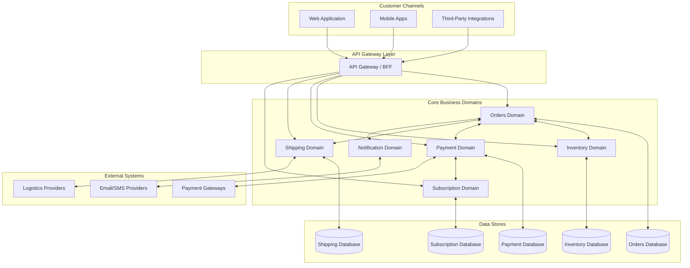

# FlowMart System Architecture: High-Level Overview

This diagram provides a high-level overview of the FlowMart e-commerce platform architecture. It illustrates the main components and how they interact to deliver our online shopping experience.

## Business Context

FlowMart is an e-commerce platform that enables customers to browse products, place orders, make payments, and track shipments. The architecture is designed to be scalable, resilient, and maintainable, following domain-driven design and event-driven architecture principles.

## High-Level Architecture Diagram

## Component Descriptions

### Customer Channels
- **Web Application**: A responsive web interface for customers to browse products and place orders
- **Mobile Apps**: Native iOS and Android applications for mobile shopping
- **Third-Party Integrations**: External platforms that integrate with our services

### API Gateway Layer
- **API Gateway / BFF**: Backend for Frontend that routes requests, handles authentication, and optimizes responses for different clients

### Core Business Domains
- **Orders Domain**: Manages the order lifecycle from creation to fulfillment
- **Inventory Domain**: Tracks product availability and stock levels
- **Payment Domain**: Processes payments and manages financial transactions
- **Shipping Domain**: Handles order delivery and shipment tracking
- **Subscription Domain**: Manages recurring subscriptions and memberships
- **Notification Domain**: Delivers notifications to customers across different channels

### Data Stores
- Each domain has its dedicated database to ensure domain isolation and independent scalability

### External Systems
- **Payment Gateways**: Third-party services for processing credit card payments
- **Logistics Providers**: External shipping and delivery services
- **Email/SMS Providers**: Services for sending notifications to customers

## Key Architectural Principles

1. **Domain-Driven Design**: Our system is organized around business domains and their bounded contexts
2. **Event-Driven Architecture**: Services communicate primarily through events, enhancing decoupling and scalability
3. **Microservices**: Each domain is implemented as one or more microservices with clear boundaries
4. **API-First Approach**: All functionality is exposed through well-defined APIs
5. **Polyglot Persistence**: Each domain can choose the most appropriate database technology

## Next Steps

For a more detailed view of our architecture, refer to the following documents:
- [Domain-Level Architecture](./02-domain-level-architecture.mdx)
- [Service-Level Architecture](./03-service-level-architecture.mdx)
- [Data Flow Architecture](./04-data-flow-architecture.mdx) 