# FlowMart Domain-Level Architecture

This document describes the domain-level architecture of the FlowMart e-commerce platform, showing how different domains interact with each other through well-defined interfaces and events.

## Domain Architecture Diagram

The following diagram illustrates the bounded contexts of each domain and how they communicate with each other:

```mermaid
flowchart TD
    classDef domainStyle fill:#f9f9f9,stroke:#333,stroke-width:2px
    classDef eventStyle fill:#e1f5fe,stroke:#0288d1,stroke-width:1px,color:#01579b
    classDef commandStyle fill:#f3e5f5,stroke:#7b1fa2,stroke-width:1px,color:#4a148c
    classDef queryStyle fill:#e8f5e9,stroke:#388e3c,stroke-width:1px,color:#1b5e20

    subgraph Orders["Orders Domain"]
        class Orders domainStyle
        OrdersService["Orders Service"]
        
        subgraph OrderEvents[" "]
            OrderConfirmed["OrderConfirmed Event"]
            OrderCancelled["OrderCancelled Event"]
            OrderAmended["OrderAmended Event"]
        end
        
        subgraph OrderCommands[" "]
            PlaceOrder["PlaceOrder Command"]
        end
        
        subgraph OrderQueries[" "]
            GetOrder["GetOrder Query"]
        end
    end
    
    subgraph Inventory["Inventory Domain"]
        class Inventory domainStyle
        InventoryService["Inventory Service"]
        
        subgraph InventoryEvents[" "]
            InventoryAdjusted["InventoryAdjusted Event"]
            OutOfStock["OutOfStock Event"]
        end
        
        subgraph InventoryCommands[" "]
            AddInventory["AddInventory Command"]
            UpdateInventory["UpdateInventory Command"]
            DeleteInventory["DeleteInventory Command"]
        end
        
        subgraph InventoryQueries[" "]
            GetInventoryStatus["GetInventoryStatus Query"]
            GetInventoryList["GetInventoryList Query"]
        end
    end
    
    subgraph Payment["Payment Domain"]
        class Payment domainStyle
        PaymentService["Payment Service"]
        
        subgraph PaymentEvents[" "]
            PaymentProcessed["PaymentProcessed Event"]
        end
        
        subgraph PaymentCommands[" "]
            PaymentInitiated["PaymentInitiated Command"]
        end
        
        subgraph PaymentQueries[" "]
            GetPaymentStatus["GetPaymentStatus Query"]
        end
    end
    
    subgraph Shipping["Shipping Domain"]
        class Shipping domainStyle
        ShippingService["Shipping Service"]
        
        subgraph ShippingEvents[" "]
            ShipmentCreated["ShipmentCreated Event"]
            ShipmentDispatched["ShipmentDispatched Event"]
            ShipmentInTransit["ShipmentInTransit Event"]
            ShipmentDelivered["ShipmentDelivered Event"]
            DeliveryFailed["DeliveryFailed Event"]
            ReturnInitiated["ReturnInitiated Event"]
        end
        
        subgraph ShippingCommands[" "]
            CreateShipment["CreateShipment Command"]
            UpdateShipmentStatus["UpdateShipmentStatus Command"]
            CancelShipment["CancelShipment Command"]
            CreateReturnLabel["CreateReturnLabel Command"]
        end
    end
    
    subgraph Subscription["Subscription Domain"]
        class Subscription domainStyle
        SubscriptionService["Subscription Service"]
        
        subgraph SubscriptionEvents[" "]
            UserSubscriptionStarted["UserSubscriptionStarted Event"]
            UserSubscriptionCancelled["UserSubscriptionCancelled Event"]
        end
        
        subgraph SubscriptionCommands[" "]
            SubscribeUser["SubscribeUser Command"]
            CancelSubscription["CancelSubscription Command"]
        end
        
        subgraph SubscriptionQueries[" "]
            GetSubscriptionStatus["GetSubscriptionStatus Query"]
        end
    end
    
    subgraph Notification["Notification Domain"]
        class Notification domainStyle
        NotificationService["Notification Service"]
        
        subgraph NotificationQueries[" "]
            GetUserNotifications["GetUserNotifications Query"]
            GetNotificationDetails["GetNotificationDetails Query"]
        end
    end

    %% Domain Interactions through Events
    OrderConfirmed -->|Consumed by| InventoryService
    OrderConfirmed -->|Consumed by| ShippingService
    OrderCancelled -->|Consumed by| InventoryService
    OrderAmended -->|Consumed by| InventoryService
    
    InventoryAdjusted -->|Consumed by| OrdersService
    InventoryAdjusted -->|Consumed by| NotificationService
    OutOfStock -->|Consumed by| NotificationService
    
    PaymentProcessed -->|Consumed by| OrdersService
    PaymentProcessed -->|Consumed by| ShippingService
    PaymentProcessed -->|Consumed by| SubscriptionService
    
    UserSubscriptionCancelled -->|Consumed by| OrdersService

    %% Apply styles to events, commands and queries
    class OrderConfirmed,OrderCancelled,OrderAmended,InventoryAdjusted,OutOfStock,PaymentProcessed,ShipmentCreated,ShipmentDispatched,ShipmentInTransit,ShipmentDelivered,DeliveryFailed,ReturnInitiated,UserSubscriptionStarted,UserSubscriptionCancelled eventStyle
    
    class PlaceOrder,AddInventory,UpdateInventory,DeleteInventory,PaymentInitiated,CreateShipment,UpdateShipmentStatus,CancelShipment,CreateReturnLabel,SubscribeUser,CancelSubscription commandStyle
    
    class GetOrder,GetInventoryStatus,GetInventoryList,GetPaymentStatus,GetSubscriptionStatus,GetUserNotifications,GetNotificationDetails queryStyle
```

## Domain Descriptions

### Orders Domain
The Orders Domain is the central domain of our e-commerce platform. It manages the entire lifecycle of customer orders, from creation to fulfillment. It communicates with other domains to check inventory availability, process payments, and arrange shipping.

**Key Events Published:**
- OrderConfirmed
- OrderCancelled 
- OrderAmended

**Commands:**
- PlaceOrder

**Queries:**
- GetOrder

### Inventory Domain
The Inventory Domain manages product stock levels across all warehouses. It ensures accurate inventory tracking and provides real-time stock information to other domains.

**Key Events Published:**
- InventoryAdjusted
- OutOfStock

**Commands:**
- AddInventory
- UpdateInventory
- DeleteInventory

**Queries:**
- GetInventoryStatus
- GetInventoryList

### Payment Domain
The Payment Domain handles all financial transactions within the platform. It processes customer payments, manages refunds, and communicates with external payment gateways.

**Key Events Published:**
- PaymentProcessed

**Commands:**
- PaymentInitiated

**Queries:**
- GetPaymentStatus

### Shipping Domain
The Shipping Domain manages order delivery to customers. It tracks shipment status, handles returns, and integrates with external logistics providers.

**Key Events Published:**
- ShipmentCreated
- ShipmentDispatched
- ShipmentInTransit
- ShipmentDelivered
- DeliveryFailed
- ReturnInitiated

**Commands:**
- CreateShipment
- UpdateShipmentStatus
- CancelShipment
- CreateReturnLabel

### Subscription Domain
The Subscription Domain manages recurring customer subscriptions. It handles subscription lifecycle, billing cycles, and renewal processes.

**Key Events Published:**
- UserSubscriptionStarted
- UserSubscriptionCancelled

**Commands:**
- SubscribeUser
- CancelSubscription

**Queries:**
- GetSubscriptionStatus

### Notification Domain
The Notification Domain is responsible for sending notifications to customers through various channels like email, SMS, and push notifications.

**Queries:**
- GetUserNotifications
- GetNotificationDetails

## Domain Integration Patterns

The domains in FlowMart's architecture interact using several integration patterns:

1. **Event-Driven Communication**: Most domain interactions occur through asynchronous events published to a message broker, promoting loose coupling.

2. **Synchronous API Calls**: For operations requiring immediate responses, domains expose REST APIs that can be called synchronously.

3. **Saga Pattern**: For complex workflows spanning multiple domains, we use choreography-based sagas where services respond to events to maintain data consistency.

4. **CQRS**: We separate command (write) and query (read) operations, allowing for optimization of each path.

## Next Steps

For more detailed architectural information, see:
- [Service-Level Architecture](./03-service-level-architecture.mdx)
- [Data Flow Architecture](./04-data-flow-architecture.mdx) 