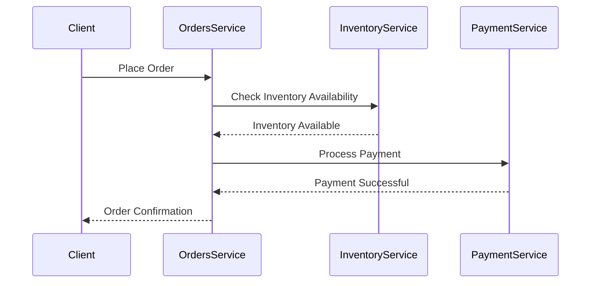
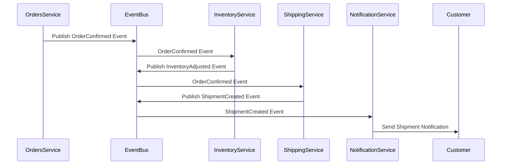

# FlowMart Service-Level Architecture

This document provides a detailed view of the individual services within FlowMart's e-commerce platform, their responsibilities, and how they interact.

## Service Architecture Overview

The following diagram illustrates the services that make up our platform and how they communicate:

```mermaid
flowchart TD
    classDef apiGateway fill:#f8cecc,stroke:#b85450,stroke-width:2px
    classDef orderService fill:#dae8fc,stroke:#6c8ebf,stroke-width:2px
    classDef inventoryService fill:#d5e8d4,stroke:#82b366,stroke-width:2px
    classDef paymentService fill:#ffe6cc,stroke:#d79b00,stroke-width:2px
    classDef shippingService fill:#e1d5e7,stroke:#9673a6,stroke-width:2px
    classDef notificationService fill:#fff2cc,stroke:#d6b656,stroke-width:2px
    classDef subscriptionService fill:#f8cecc,stroke:#b85450,stroke-width:2px
    classDef datastore fill:#f5f5f5,stroke:#666666,stroke-width:1px
    classDef messagebroker fill:#e6ffcc,stroke:#36b37e,stroke-width:2px
    classDef externalSystem fill:#f5f5f5,stroke:#666666,stroke-width:1px,stroke-dasharray: 5 5

    APIGateway[API Gateway]
    EventBus[Event Bus / Message Broker]
    
    subgraph OrdersDomain["Orders Domain"]
        OrdersService[Orders Service]
        OrdersDB[(Orders Database)]
    end
    
    subgraph InventoryDomain["Inventory Domain"]
        InventoryService[Inventory Service]
        InventoryDB[(Inventory Database)]
    end
    
    subgraph PaymentDomain["Payment Domain"]
        PaymentService[Payment Service]
        PaymentDB[(Payment Database)]
    end
    
    subgraph ShippingDomain["Shipping Domain"]
        ShippingService[Shipping Service]
        ShippingDB[(Shipping Database)]
    end
    
    subgraph NotificationDomain["Notification Domain"]
        NotificationService[Notification Service]
    end
    
    subgraph SubscriptionDomain["Subscription Domain"]
        SubscriptionService[Subscription Service]
        SubscriptionDB[(Subscription Database)]
    end
    
    subgraph ExternalSystems["External Systems"]
        PaymentGateway[Payment Gateway]
        EmailProvider[Email Provider]
        SMSProvider[SMS Provider]
        LogisticsPartner[Logistics Partner]
    end
    
    %% API Gateway connections
    APIGateway --> OrdersService
    APIGateway --> InventoryService
    APIGateway --> PaymentService
    APIGateway --> ShippingService
    APIGateway --> SubscriptionService
    
    %% Database connections
    OrdersService <--> OrdersDB
    InventoryService <--> InventoryDB
    PaymentService <--> PaymentDB
    ShippingService <--> ShippingDB
    SubscriptionService <--> SubscriptionDB
    
    %% Event bus connections
    OrdersService <--> EventBus
    InventoryService <--> EventBus
    PaymentService <--> EventBus
    ShippingService <--> EventBus
    NotificationService <--> EventBus
    SubscriptionService <--> EventBus
    
    %% External system connections
    PaymentService --> PaymentGateway
    NotificationService --> EmailProvider
    NotificationService --> SMSProvider
    ShippingService --> LogisticsPartner
    
    %% Apply styles
    class APIGateway apiGateway
    class OrdersService orderService
    class InventoryService inventoryService
    class PaymentService paymentService
    class ShippingService shippingService
    class NotificationService notificationService
    class SubscriptionService subscriptionService
    class OrdersDB,InventoryDB,PaymentDB,ShippingDB,SubscriptionDB datastore
    class EventBus messagebroker
    class PaymentGateway,EmailProvider,SMSProvider,LogisticsPartner externalSystem
```

## Service Component Details

### API Gateway
- **Description**: Entry point for all client requests, handles routing, authentication, and load balancing
- **Technologies**: AWS API Gateway, Kong, or Nginx
- **Key Responsibilities**:
  - Route requests to appropriate services
  - Handle authentication and authorization
  - API rate limiting and throttling
  - Request validation
  - Response caching

### Orders Service
- **Description**: Manages the entire lifecycle of customer orders
- **Technologies**: Node.js, Express, MongoDB
- **Key Responsibilities**:
  - Create and manage orders
  - Process order amendments and cancellations
  - Coordinate with other services for order fulfillment
  - Maintain order history and status
- **Key Events**:
  - Publishes: OrderConfirmed, OrderCancelled, OrderAmended
  - Consumes: InventoryAdjusted, PaymentProcessed, UserSubscriptionCancelled

### Inventory Service
- **Description**: Tracks and manages product inventory across warehouses
- **Technologies**: Java, Spring Boot, PostgreSQL
- **Key Responsibilities**:
  - Maintain accurate inventory levels
  - Process inventory adjustments
  - Monitor stock levels and trigger alerts
  - Support inventory queries
- **Key Events**:
  - Publishes: InventoryAdjusted, OutOfStock
  - Consumes: OrderConfirmed, OrderCancelled, OrderAmended

### Payment Service
- **Description**: Handles all payment processing and financial transactions
- **Technologies**: Node.js, Express, PostgreSQL
- **Key Responsibilities**:
  - Process customer payments
  - Manage refunds and chargebacks
  - Integrate with payment gateways
  - Track payment status
- **Key Events**:
  - Publishes: PaymentProcessed
  - Consumes: PaymentInitiated, UserSubscriptionStarted, InventoryAdjusted

### Shipping Service
- **Description**: Manages logistics and shipment of orders
- **Technologies**: Python, Flask, MongoDB
- **Key Responsibilities**:
  - Create and track shipments
  - Integrate with logistics providers
  - Process returns and exchanges
  - Calculate shipping costs
- **Key Events**:
  - Publishes: ShipmentCreated, ShipmentDispatched, ShipmentInTransit, ShipmentDelivered, DeliveryFailed, ReturnInitiated
  - Consumes: OrderConfirmed, PaymentProcessed

### Notification Service
- **Description**: Delivers notifications to customers through various channels
- **Technologies**: Node.js, Express, Redis
- **Key Responsibilities**:
  - Send transactional emails
  - Deliver SMS notifications
  - Push mobile app notifications
  - Store notification history
- **Key Events**:
  - Consumes: InventoryAdjusted, OutOfStock, PaymentProcessed

### Subscription Service
- **Description**: Manages recurring subscriptions and memberships
- **Technologies**: Java, Spring Boot, MySQL
- **Key Responsibilities**:
  - Handle subscription lifecycle
  - Process recurring billing
  - Manage subscription plans and tiers
  - Track subscription status
- **Key Events**:
  - Publishes: UserSubscriptionStarted, UserSubscriptionCancelled
  - Consumes: PaymentProcessed

### Event Bus / Message Broker
- **Description**: Central messaging system that enables asynchronous communication between services
- **Technologies**: Apache Kafka, RabbitMQ, or AWS SNS/SQS
- **Key Responsibilities**:
  - Reliable event delivery
  - Support for event persistence
  - Message routing
  - Scalable message throughput

## Service Interaction Patterns

### Synchronous Communication
Services communicate directly with each other through REST APIs for operations that require immediate responses.

### Asynchronous Communication
Services communicate through events published to the event bus, allowing for loose coupling.

## Infrastructure Considerations

- All services are containerized using Docker and orchestrated with Kubernetes
- Services are deployed across multiple availability zones for high availability
- Auto-scaling is configured based on CPU and memory metrics
- Database replication and backups are implemented for data durability
- Centralized logging and monitoring using Prometheus and Grafana

## Next Steps

For more information about data flows within the system, refer to:
- [Data Flow Architecture](./04-data-flow-architecture.mdx) 