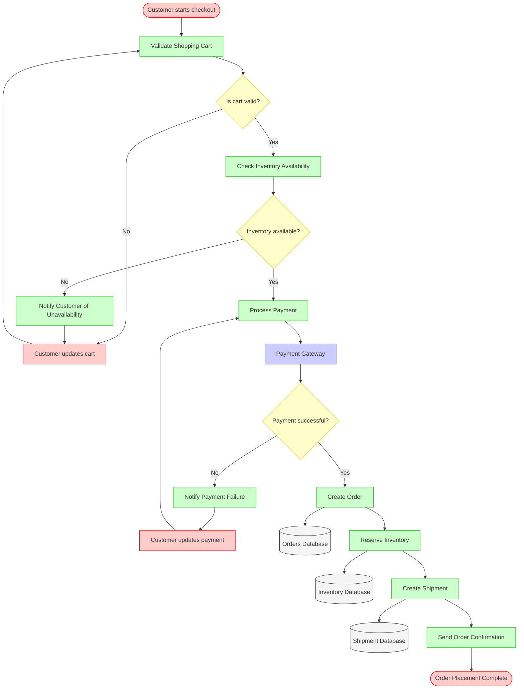
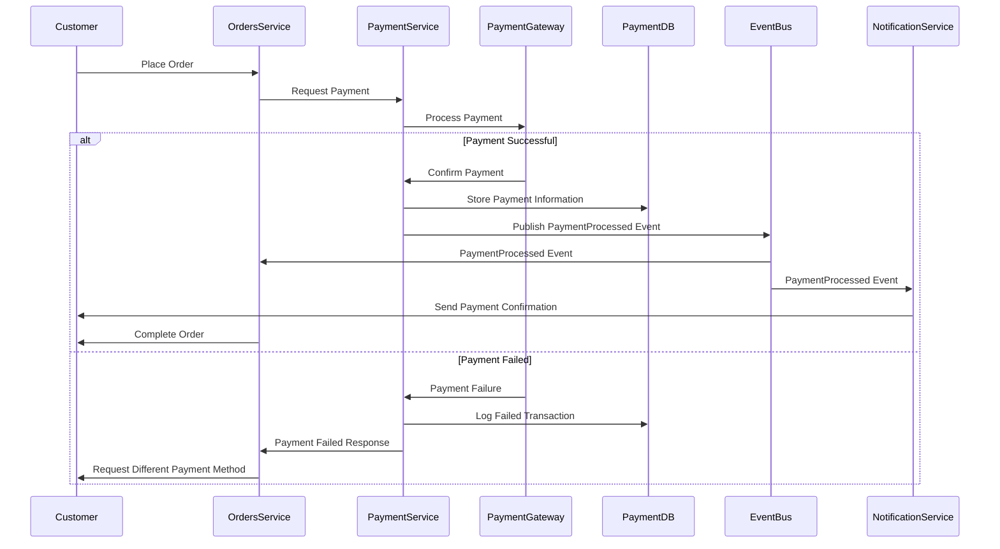
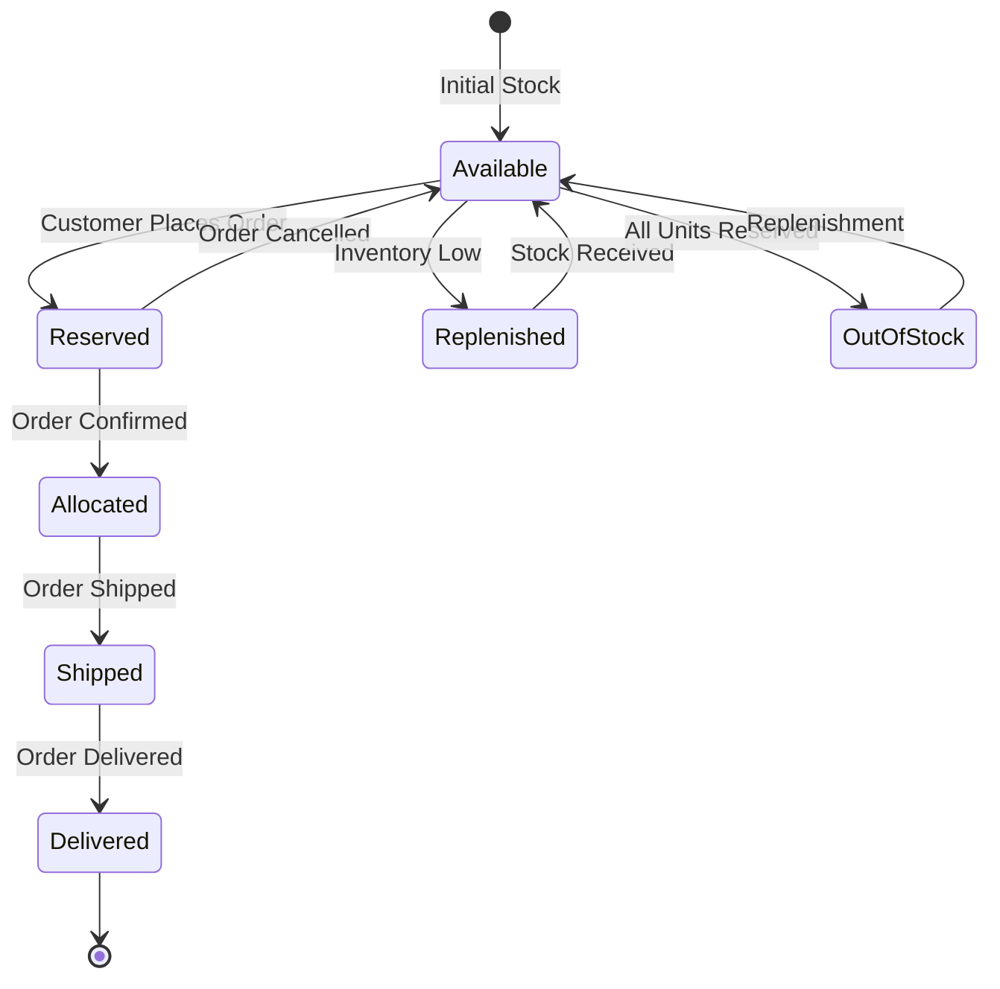
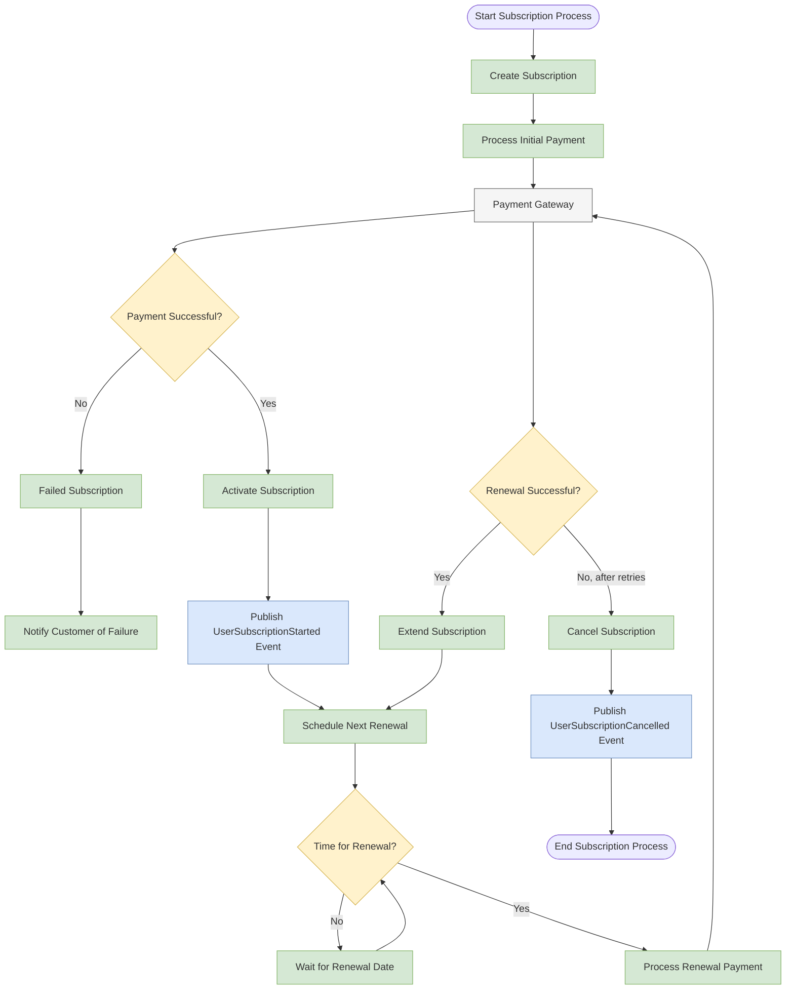
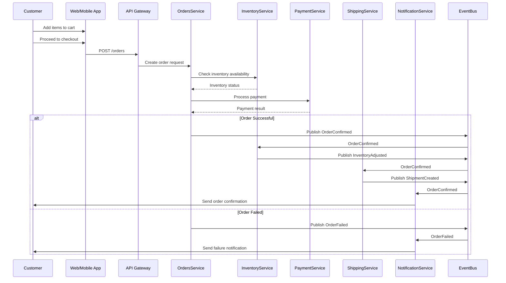
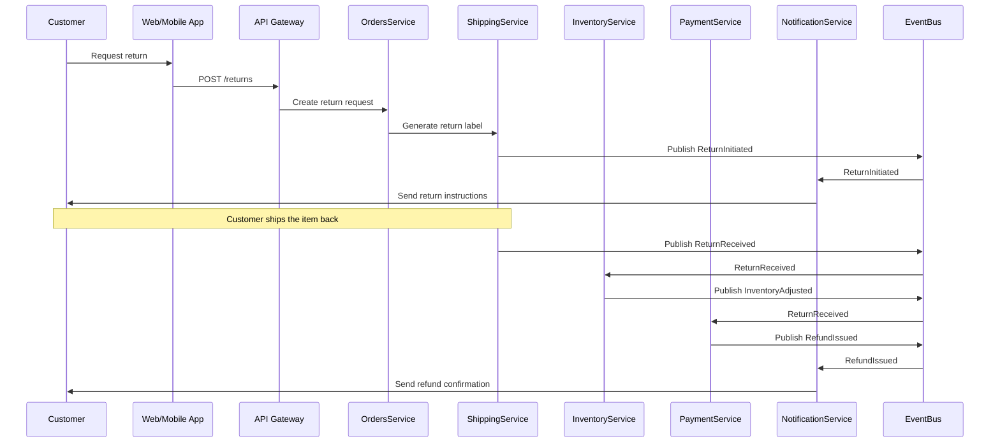
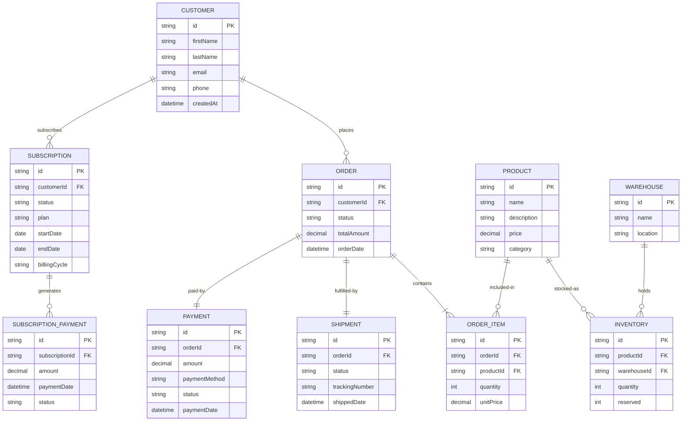
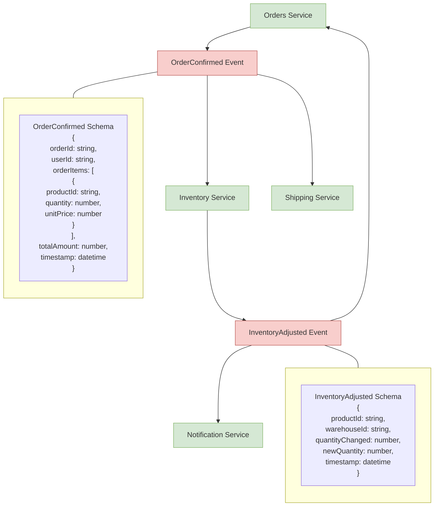

# FlowMart Data Flow Architecture

This document illustrates the key data flows within the FlowMart e-commerce platform, focusing on the most important business processes and how data moves through the system.

## Key Business Process Flows

### Order Placement and Fulfillment Flow

This diagram shows the complete flow from order placement to order fulfillment:

### Payment Processing Flow

This diagram details the payment processing flow:

### Inventory Management Flow

This diagram shows how inventory is managed across the system:

### Subscription Processing Flow

This diagram illustrates the subscription management flow:

## Detailed Data Flow Examples

### Customer Order Flow

The following diagram shows the data flow when a customer places an order:

### Product Return Flow

The following diagram shows the data flow when a customer returns a product:

## Data Storage Overview

The following diagram provides a high-level overview of the data storage architecture:

## Event Flow and Message Schema

The following diagram shows a sample of our event structure and flow:

## Conclusion

This document has provided an in-depth view of the data flows within the FlowMart e-commerce platform. By understanding these flows, developers and stakeholders can better comprehend how data moves through the system and how different components interact with each other.

For more details on specific architecture components, refer to:
- [High-Level System Overview](./01-high-level-system-overview.mdx)
- [Domain-Level Architecture](./02-domain-level-architecture.mdx)
- [Service-Level Architecture](./03-service-level-architecture.mdx) 