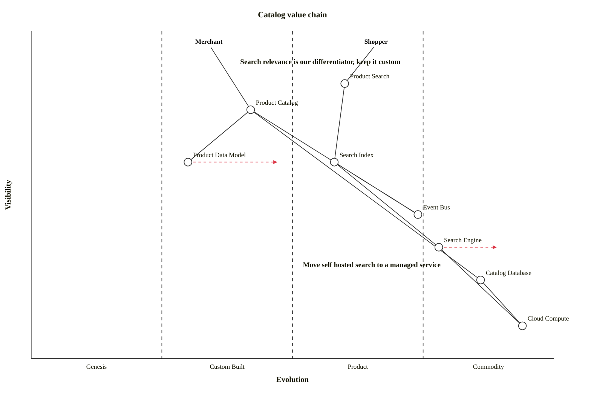

## Overview

The **Catalog** domain is responsible for the lifecycle of every product Acme Inc sells, and for making those products discoverable. It is split into two internal systems that work together:

<Tiles>
  <Tile
    icon="RectangleGroupIcon"
    href="/docs/systems/product-catalog-system/1.0.0"
    title="Product Catalog System"
    description="System of record for product data — create, update, delete and read products."
  />
  <Tile
    icon="MagnifyingGlassIcon"
    href="/docs/systems/search-system/1.0.0"
    title="Search System"
    description="Indexes product changes and serves fast, relevant product search to the rest of the business."
  />
</Tiles>

### How the systems work together

The **Product Catalog System** is the authoritative source of product data. Whenever a product is created, updated or deleted it publishes a domain event. The **Search System** subscribes to those events, keeps its search index in sync, and exposes a search API so other teams never have to query the catalog database directly.

## Value Chain

A Wardley map of the Catalog domain. Product search is where we differentiate, so it sits closest to the shopper and furthest from commodity. The data stores and compute underneath are bought, not built.

## Architecture Graph

Where Catalog sits in the wider architecture — its systems and messages, and the neighbouring domains it talks to.

<ArchitectureGraph />

The diagram below shows the domain's systems, how they relate, and the people who interact with them.
