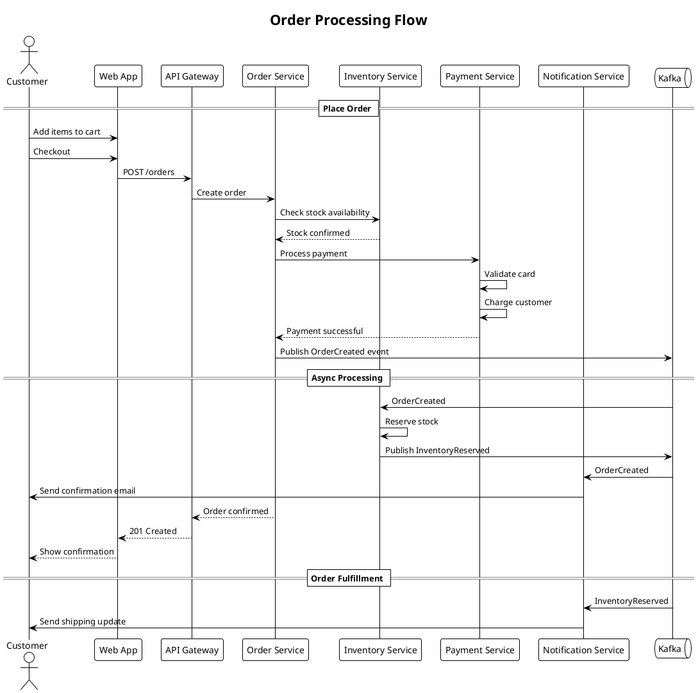

## Order Processing Flow

This sequence diagram illustrates the complete order processing flow in the e-commerce system:

1. **Customer Interaction**: Customer adds items and proceeds to checkout
2. **Synchronous Validation**: Stock and payment are validated before confirming
3. **Event Publishing**: OrderCreated event triggers async processing
4. **Parallel Processing**: Inventory reservation and notifications happen concurrently
5. **Customer Communication**: Email notifications at each stage
