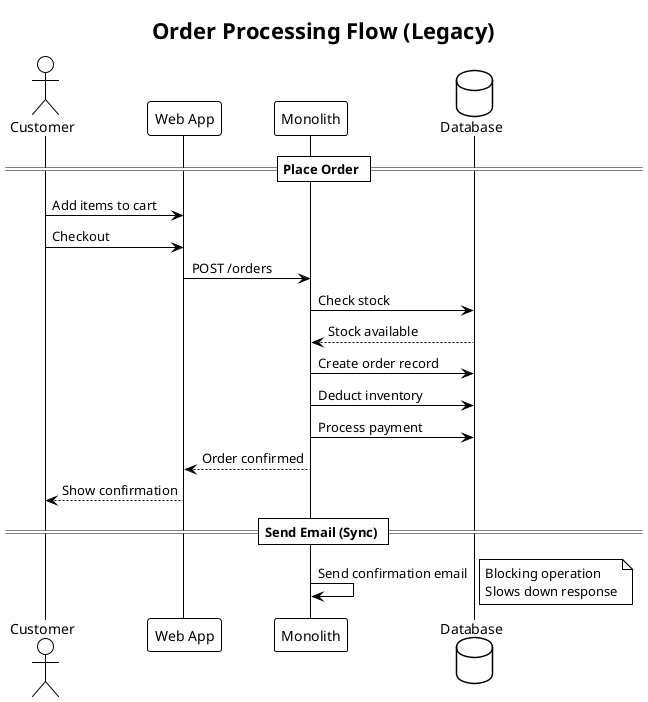

## V0.0.1 - Legacy Synchronous Flow

The original order processing was fully synchronous:

- **Single monolith**: All logic in one application
- **Shared database**: Single database for all data
- **Blocking operations**: Email sent synchronously, slowing response
- **No event streaming**: Direct database updates only
- **Limited scalability**: Could not handle high traffic
