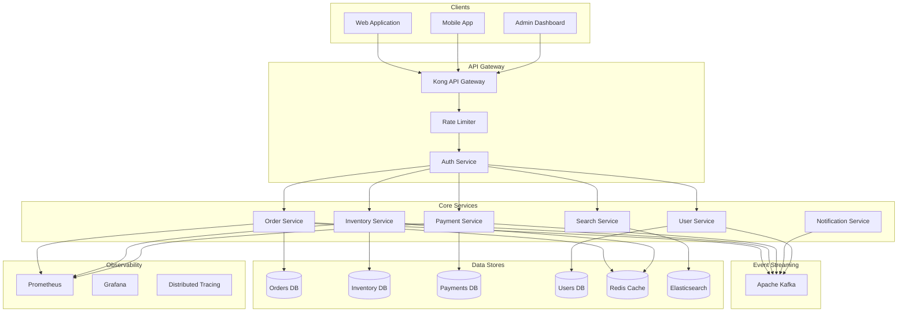

## Target State (v1.0.0)

This is our **target architecture** - the event-driven microservices platform we are actively migrating towards.

### Key Improvements

- **Independent deployments**: Each service deploys independently, enabling daily releases
- **Team autonomy**: Domain teams own their services end-to-end
- **Horizontal scaling**: Scale individual services based on demand
- **Resilience**: Service failures are isolated, no single point of failure
- **Event-driven**: Kafka enables loose coupling and async processing

### Migration Progress

| Service | Status | Target Date |
|---------|--------|-------------|
| User Service | Live | Completed |
| Order Service | Live | Completed |
| Payment Service | In Progress | Q1 2025 |
| Inventory Service | Planned | Q2 2025 |
| Notification Service | Planned | Q2 2025 |
| Search Service | Planned | Q3 2025 |

### Expected Outcomes

- **10x faster deployments** - From weekly to multiple times per day
- **99.9% availability** - Up from 99.5% with the monolith
- **50% cost reduction** - Through efficient auto-scaling
- **Team velocity** - 3x improvement in feature delivery
