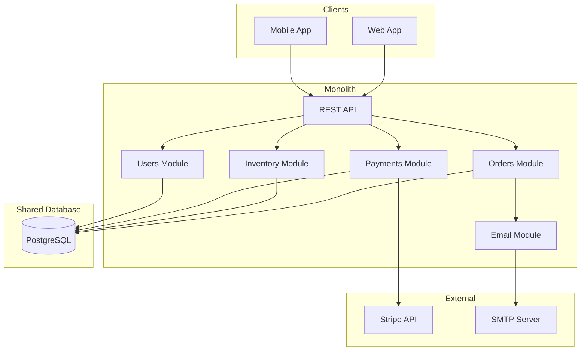

## Current State (v0.0.1)

This represents our **current production architecture** - a monolithic application that has served us well but is reaching its limits.

### Pain Points

- **Deployment bottleneck**: Any change requires full application deployment
- **Scaling limitations**: Cannot scale individual components independently
- **Database contention**: Single database becoming a bottleneck
- **Team dependencies**: Teams step on each other's toes
- **Reliability concerns**: One module failure affects entire system

### Key Metrics

| Metric | Current | Target |
|--------|---------|--------|
| Deploy frequency | Weekly | Daily |
| Lead time | 2 weeks | < 1 day |
| MTTR | 4 hours | < 15 min |
| Change failure rate | 15% | < 5% |
