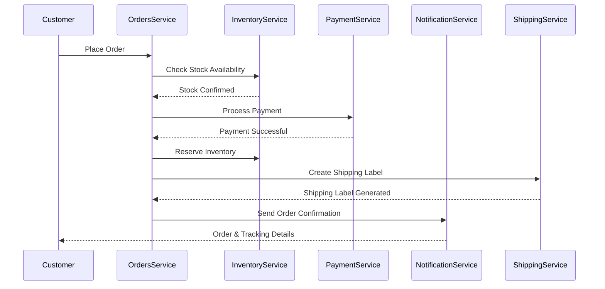

import Footer from '@catalog/components/footer.astro';

The E-Commerce domain is the core business domain of FlowMart, our modern digital marketplace. This domain orchestrates all critical business operations from product discovery to order fulfillment, handling millions of transactions monthly across our global customer base.

<Tiles>
    <Tile 
        icon="UserGroupIcon" 
        href="/docs/teams/full-stack" 
        title="Engineering Support" 
        description="Questions? Contact our full-stack team for technical support" 
    />
    <Tile 
        icon="RectangleGroupIcon" 
        href={`/visualiser/domains/${frontmatter.id}/${frontmatter.version}`} 
        title="Domain Architecture" 
        description="Explore our domain structure and service interactions" 
    />
</Tiles>

## Domain Overview

The E-Commerce domain encapsulates all the core business logic for the FlowMart e-commerce platform. It is built on event-driven microservices architecture.

<NodeGraph  />

FlowMart's E-Commerce domain is built on event-driven microservices architecture, enabling:
- Real-time inventory management across multiple warehouses
- Seamless payment processing with multiple providers
- Smart order routing and fulfillment
- Personalized customer notifications
- Subscription-based shopping experiences
- Advanced fraud detection and prevention

## Core Domains for E-Commerce

The <ResourceLink id="Orders" type="domain">Orders</ResourceLink> and <ResourceLink id="Subscription" type="domain">Subscription</ResourceLink> domains are core domains for the E-Commerce domain.

They are used to manage the orders and subscriptions for the E-Commerce domain.

  <NodeGraph id="Orders" version="0.0.3" type="domain" />
  <NodeGraph id="Subscription" version="0.0.1" type="domain" />

The E-Commerce domain is built on the following sub domains:

- <ResourceLink id="Orders" type="domain">Orders</ResourceLink> - Core domain for order management
- <ResourceLink id="Payment" type="domain">Payment</ResourceLink> - A generic domain for payment processing using Stripe as a payment provider
- <ResourceLink id="Subscription" type="domain">Subscription</ResourceLink> - Generic subscription domain handling users subscriptions

## Target Architecture (Event Storming Results)

Our target architecture was defined through collaborative event storming sessions with product, engineering, and business stakeholders. This represents our vision for FlowMart's commerce capabilities.

<Miro boardId="uXjVIHCImos=/" moveToWidget="3074457347671667709" edit={false} />

### Order Processing Flow

## Key Business Flows

### Subscription Management
Our subscription service powers FlowMart's popular "Subscribe & Save" feature:

<Flow id="CancelSubscription" version="latest" includeKey={false} />

### Payment Processing
Secure, multi-provider payment processing with fraud detection:

<Flow id="PaymentFlow" version="latest" includeKey={false} />

## Core Services

These services form the backbone of FlowMart's e-commerce operations:

<ResourceGroupTable 
    id="related-resources" 
    limit={7} 
    showOwners={true} 
    description="Essential services powering our e-commerce platform" 
/>

## Performance SLAs

- Order Processing: < 2 seconds
- Payment Processing: < 3 seconds
- Inventory Updates: Real-time
- Notification Delivery: < 30 seconds

## Monitoring & Alerts

- Real-time order volume monitoring
- Payment gateway health checks
- Inventory level alerts
- Customer experience metrics
- System performance dashboards

<Footer />
