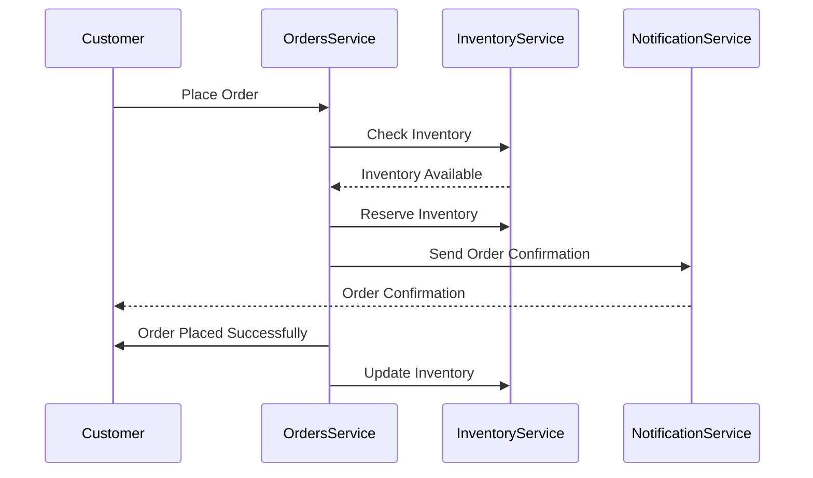

import Footer from '@catalog/components/footer.astro';

:::warning

Please ensure all services are **updated** to the latest version for compatibility and performance improvements.
:::

The Orders domain handles all operations related to customer orders, from creation to fulfillment. This domain is part of the larger [[domain|E-Commerce]] domain and includes key services like [[service|OrdersService]], [[service|InventoryService]], and [[service|NotificationService]].

Core entities include [[entity|Order]], [[entity|OrderItem]], and [[entity|Customer]]. This documentation provides an overview of the events and services involved, helping developers and stakeholders understand the event-driven architecture.

<Tiles >
    <Tile icon="UserGroupIcon" href="/docs/teams/full-stack" title="Contact the team" description="Any questions? Feel free to contact the owners" />
    <Tile icon="RectangleGroupIcon" href={`/visualiser/domains/${frontmatter.id}/${frontmatter.version}`} title={`${frontmatter.services.length} services`} description="This domain contains the following services." />
</Tiles>

### Architecture for the Orders domain

<NodeGraph />

### Entity Map

This is an entity map for the Orders domain. It shows the entities and their relationships with external entities in this domain.

<EntityMap title="Orders Entity Map"/>

<MessageTable format="all" limit={4} showChannels={true} title="Messages in/out of the domain" />

### Order example (sequence diagram)

## Flows

### Cancel Subscription flow
The [[flow|CancelSubscription]] documents the process when a user cancels their subscription. This flow involves the [[service|SubscriptionService]] and [[service|BillingService]].

<Flow id="CancelSubscription" version="latest" includeKey={false} />

### Payment processing flow
The [[flow|PaymentFlow]] documents the payment process within the order domain, utilizing the [[service|PaymentService]] and [[service|FraudDetectionService]].

<Flow id="PaymentFlow" version="latest" includeKey={false} />

<ResourceGroupTable id="related-resources" limit={4} showOwners={true} title="Core resources for the Orders domain" description="Resources that are related to the Orders domain, you may find them useful" />

<Footer />
