import Footer from '@catalog/components/footer.astro';

## Overview

The Inventory Service is a critical component of the system responsible for managing product stock levels, tracking inventory movements, and ensuring product availability. It works closely with the [[service|OrdersService]] and is part of the [[domain|Orders]] domain.

The service receives events like [[event|OrderConfirmed]] and [[event|OrderAmended]], and publishes [[event|InventoryAdjusted]] and [[event|OutOfStock]] to notify other services of inventory changes.

<Tiles >
    <Tile icon="DocumentIcon" href={`/docs/services/${frontmatter.id}/${frontmatter.version}/changelog`}  title="View the changelog" description="Want to know the history of this service? View the change logs" />
    <Tile icon="UserGroupIcon" href="/docs/teams/full-stack" title="Contact the team" description="Any questions? Feel free to contact the owners" />
    <Tile icon="BoltIcon" href={`/visualiser/services/${frontmatter.id}/${frontmatter.version}`} title={`Sends ${frontmatter.sends.length} messages`} description="This service sends messages to downstream consumers" />
    <Tile icon="BoltIcon"  href={`/visualiser/services/${frontmatter.id}/${frontmatter.version}`} title={`Receives ${frontmatter.receives.length} messages`} description="This service receives messages from other services" />
</Tiles>

## Core features

| Feature | Description |
|---------|-------------|
| Real-time Stock Tracking | Monitors inventory levels across all warehouses in real-time |
| Automated Reordering | Triggers purchase orders when stock levels fall below defined thresholds |
| Multi-warehouse Support | Manages inventory across multiple warehouse locations |
| Batch Processing | Handles bulk inventory updates and adjustments efficiently |

## Architecture diagram

<NodeGraph title="Hello world" />

<MessageTable format="all" limit={4} />

# Infrastructure

The Inventory Service is hosted on AWS.

The diagram below shows the infrastructure of the Inventory Service. The service is hosted on AWS and uses AWS Lambda to handle the inventory requests. The inventory is stored in an AWS Aurora database and the inventory metadata is stored in an AWS S3 bucket.

```mermaid
architecture-beta
    group api(logos:aws)

    service db(logos:aws-aurora)[Inventory DB] in api
    service disk1(logos:aws-s3)[Inventory Metadata] in api
    service server(logos:aws-lambda)[Inventory Handler] in api

    db:L -- R:server
    disk1:T -- B:server
```



You can find more information about the Inventory Service infrastructure in the [Inventory Service documentation](https://github.com/event-catalog/pretend-shipping-service/blob/main/README.md).


<Steps title="How to connect to Inventory Service">
  <Step title="Obtain API credentials">
    Request API credentials from the Inventory Service team.
  </Step>
  <Step title="Install the SDK">
    Run the following command in your project directory:
    ```bash
    npm install inventory-service-sdk
    ```
  </Step>
  <Step title="Initialize the client">
  Use the following code to initialize the Inventory Service client:

  ```js
  const InventoryService = require('inventory-service-sdk');
  const client = new InventoryService.Client({
    clientId: 'YOUR_CLIENT_ID',
    clientSecret: 'YOUR_CLIENT_SECRET',
    apiUrl: 'https://api.inventoryservice.com/v1'
  });
```
  </Step>
  <Step title="Make API calls">
  
  You can now use the client to make API calls. For example, to get all products:

  ```js
  client.getProducts()
    .then(products => console.log(products))
    .catch(error => console.error(error));
  ```
  </Step>
</Steps>

<Footer />
