import Footer from '@catalog/components/footer.astro';

## Overview

The Notification Service is responsible for managing and delivering notifications to users and other services. It is part of the [[domain|Orders]] domain and listens for events from multiple services including [[service|InventoryService]] and [[service|PaymentService]].

The service receives events like [[event|InventoryAdjusted]], [[event|PaymentProcessed]], and [[event|OutOfStock]] to trigger appropriate notifications. It supports various notification channels such as email, SMS, push notifications, and in-app notifications.

<Tiles >
    <Tile icon="DocumentIcon" href={`/docs/services/${frontmatter.id}/${frontmatter.version}/changelog`}  title="View the changelog" description="Want to know the history of this service? View the change logs" />
    <Tile icon="UserGroupIcon" href="/docs/teams/full-stack" title="Contact the team" description="Any questions? Feel free to contact the owners" />
    <Tile icon="BoltIcon" href={`/visualiser/services/${frontmatter.id}/${frontmatter.version}`} title={`Sends ${frontmatter.sends.length} messages`} description="This service sends messages to downstream consumers" />
    <Tile icon="BoltIcon"  href={`/visualiser/services/${frontmatter.id}/${frontmatter.version}`} title={`Receives ${frontmatter.receives.length} messages`} description="This service receives messages from other services" />
</Tiles>

### Core features

| Feature | Description |
|---------|-------------|
| Multi-Channel Delivery | Supports notifications via email, SMS, push notifications, and in-app messages |
| Template Management | Customizable notification templates with dynamic content placeholders |
| Delivery Status Tracking | Real-time tracking and monitoring of notification delivery status |
| Rate Limiting | Prevents notification flooding through configurable rate limits |
| Priority Queue | Handles urgent notifications with priority delivery mechanisms |
| Batch Processing | Efficiently processes and sends bulk notifications |
| Retry Mechanism | Automatic retry logic for failed notification deliveries |
| Event-Driven Notifications | Triggers notifications based on system events and user actions |

## Architecture diagram

<NodeGraph />

<MessageTable format="all" limit={4} />

## Core Concepts

<AccordionGroup>
  <Accordion title="Notification">
    - Description: A message that is sent to a user or a service.
    - Attributes: notificationId, type, recipient, content, channel, status, timestamp
  </Accordion>
  <Accordion title="Channel">
    - Description: The medium through which the notification is delivered (e.g., email, SMS, push notification).
    - Attributes: channelId, name, provider, configuration 
  </Accordion>
</AccordionGroup>

## Infrastructure

The Notification Service is hosted on AWS.

The diagram below shows the infrastructure of the Notification Service. The service is hosted on AWS and uses AWS Lambda to handle the notification requests. The notification is stored in an AWS Aurora database and the notification metadata is stored in an AWS S3 bucket.

```mermaid
architecture-beta
    group api(logos:aws)

    service db(logos:aws-aurora)[Notification DB] in api
    service disk1(logos:aws-s3)[Notification Metadata] in api
    service server(logos:aws-lambda)[Notification Handler] in api

    db:L -- R:server
    disk1:T -- B:server
```

You can find more information about the Notification Service infrastructure in the [Notification Service documentation](https://github.com/event-catalog/pretend-shipping-service/blob/main/README.md).

<Footer />
