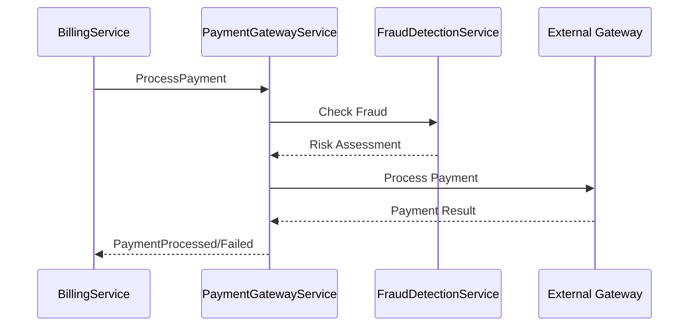

import Footer from '@catalog/components/footer.astro'

## Overview

The `ProcessPayment` command is used to initiate payment processing through the payment gateway. This command can be triggered by various sources including the Billing Service for subscription payments.

## Command Sources

This command can be triggered by:
- **BillingService** (Subscriptions Domain) - For recurring subscription payments
- **OrdersService** (Orders Domain) - For one-time order payments
- **PaymentService** (Payment Domain) - For payment retries

## Command Flow



## Schema

<SchemaViewer title="ProcessPayment Schema" schemaPath={frontmatter.schemaPath} />

## Example Request

```json
{
  "paymentId": "pay_123456",
  "amount": 49.99,
  "currency": "USD",
  "paymentMethod": {
    "type": "card",
    "token": "tok_visa_4242"
  },
  "metadata": {
    "subscriptionId": "sub_ABC123",
    "invoiceId": "inv_123456",
    "customerId": "cust_XYZ789"
  },
  "idempotencyKey": "sub_ABC123_2024_02",
  "captureImmediately": true
}
```

<Footer />