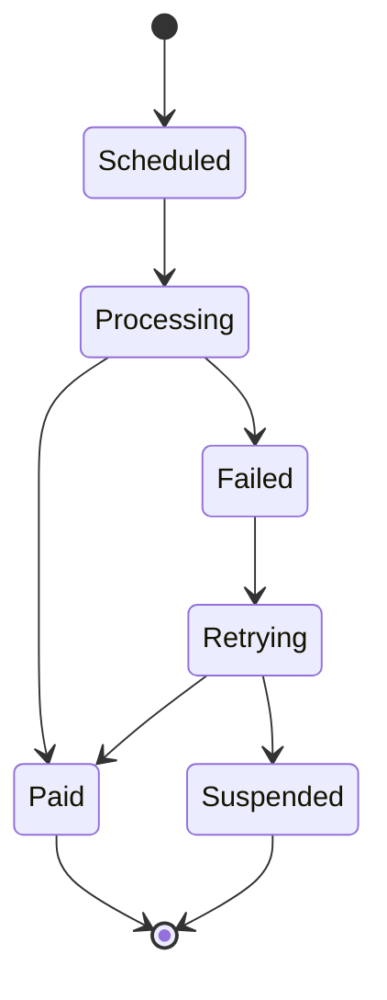

import Footer from '@catalog/components/footer.astro'

## Overview

The Billing Service is responsible for managing all billing-related operations for subscriptions. It calculates billing cycles, generates invoices, and coordinates with payment services to ensure timely payment collection.

## Key Features

- **Billing Cycle Management**: Handles daily, weekly, monthly, quarterly, and annual billing cycles
- **Invoice Generation**: Creates detailed invoices with line items and tax calculations
- **Payment Scheduling**: Schedules recurring payments based on billing cycles
- **Proration**: Calculates prorated charges for mid-cycle changes
- **Dunning Management**: Handles failed payment retry logic

## API Endpoints

### REST API
- `GET /api/billing/invoice/{subscriptionId}` - Get current invoice
- `GET /api/billing/history/{subscriptionId}` - Get billing history
- `POST /api/billing/preview` - Preview upcoming charges
- `PUT /api/billing/retry/{invoiceId}` - Retry failed payment

## Billing Cycle States



## Configuration

```yaml
billing_service:
  cycles:
    - daily
    - weekly
    - monthly
    - quarterly
    - annual
  retry_attempts: 3
  retry_interval_days: [1, 3, 7]
  invoice_generation_lead_days: 7
```

<Footer />