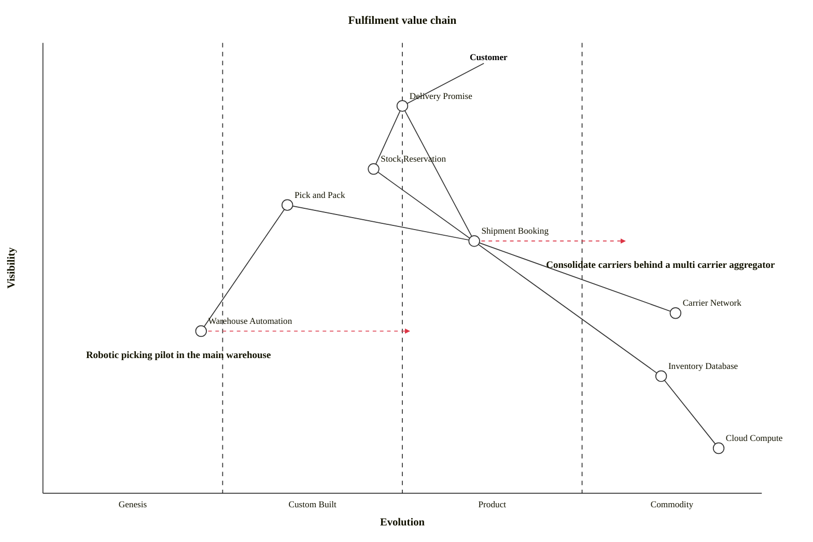

## Overview

The **Fulfilment** domain is responsible for the physical side of an order — making sure stock is available, picking and packing it, and shipping it to the customer. It owns three internal systems and integrates with external carriers:

<Tiles>
  <Tile
    icon="ArchiveBoxIcon"
    href="/docs/systems/inventory-system/1.0.0"
    title="Inventory System"
    description="Tracks and reserves stock for orders."
  />
  <Tile
    icon="BuildingStorefrontIcon"
    href="/docs/systems/warehouse-system/1.0.0"
    title="Warehouse System"
    description="Picks and packs orders ready for shipping."
  />
  <Tile
    icon="TruckIcon"
    href="/docs/systems/shipping-system/1.0.0"
    title="Shipping System"
    description="Hands packed orders to carriers for delivery."
  />
  <Tile
    icon="GlobeAltIcon"
    href="/docs/systems/carrier/1.0.0"
    title="Carrier"
    description="External carrier that delivers shipments to customers."
  />
</Tiles>

### How the systems work together

When an order is completed, the **Warehouse System** picks and packs it, having relied on the **Inventory System** to reserve stock earlier in checkout. Once packed, the **Shipping System** creates a shipment with an external **Carrier**, which delivers it to the customer and reports progress back.

## Value Chain

A Wardley map of the Fulfilment domain. Delivery is the promise customers see, carriers are a commodity we rent, and warehouse automation is the most novel part of the chain.

## System Diagram

The systems in this domain, how they relate, and the people who interact with them.

<ContextDiagram />
