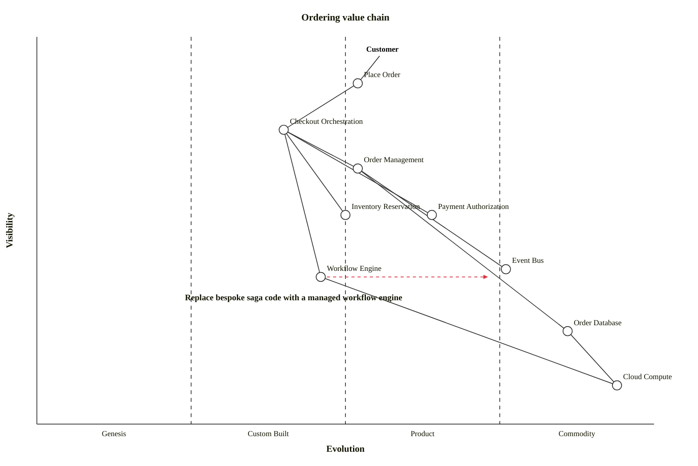

## Overview

The **Ordering** domain is responsible for everything that happens once a customer commits to buy — from the moment their cart is checked out to a confirmed, fulfilled order. It is split into two systems:

<Tiles>
  <Tile
    icon="CreditCardIcon"
    href="/docs/systems/checkout-system/1.0.0"
    title="Checkout System"
    description="Orchestrates checkout — reserves inventory, authorizes payment and creates the order."
  />
  <Tile
    icon="ClipboardDocumentListIcon"
    href="/docs/systems/order-management-system/1.0.0"
    title="Order Management System"
    description="System of record for orders and their lifecycle."
  />
</Tiles>

### How the systems work together

When the [[domain|shopping]] domain checks out a cart, the **Checkout System** takes over. It orchestrates the steps needed to place an order — reserving inventory, authorizing payment, and finally asking the **Order Management System** to create the order. The Order Management System then owns that order for the rest of its life, publishing events as it is created, completed or cancelled.

## Value Chain

A Wardley map of the Ordering domain. Placing an order is the most visible need in the business, the checkout orchestration behind it is custom, and the workflow tooling it runs on is evolving towards a product.

## System Diagram

The systems in this domain, how they relate, and the people who interact with them.

<ContextDiagram />

## Resource Diagram

The components that make up this domain.

<NodeGraph />

## Architecture Graph

Where Ordering sits in the wider architecture — its systems and messages, and the neighbouring domains it talks to.

<ArchitectureGraph />
