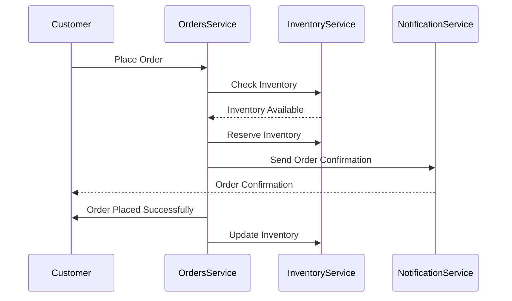

import Footer from '@catalog/components/footer.astro';

## Overview

<Admonition type="warning">Please ensure all services are updated to the latest version for compatibility and performance improvements.</Admonition>

The Orders domain handles all operations related to customer orders, from creation to fulfillment. This documentation provides an overview of the events and services involved in the Orders domain, helping developers and stakeholders understand the event-driven architecture.

<Tiles >
    <Tile icon="UserGroupIcon" href="/docs/teams/full-stack" title="Contact the team" description="Any questions? Feel free to contact the owners" />
    <Tile icon="RectangleGroupIcon" href={`/visualiser/domains/${frontmatter.id}/${frontmatter.version}`} title={`${frontmatter.services.length} services are in this domain`} description="This service sends messages to downstream consumers" />
</Tiles>

## Bounded context

<NodeGraph />

### Order example (sequence diagram)

## Flows

### Cancel Subscription flow
Documented flow when a user cancels their subscription.

<Flow id="CancelSubscription" version="latest" includeKey={false} />

### Payment processing flow
Documented flow when a user makes a payment within the order domain

<Flow id="PaymentFlow" version="latest" includeKey={false} />

<Footer />
