import Footer from '@catalog/components/footer.astro';

## Overview

The Orders Service is responsible for managing customer orders within the system. It handles order creation, updating, status tracking, and interactions with other services such as Inventory, Payment, and Notification services to ensure smooth order processing and fulfillment.

<Tiles >
    <Tile icon="DocumentIcon" href={`/docs/services/${frontmatter.id}/${frontmatter.version}/changelog`}  title="View the changelog" description="Want to know the history of this service? View the change logs" />
    <Tile icon="UserGroupIcon" href="/docs/teams/full-stack" title="Contact the team" description="Any questions? Feel free to contact the owners" />
    <Tile icon="BoltIcon" href={`/visualiser/services/${frontmatter.id}/${frontmatter.version}`} title={`Sends ${frontmatter.sends.length} messages`} description="This service sends messages to downstream consumers" />
    <Tile icon="BoltIcon"  href={`/visualiser/services/${frontmatter.id}/${frontmatter.version}`} title={`Receives ${frontmatter.receives.length} messages`} description="This service receives messages from other services" />
</Tiles>

### Core features

| Feature | Description |
|---------|-------------|
| Order Management | Handles order creation, updates, and status tracking |
| Inventory Integration | Validates and processes inventory for incoming orders |
| Payment Processing | Integrates with payment gateways to handle payment transactions |
| Notification Integration | Sends notifications to users and other services |

## Architecture diagram 

<NodeGraph />

<MessageTable format="all" limit={4} />

## Infrastructure

The Orders Service is hosted on AWS.

The diagram below shows the infrastructure of the Orders Service. The service is hosted on AWS and uses AWS Lambda to handle the order requests. The order is stored in an AWS Aurora database and the order metadata is stored in an AWS S3 bucket.

```mermaid
architecture-beta
    group api(logos:aws)

    service db(logos:aws-aurora)[Order DB] in api
    service disk1(logos:aws-s3)[Order Metadata] in api
    service server(logos:aws-lambda)[Order Handler] in api

    db:L -- R:server
    disk1:T -- B:server
```

You can find more information about the Orders Service infrastructure in the [Orders Service documentation](https://github.com/event-catalog/pretend-shipping-service/blob/main/README.md).

<Footer />
