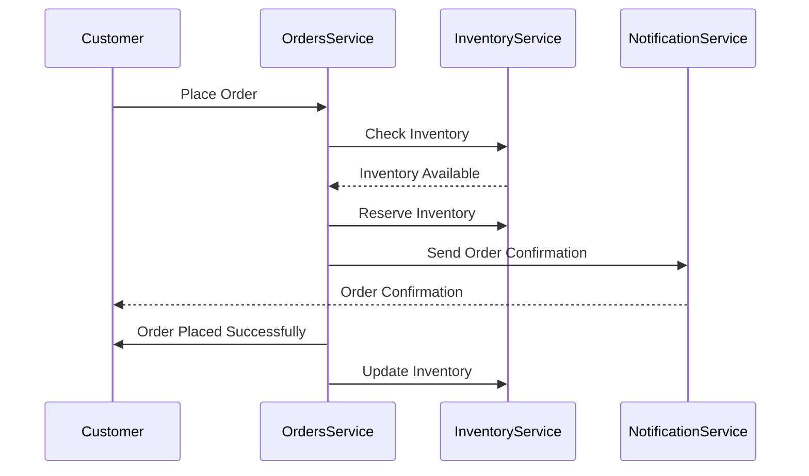

## Overview

The Orders domain handles all operations related to customer orders, from creation to fulfillment. This documentation provides an overview of the events and services involved in the Orders domain, helping developers and stakeholders understand the event-driven architecture.

<Admonition type="warning">Please ensure all services are updated to the latest version for compatibility and performance improvements.</Admonition>

## Bounded context

<NodeGraph />

### Order example (sequence diagram)

 