The Payment Service is a crucial component of our system that handles all payment-related operations. It processes payments, manages transactions, and communicates with other services through events. Using an event-driven architecture, it ensures that all actions are asynchronous, decoupled, and scalable.

### Core features

| Feature | Description |
|---------|-------------|
| Payment Processing | Processes payments and manages transactions |
| Event-Driven Architecture | Ensures asynchronous, decoupled, and scalable operations |
| Integration with Payment Gateways | Interfaces with external payment providers |

<NodeGraph />

## Infrastructure

The Payment Service is hosted on AWS.

The diagram below shows the infrastructure of the Payment Service. The service is hosted on AWS and uses AWS Lambda to handle the payment requests. The payment is stored in an AWS Aurora database and the payment metadata is stored in an AWS S3 bucket.

```mermaid
architecture-beta
    group api(logos:aws)

    service db(logos:aws-aurora)[Payment DB] in api
    service disk1(logos:aws-s3)[Payment Metadata] in api
    service server(logos:aws-lambda)[Payment Handler] in api

    db:L -- R:server
    disk1:T -- B:server
```

You can find more information about the Payment Service infrastructure in the [Payment Service documentation](https://github.com/event-catalog/pretend-payment-service/blob/main/README.md).

### Key Components
- Payment API: Exposes endpoints for initiating payments and querying payment status.
- Payment Processor: Handles the core payment processing logic.
- Event Bus: Manages the communication between services using events.
- Payment Gateway: Interfaces with external payment providers.
- Transaction Service: Manages transaction records and states.
- Notification Service: Sends notifications related to payment status changes.
- Database: Stores transaction data and payment status.