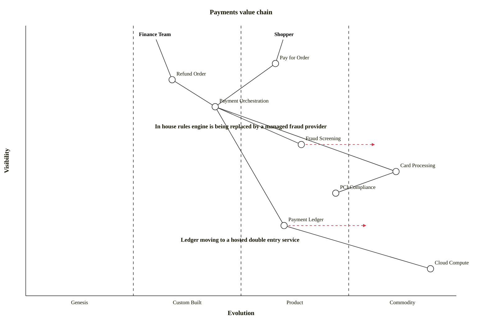

## Overview

The **Payments** domain is responsible for moving money. It authorizes and captures payment for orders, issues refunds, and screens payments for fraud. It owns one internal system and integrates with two external providers:

<CustomProperties title="Domain metadata" />

<Tiles>
  <Tile
    icon="CreditCardIcon"
    href="/docs/systems/payment-processing-system/1.0.0"
    title="Payment Processing System"
    description="Orchestrates authorization, capture and refunds for orders."
  />
  <Tile
    icon="BuildingLibraryIcon"
    href="/docs/systems/stripe/1.0.0"
    title="Stripe"
    description="External payment processor that charges cards and issues refunds."
  />
  <Tile
    icon="ShieldExclamationIcon"
    href="/docs/systems/fraud-detection/1.0.0"
    title="Fraud Detection"
    description="External provider that screens payments for fraud."
  />
</Tiles>

### How the systems work together

The **Payment Processing System** is the internal orchestrator. When the Ordering domain authorizes a payment, it requests payment via the external **Stripe** system and, in parallel, asks **Fraud Detection** to screen the payment. Stripe reports back whether the payment succeeded or failed, and the Payment Processing System records the outcome.

## Value Chain

A Wardley map of the Payments domain. Card processing and fraud screening are commodities we buy from providers, so the value we add is in orchestration, refunds and the compliance posture around them.

## System Diagram

The systems in this domain, how they relate, and the people who interact with them.

<ContextDiagram />

## Architecture Graph

Where Payments sits in the wider architecture — its systems and messages, and the neighbouring domains it talks to.

<ArchitectureGraph />
