import Footer from '@catalog/components/footer.astro';

## Overview

The subscription Service is responsible for handling customer subscriptions in our system. It handles new subscriptions, cancelling subscriptions and updating them.

<Tiles >
    <Tile icon="DocumentIcon" href={`/docs/services/${frontmatter.id}/${frontmatter.version}/changelog`}  title="View the changelog" description="Want to know the history of this service? View the change logs" />
    <Tile icon="UserGroupIcon" href="/docs/teams/full-stack" title="Contact the team" description="Any questions? Feel free to contact the owners" />
    <Tile icon="BoltIcon" href={`/visualiser/services/${frontmatter.id}/${frontmatter.version}`} title={`Sends ${frontmatter.sends.length} messages`} description="This service sends messages to downstream consumers" />
    <Tile icon="BoltIcon"  href={`/visualiser/services/${frontmatter.id}/${frontmatter.version}`} title={`Receives ${frontmatter.receives.length} messages`} description="This service receives messages from other services" />
</Tiles>

### Core features

| Feature | Description |
|---------|-------------|
| Subscription Management | Handles subscription creation, updates, and status tracking |
| Payment Processing | Integrates with payment gateways to handle payment transactions |
| Notification Integration | Sends notifications to users and other services |
| Multi-Channel Fulfillment | Supports multiple fulfillment channels (e.g., shipping, in-store pickup) |

## Architecture diagram 

<NodeGraph />

## Infrastructure

The Subscription Service is hosted on AWS.

The diagram below shows the infrastructure of the Subscription Service. The service is hosted on AWS and uses AWS Lambda to handle the subscription requests. The subscription is stored in an AWS Aurora database and the subscription metadata is stored in an AWS S3 bucket.

```mermaid
architecture-beta
    group api(logos:aws)

    service db(logos:aws-aurora)[Subscription DB] in api
    service disk1(logos:aws-s3)[Subscription Metadata] in api
    service server(logos:aws-lambda)[Subscription Handler] in api

    db:L -- R:server
    disk1:T -- B:server
```

You can find more information about the Subscription Service infrastructure in the [Subscription Service documentation](https://github.com/event-catalog/pretend-subscription-service/blob/main/README.md).

<Footer />