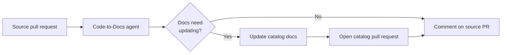

The **Code-to-Docs** agent keeps your EventCatalog documentation in sync with your code.

When you open a pull request, the agent reviews the diff, works out which documentation should change, updates it in your catalog repository, and opens (or updates) a documentation pull request. It then comments back on your source pull request with a summary and a link.

## How it works



When a pull request is opened, the agent:

1. **Checks out your catalog** so it can see your existing documentation.
2. **Collects the changed source files** from the pull request.
3. **Plans the impact**. A read-only pass where the agent decides whether the diff requires any documentation changes, and if so, exactly which catalog resources should change. If nothing is needed, it stops here and says so.
4. **Applies the plan**. The agent updates the documentation, using EventCatalog conventions for frontmatter and folder structure, and a linter to validate its changes. It is only allowed to touch the resources approved in the plan.
5. **Opens a catalog pull request** with the changes for you to review.
6. **Comments on your source pull request** with a high-level summary and a link to the catalog pull request.

You stay in control: the agent never edits your catalog silently. Every change arrives as a pull request you can review, tweak, and merge.

## Getting started

The Code-to-Docs agent runs as a GitHub Action. Add it to your repository in three steps.

### 1. Add a new GitHub workflow

Create a new workflow in your source directory. Typically this is where your source code lives (e.g a service that publishes/consumes messages).

Create a `.github/workflows/eventcatalog.yml` file.

```yaml
on:
  pull_request:

jobs:
  eventcatalog:
    runs-on: ubuntu-latest
    permissions:
      contents: read
      issues: write
      pull-requests: write
    steps:
      - uses: actions/checkout@v6
        with:
          fetch-depth: 0

      - uses: event-catalog/agents@main
        env:
          ANTHROPIC_API_KEY: ${{ secrets.ANTHROPIC_API_KEY }}
        with:
          agent: code-to-docs
          catalog-repo: your-org/your-catalog
          catalog-token: ${{ secrets.EVENTCATALOG_TOKEN }}
```

`fetch-depth: 0` is required so the agent can diff the pull request against its base.

### 2. Add your model provider key

Add the API key for your chosen model as a secret in your repository (**Settings → Secrets and variables → Actions**). Use the one that matches your model, for example `ANTHROPIC_API_KEY`, `OPENAI_API_KEY`, or `OPENROUTER_API_KEY`.

You can see the list of [available models here](https://pi.dev/models).

### 3. Open a pull request

When you next open a pull request on your project, the EventCatalog Agent will run.

If your architecture changed, opens a documentation pull request in your catalog repository and comments back with a link.

## Configuration

### Inputs

| Input | Required | Default | Description |
| --- | --- | --- | --- |
| `catalog-repo` | Yes | | The location of your hosted EventCatalog. EventCatalog repository to document into, in `owner/repo` format. |
| `catalog-ref` | No | `main` | Branch checked out from the catalog repository and targeted by documentation pull requests. |
| `catalog-token` | No | `github.token` | Token used to check out the catalog repository and open documentation pull requests. |
| `model` | No | `anthropic/claude-sonnet-4-6` | Model specifier for the agent. See [available models](https://pi.dev/models). |
| `ignore-paths` | No | common build/output paths | Comma-separated paths or glob patterns to ignore in pull request diffs. |
| `agent` | No | `code-to-docs` | Which EventCatalog agent to run. Use `code-to-docs` for this workflow. |

### Provider API keys

The model provider's API key is passed as a normal workflow environment variable. Set the one that matches your `model`:

| Provider | Environment variable |
| --- | --- |
| Anthropic | `ANTHROPIC_API_KEY` |
| OpenAI | `OPENAI_API_KEY` |
| OpenRouter | `OPENROUTER_API_KEY` |

The agent supports models from many providers. See the full list of model specifiers at [pi.dev/models](https://pi.dev/models).

### Documenting into a separate catalog repository

When your catalog lives in a **different** repository from your source code, provide a `catalog-token` with permission to push branches and open pull requests in that catalog repository (the default `github.token` only has access to the current repository).

:::info Early access
The Code-to-Docs agent is in early access and free to evaluate. In the future, a license will be required to run EventCatalog Agents in production.
:::

## Found an issue or have feedback?

The Code-to-Docs agent is open on GitHub at [event-catalog/agents](https://github.com/event-catalog/agents). If you hit a problem, or the agent documents something in a way you didn't expect, [open an issue](https://github.com/event-catalog/agents/issues/new) and let us know. Your feedback during early access directly shapes how the agent works.
