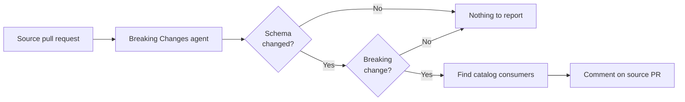

The **Breaking Changes** agent reviews schema changes in pull requests and reports whether they are likely to break existing consumers.

When a pull request changes a message schema, the agent checks whether the diff removes or renames fields, changes types, adds new required fields, narrows enums, or introduces similar compatibility risks. If it finds a breaking change, it traces the schema through your EventCatalog and comments on the source pull request with the breaking lines and affected consumers.

The Breaking Changes agent is read-only. It does not edit your catalog or open documentation pull requests.


## How it works



When a pull request is opened, the agent:

1. **Checks out your catalog** so it can understand the existing producers, consumers, messages, schemas, and flows.
2. **Collects the changed source files** from the pull request.
3. **Filters to schema files** using the configured schema extensions.
4. **Scores each schema change** for breaking-change risk. Additive changes, such as adding an optional field, are skipped.
5. **Finds affected consumers** for each breaking schema change by tracing the message through EventCatalog.
6. **Comments on your source pull request** with the breaking change, the relevant diff lines, and the consumers that could be affected.

If the pull request has no changed schema files, or only non-breaking schema changes, the workflow exits without creating a catalog pull request.

## Getting started

The Breaking Changes agent runs as a GitHub Action.

### 1. Add a new GitHub workflow

Create a `.github/workflows/eventcatalog-breaking-changes.yml` file in the repository where your source changes happen.

```yaml
on:
  pull_request:

jobs:
  eventcatalog-breaking-changes:
    runs-on: ubuntu-latest
    permissions:
      contents: read
      issues: write
      pull-requests: write
    steps:
      - uses: actions/checkout@v6
        with:
          fetch-depth: 0

      - uses: event-catalog/agents@main
        env:
          ANTHROPIC_API_KEY: ${{ secrets.ANTHROPIC_API_KEY }}
        with:
          agent: breaking-changes
          catalog-repo: your-org/your-catalog
          catalog-token: ${{ secrets.EVENTCATALOG_TOKEN }}
```

`fetch-depth: 0` is required so the agent can diff the pull request against its base.

### 2. Add your model provider key

Add the API key for your chosen model as a secret in your repository (**Settings → Secrets and variables → Actions**). Use the one that matches your model, for example `ANTHROPIC_API_KEY`, `OPENAI_API_KEY`, or `OPENROUTER_API_KEY`.

You can see the list of [available models here](https://pi.dev/models).

### 3. Open a pull request that changes a schema

When a pull request changes a schema, the agent reviews the schema diff. If it finds a breaking change, it comments on the pull request with the affected EventCatalog consumers.

## Configuration

### Inputs

| Input | Required | Default | Description |
| --- | --- | --- | --- |
| `agent` | No | `code-to-docs` | Set this to `breaking-changes` to run the Breaking Changes agent. |
| `catalog-repo` | Yes | | The EventCatalog repository to inspect, in `owner/repo` format. |
| `catalog-ref` | No | `main` | Branch checked out from the catalog repository. |
| `catalog-token` | No | `github.token` | Token used to check out the catalog repository. Use a token with read access when the catalog is in another private repository. |
| `model` | No | `anthropic/claude-sonnet-4-6` | Model specifier for the agent. See [available models](https://pi.dev/models). |
| `ignore-paths` | No | common build/output paths | Comma-separated paths or glob patterns to ignore in pull request diffs. |
| `schema-extensions` | No | `.json,.yml,.yaml,.avro,.avsc,.proto,.graphql,.gql` | Comma-separated file extensions the agent treats as message schemas. |

### Schema extensions

By default, the agent checks common schema files:

```yaml
schema-extensions: .json,.yml,.yaml,.avro,.avsc,.proto,.graphql,.gql
```

If your message contracts live in another file type, add that extension:

```yaml
- uses: event-catalog/agents@main
  env:
    ANTHROPIC_API_KEY: ${{ secrets.ANTHROPIC_API_KEY }}
  with:
    agent: breaking-changes
    catalog-repo: your-org/your-catalog
    catalog-token: ${{ secrets.EVENTCATALOG_TOKEN }}
    schema-extensions: .json,.yaml,.ts
```

Only add source-code extensions when those files contain message contracts. The agent ignores non-schema files for this workflow.

### Provider API keys

The model provider's API key is passed as a normal workflow environment variable. Set the one that matches your `model`:

| Provider | Environment variable |
| --- | --- |
| Anthropic | `ANTHROPIC_API_KEY` |
| OpenAI | `OPENAI_API_KEY` |
| OpenRouter | `OPENROUTER_API_KEY` |

The agent supports models from many providers. See the full list of model specifiers at [pi.dev/models](https://pi.dev/models).

## Run with Code-to-Docs

Each Action step runs one EventCatalog agent. To run Breaking Changes and [Code-to-Docs](/docs/development/ask-your-architecture/agents/code-to-docs) on the same pull request, add two steps:

```yaml
- uses: event-catalog/agents@main
  env:
    ANTHROPIC_API_KEY: ${{ secrets.ANTHROPIC_API_KEY }}
  with:
    agent: breaking-changes
    catalog-repo: your-org/your-catalog
    catalog-token: ${{ secrets.EVENTCATALOG_TOKEN }}

- uses: event-catalog/agents@main
  env:
    ANTHROPIC_API_KEY: ${{ secrets.ANTHROPIC_API_KEY }}
  with:
    agent: code-to-docs
    catalog-repo: your-org/your-catalog
    catalog-token: ${{ secrets.EVENTCATALOG_TOKEN }}
```

Use Breaking Changes when you want pull request feedback about schema compatibility. Use Code-to-Docs when you want catalog documentation updates proposed as a separate pull request.

:::info Early access
The Breaking Changes agent is in early access and free to evaluate. In the future, a license will be required to run EventCatalog Agents in production.
:::

## Found an issue or have feedback?

The Breaking Changes agent is open on GitHub at [event-catalog/agents](https://github.com/event-catalog/agents). If you hit a problem, or the agent reports something in a way you didn't expect, [open an issue](https://github.com/event-catalog/agents/issues/new) and let us know. Your feedback during early access directly shapes how the agent works.
