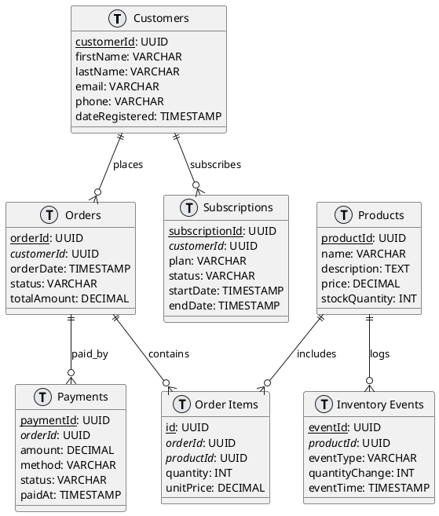

import AddedIn from '@site/src/components/MDX/AddedIn';

<AddedIn version="2.46.0" />

EventCatalog supports [plantuml](https://plantuml.com/) in all your markdown files.

This let's you create [Class Diagrams](https://plantuml.com/class-diagram), [Sequence Diagrams](https://plantuml.com/sequence-diagram), [Class Diagrams](https://plantuml.com/class-diagram), [State Diagrams](https://plantuml.com/state-diagram) and much more.

## Using plantuml in EventCatalog

To use plantuml you need to use the `plantuml` code block in any markdown file.

#### Example

```markdown


This example will output the following in the markdown file.


### How it works?

The PlantUML implementation takes your content and converts it to a PNG image using https://www.plantuml.com/plantuml/svg.


## Interactive controls

<AddedIn version="3.5.0" />

All PlantUML diagrams include interactive controls for better viewing and exploration.

### Zoom and pan

Click and drag to pan around the diagram, or use the zoom controls in the bottom-left corner to zoom in and out. Double-click the diagram to zoom in quickly.

### Presentation mode

Click the presentation button in the top-left corner to view the diagram in fullscreen. In presentation mode, mouse wheel zooming is enabled for precise control.

Press `Escape` to exit presentation mode.

### Copy diagram code

Click the copy button in the top-right corner to copy the diagram code to your clipboard. 

Useful for copying diagrams into LLM prompts.

### More resources

- [PlantUML documentation](https://plantuml.com) - Learn more about plantuml and how to use it
- [Real world examples](https://real-world-plantuml.com/) - Real world examples of plantuml in use
